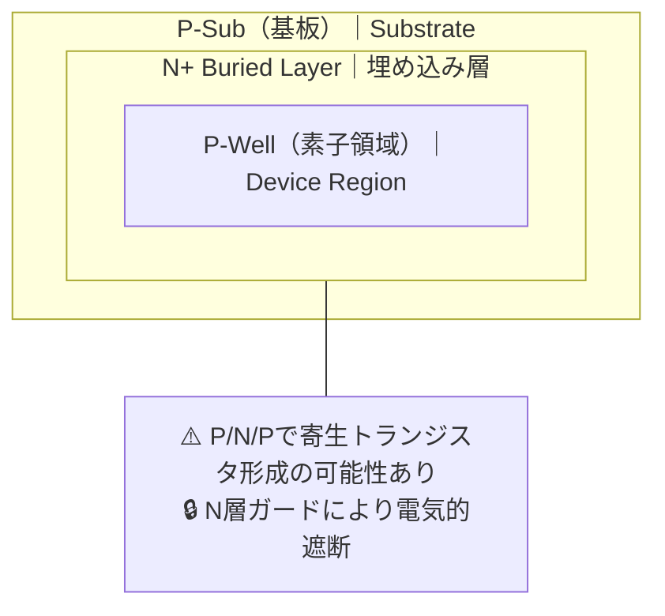
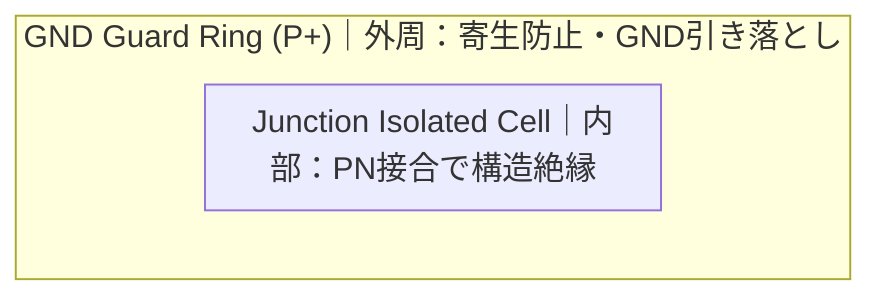

---

# 🧩 Junction Isolation（接合型絶縁構造）
**Junction Isolation**

---

## 📘 概要｜Overview

**CMOSや高耐圧デバイスを安定に動作させるためには、異なる素子間での電気的干渉を防ぐ絶縁構造が不可欠です。**  
**To ensure stable operation of CMOS and high-voltage devices, isolation structures that prevent electrical interference between different elements are essential.**

特に高耐圧デバイスでは、**高電圧による寄生トランジスタ動作やサブストレート電流**を抑える必要があります。  
In high-voltage devices, suppression of **parasitic transistor action and substrate current** is critical.

---

## 🏗️ 絶縁構造の比較｜Comparison of Isolation Structures

| 構造｜Structure | 特徴｜Features | 用途｜Applications |
|----------------|----------------|--------------------|
| **N-Well / P-Well** | 基本的なウェル絶縁 Basic well-based isolation | 通常CMOS、低耐圧構成 Standard CMOS, low-voltage |
| **Deep N-Well (DNW)** | 広域絶縁とノイズ遮断 Deep region isolation and noise suppression | HV-CMOS、アナログ混載 HV-CMOS, analog SoC |
| **Junction Isolation** | PN接合による電気的遮断 Electrical isolation using PN junction | LDMOS、高密度HVセル LDMOS, dense HV cells |

---

## 🔬 Junction Isolationの仕組み｜How Junction Isolation Works

- **PN接合に逆バイアスを印加し、空乏層で絶縁を形成**  
  *Isolation is achieved by applying reverse bias to form a depletion region across the PN junction.*
- **面積効率が高く、高密度設計に向く**  
  *Efficient for area, suitable for dense layouts.*
- **ラッチアップリスク（npn型）に注意**  
  *Requires care due to risk of parasitic npn latch-up.*

---

## 🛡️ ガードリングとの併用｜Combination with Guard Rings

Junction Isolationだけでは、寄生npnや光電流による誤動作を完全には防げません。  
**そのため、レイアウト的な工夫として「P+ GNDガードリング」を外周に配置し、電位を固定・電流を逃がす**のが一般的です。

- **ラッチアップ・光感受性・熱ノイズへの多重対策**  
- **HV-CMOSやLDMOSのレイアウトでは標準的構成**

---

## ⚠️ 設計上の注意点｜Design Considerations

| 注意点｜Concern | 説明｜Description |
|-------------|--------|
| **逆バイアス印加** Reverse Bias Requirement | 絶縁効果を維持するためには、常時逆バイアス電圧が必要 Constant reverse bias must be maintained |
| **寄生トランジスタ解析** Parasitic BJT Analysis | PNP/NPN構造を含むため、電気的シミュレーションが必須 Device simulation needed to evaluate parasitic effects |
| **熱的影響** Thermal Degradation | 高温下での拡散や絶縁劣化の懸念あり Risk of thermal-induced degradation of isolation |

---

## 📚 教材的意義｜Educational Relevance

- **構造と絶縁の原理の対応関係**を学べる  
  *Understand relationship between device structure and electrical isolation*
- **高密度・高耐圧設計のトレードオフ**を体験的に理解可能  
  *Explore trade-offs in dense high-voltage device design*
- **ラッチアップ・ノイズ対策の導入教材**として活用可能  
  *Useful for introducing latch-up and noise immunity topics*

---

## 🔗 関連リンク｜Related Topics

- [📘 応用編 第2章｜高耐圧デバイス 全体README](../d_chapter2_high_voltage_devices/README.md)  
  **章全体の構成と関連技術の導入**  
  *Chapter 2 Top: Overview of high-voltage devices and structure of this section*

- [`hvcmos.md`](./hvcmos.md)  
  **CMOSプロセス互換での高耐圧化技術**  
  *High-voltage CMOS with process compatibility*

- [`ldmos.md`](./ldmos.md)  
  **LDMOSの構造と電界制御・絶縁設計**  
  *Structure and field/isolation control in LDMOS*

- [`layout_rules.md`](./layout_rules.md)  
  **絶縁レイアウトとセル間設計規則**  
  *Isolation layout and inter-cell design rules*

- [基礎編 第4章｜MOSトランジスタの特性](../chapter4_mos_characteristics/)  
  **MOS構造と寄生素子の理解**  
  *Understanding MOS structure and parasitic elements*

---

© 2025 Shinichi Samizo / MIT License
