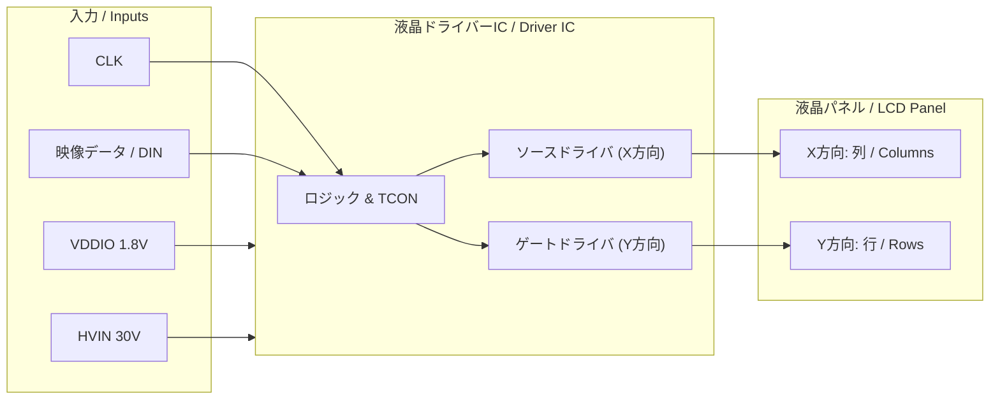

---

# 📑 液晶パネル用ドライバーIC 仕様書  
*Specification for LCD Panel Driver IC (Concept Model)*

---

## 1. 概要 / Overview
本ICはTFT-LCDパネルを駆動するための**液晶ドライバーIC**である。  
外部入力は最小限（1.8 Vロジック電源、30 V高電圧電源、クロック、データ入力）で済み、内部で必要な5 Vアナログ電源やゲート用高電圧を生成する。  
ガンマ補正はポリ抵抗ラダーを用い、外付けサーミスタによる温度補償機能を備える。  

*This IC drives TFT-LCD panels with minimal external supplies (1.8 V logic, 30 V high-voltage, CLK, data input).  
It generates the required 5 V analog and gate high-voltage rails internally, provides gamma correction via a poly resistor ladder, and implements temperature compensation with an external thermistor.*

---

## 2. 電源仕様 / Power Supplies
- **外部入力 / External Inputs**  
  - VDDIO = 1.8 V（ロジックI/F, レジスタ）  
  - HVIN = 30 V（高電圧源, AVDD/LDOおよびVGH/VGLポンプ用）  

- **内部生成 / Internal Rails**  
  - AVDD = 5.0 V（30 V → 5 V LDO）  
  - VDDC = 1.0–1.2 V（1.8 V → LDO, ロジックコア用）  
  - VGH = +22〜+30 V（チャージポンプ生成, ゲートON用）  
  - VGL = −6〜−10 V（チャージポンプ生成, ゲートOFF用）  
  - VCOM = 2.0〜4.0 V 可変（AVDDから生成, バッファ付）  

---

## 3. 入力インタフェース / Inputs
- **CLK**：ピクセル/シリアルクロック（1.8 Vロジック準拠）  
- **DIN[n:0]**：入力データバス（MIPI, LVDS, RGBパラレル等, 1.8 V系）  
- **I²C / SPI**：γ, VCOM, 補償係数レジスタ設定用（オプション）  
- **RESET, STBY**：初期化・低消費モード（オプション）  

---

## 4. 出力仕様 / Outputs
- **ゲートドライバ (Y方向)**  
  - 出力電圧：VGH（+30 V）/ VGL（−8 V）  
  - ドライブ能力：±50〜100 mA  
  - 立上/立下：≤ 2 µs  
  - dv/dt耐性：≥ 30 V/µs  
  - 機能：行（Yライン）を1行ずつ選択する  

- **ソースドライバ (X方向)**  
  - 出力範囲：VCOM ± (0〜AVDD/2) ≈ 0.3〜5.0 V  
  - 分解能：等価 8–10 bit  
  - 出力電流：±5〜10 mA / ch  
  - 出力インピーダンス：≤ 10 Ω  
  - 機能：列（Xライン）に画素データ電圧を供給する  

- **VCOM バッファ**  
  - 出力範囲：2.0〜4.0 V 可変  
  - ドライブ能力：±100 mA  
  - ノイズ：≤ 100 µV_rms (10 Hz–100 kHz)  

---

## 5. ガンマ階調生成 / Gamma Reference
- **方式**：ポリ抵抗ラダー（Rseg = 2–3 kΩ/段, 10–14タップ）  
- **各タップ**：低オフセットOPAMPでバッファ  
- **精度**：タップ間ミスマッチ ≤ 0.25%  
- **レイアウト**：インターディジテーション＋ダミー、コモンセントロイド配置必須  

---

## 6. 温度センサと補償 / Temperature Sensor & Compensation
- **外付け NTC サーミスタ**：10 kΩ, B=3435–3950  
- **回路**：分圧→ADC入力→γ/VCOM 補償ロジック  
- **補償式**：  
  - γ補正:  
    Vγ,i(T) = Vγ,i(25℃) × {1 + kγ,i(T-25)}  
  - VCOM補正:  
    VCOM(T) = VCOM(25℃) + kCOM(T-25)  

---

## 7. 保護機能 / Protections
- **UVLO**：1.8 V, 5 V, 30 V 各レールを監視  
- **OTP**：150 ℃ シャットダウン / 130 ℃ 復帰  
- **過電流保護**：LDO, VGH/VGLポンプ  
- **ショート保護**：ソース・ゲート出力段  

---

## 8. 版図・実装ガイド / Layout Guidelines
- **γラダー**：コモンセントロイド配置、各タップはケルビン取り  
- **電源プレーン**：アナログ/デジタル/HV 分離、スター配線  
- **ガードリング**：N-well/P-sub によるアナログ島の分離  
- **デカップリング**：LDO出力に 4.7–10 µF、各ブロックに 0.1 µF 分散配置  
- **HVポンプ**：最短ループ、AVDDアナログ領域から距離を置く  

---

## 9. 入出力構造図 / Block Diagram



---

## 10. 動作タイミング概要 / Frame Operation


---

## 11. 1画素の等価回路 / Equivalent Pixel Circuit

```mermaid
graph LR
    Source[ソースライン<br/>(X方向データ電圧)] -->|ON時| TFT[薄膜トランジスタ<br/>(TFTスイッチ)]
    Gate[ゲートライン<br/>(Y方向選択パルス)] -->|制御| TFT
    TFT --> NodeQ[画素電極]
    NodeQ -->|液晶容量| CLCD[(C_LCD)]
    NodeQ -->|ストレージ容量| CST[(C_ST)]
    VCOM[VCOM (共通電極)] --- CLCD
    VCOM --- CST
```

- **TFT**：ゲートONでソース電圧を書き込み、OFFで高抵抗に  
- **C_LCD**：液晶セル容量、画素電位とVCOM差が透過率を決定  
- **C_ST**：保持用キャパシタ、フレーム間の電圧保持に寄与  

---

## 12. レジスタマップ / Register Map (例)
| Addr | 名称 | 概要 |
|---|---|---|
| 0x00 | PWR_CTRL | LDO/HVポンプ有効, UVLO/OTP ステータス |
| 0x10 | VCOM_SET | VCOM (mV) 設定 |
| 0x20–0x2D | GAMMA[14] | γタップ微調整 |
| 0x40 | TEMP_COEF | k_COM, k_γ 補償係数 |
| 0x41 | TEMP_RAW | サーミスタ換算温度 |
| 0x7F | DEV_ID | デバイスID / リビジョン |

---

# ✅ まとめ
- **入力**：1.8 V, 30 V, CLK, データ  
- **内部生成**：30 V→5 V LDO (AVDD), VGH/VGL チャージポンプ, VCOMバッファ  
- **γ**：ポリ抵抗ラダー 2–3 kΩ/段、各タップバッファ必須  
- **温度補償**：外付けNTCでγ/VCOM補正  
- **出力**：ゲートドライバ(±30 V, Y方向), ソースドライバ(0–5 V, X方向), VCOMバッファ  
- **1画素等価回路**：TFT + 液晶容量 + ストレージ容量、VCOM基準で動作  

本仕様書は **Samizo構想モデル**の液晶パネル用ドライバーICを定義するものであり、教育・教材用途としても活用可能である。  
