---

# 📑 液晶パネル用ドライバーIC 仕様書  
*Specification for LCD Panel Driver IC (Concept Model)*

---

## 1. 概要 / Overview
本ICは **TFT-LCDパネルを駆動**するための **液晶ドライバーIC** である。  
外部入力は最小限（**1.8 V ロジック電源、30 V 高電圧電源、クロック、データ入力**）で済み、内部で必要な **5 V アナログ電源** や **ゲート用高電圧** を生成する。  
ガンマ補正は **ポリ抵抗ラダー** を用い、**外付けサーミスタ** による温度補償機能を備える。  

*This IC drives TFT-LCD panels with minimal external supplies (1.8 V logic, 30 V high-voltage, CLK, data input).  
It internally generates the required 5 V analog and gate high-voltage rails, provides gamma correction via a poly resistor ladder, and implements temperature compensation with an external thermistor.*

---

## 2. ⚡ 電源仕様 / Power Supplies

| 種類 | 電圧 / Voltage | 用途 / Usage |
|------|----------------|---------------|
| **VDDIO** | 1.8 V | ロジックI/F, レジスタ *Logic interface & registers* |
| **HVIN** | 30 V | 高電圧源、AVDD/LDO, VGH/VGL用 *High-voltage source* |
| **AVDD** | 5.0 V (30 V → LDO) | アナログ, γ, VCOM *Analog, gamma, VCOM* |
| **VDDC** | 1.0–1.2 V | ロジックコア *Logic core* |
| **VGH** | +22〜+30 V | ゲートON電圧 *Gate ON* |
| **VGL** | −6〜−10 V | ゲートOFF電圧 *Gate OFF* |
| **VCOM** | 2.0〜4.0 V 可変 | 共通電極電圧 *Common electrode* |

---

## 3. ⬅️ 入力インタフェース / Inputs
- **CLK**：ピクセル/シリアルクロック *Pixel/serial clock*  
- **DIN[n:0]**：入力データ（MIPI, LVDS, RGB 等, 1.8 V系） *Input data bus*  
- **I²C / SPI**：γ, VCOM, 温度補償設定（オプション） *Control interface (optional)*  
- **RESET, STBY**：初期化・低消費モード *Reset / Standby*  

---

## 4. ➡️ 出力仕様 / Outputs

| 出力 | 仕様 / Spec | 機能 / Function |
|------|-------------|-----------------|
| **ゲートドライム(Y方向 / Gate Driver)** | VGH=+30 V, VGL=−8 V, ±50〜100 mA, tr/tf ≤ 2 µs | 行（Yライン）を順次é¸æŠ *Select rows sequentially* |
| **ソースドライム(X方向 / Source Driver)** | 0.3〜5.0 V, 8–10 bit 等価, ±5〜10 mA/ch, Rout ≤ 10 Ω | 列（Xライン）ã«ç”»ç´ ãƒ‡ãƒ¼ã‚¿ã‚’供給 *Provide column voltages* |
| **VCOM バッファ** | 2.0〜4.0 V 可変, ±100 mA, ノイズ ≤ 100 µV_rms | 共通電極を安定化 *Common electrode buffer* |

---

## 5. 🎚 ガンマ階調生成 / Gamma Reference
- **方式 / Type**：ポリ抵抗ラダー *Poly resistor ladder*  
- **値 / Segment**：Rseg = 2–3 kΩ, 10–14 タップ  
- **バッファ / Buffer**：各タップに低オフセットOPAMP  
- **精度 / Matching**：≤ 0.25%  
- **レイアウト / Layout**：インターディジテーション＋ダミー＋コモンセントロイド  

---

## 6. 🌡 温度センサと補償 / Temperature Sensor & Compensation
- **外付け NTC サーミスタ**：10 kΩ, B=3435–3950  
- **ADC 読み出し → γ/VCOM を補正**  
- **補償式 / Compensation**  
  - γ補正: *Vγ,i(T) = Vγ,i(25℃) × {1 + kγ,i (T−25)}*  
  - VCOM補正: *VCOM(T) = VCOM(25℃) + kCOM (T−25)*  

---

## 7. 🛡 保護機能 / Protections
- **UVLO**：1.8 V, 5 V, 30 V を監視 *Undervoltage lockout*  
- **OTP**：150 ℃ シャットダウン / 130 ℃ 復帰 *Over-temperature protection*  
- **OCP**：LDO, VGH/VGL 過電流 *Over-current protection*  
- **Short 保護**：ソース/ゲート出力 *Short-circuit protection*  

---

## 8. 🧩 版図・実装ガイド / Layout Guidelines
- γラダーは **コモンセントロイド配置**、タップは **ケルビン取り**  
- **アナログ/デジタル/HV の電源プレーン分離**、スター配線  
- **N-well/P-sub ガードリング**でアナログ島を分離  
- LDO 出力に **4.7–10 µF**、各ブロックに **0.1 µF** 分散配置  
- HVポンプは **最短ループ設計**、AVDDアナログ領域から距離を置く  

---

## 9. 📊 入出力構造図 / Block Diagram

```mermaid
flowchart LR
    subgraph Input["入力 / Inputs"]
        A1["VDDIO 1.8V"]
        A2["HVIN 30V"]
        A3["CLK"]
        A4["映像データ / DIN"]
    end

    subgraph DriverIC["液晶ドライバーIC / Driver IC"]
        D1["ロジック & TCON"]
        D2["ソースドライバ (X方向)"]
        D3["ゲートドライバ (Y方向)"]
    end

    subgraph Panel["液晶パネル / LCD Panel"]
        X["X方向: 列 / Columns"]
        Y["Y方向: 行 / Rows"]
    end

    A1 --> DriverIC
    A2 --> DriverIC
    A3 --> D1
    A4 --> D1
    D1 --> D2
    D1 --> D3
    D2 --> X
    D3 --> Y
```

---

## 10. ⏱ 動作タイミング概要 / Frame Operation

```mermaid
sequenceDiagram
    participant CLK as クロック
    participant TCON as ドライバーIC: TCON
    participant Gate as ゲートドライバ (Y方向)
    participant Source as ソースドライバ (X方向)
    participant Panel as 液晶パネル (画素)

    CLK->>TCON: VSYNC (フレーム開始)
    TCON->>Gate: 行1選択 (VGH High)
    TCON->>Source: 行1データ送出
    Source->>Panel: 列データ書込み
    Gate-->>Panel: 行1 OFF (VGL)

    TCON->>Gate: 行2選択
    TCON->>Source: 行2データ
    Source->>Panel: 列データ書込み
    Gate-->>Panel: 行2 OFF

    Note over Gate,Source: 行3〜Nまで繰り返し

    CLK->>TCON: VSYNC (フレーム終了)
```

---

## 10b. ⏱📈 タイミング波形 / Timing Waveforms (Clear)

下の3図は、**Gate(Y)** → **Source(X)** → **Pixel** の順に分けて表示し、 
サンプル＆ホールドの関係を明確に示しています。薄い帯は「行選択（Gate ON）」区間です。  
*The following three figures show Gate (Y) → Source (X) → Pixel in sequence,  
highlighting the sample-and-hold relationship. Shaded areas represent line selection (Gate ON) periods.*

---

### Gate (Y) select pulses  

**説明 / Description**  
- Gate が High (VGH) の間、その行の TFT がオンになる。  
- *When the Gate is High (VGH), the TFTs in that row are turned on.*

---

### Source (X) analog data  

**説明 / Description**  
- Source は各列に画素データ電圧を出力する。行ごとに異なるアナログ値が設定される。  
- *The Source driver outputs pixel data voltages to each column, with different analog values per line.*

---

### Pixel node (sample & hold)  

**説明 / Description**  
- Gate が ON の間だけ Pixel は Source をトラックし、その後は保持 (Hold) に入る。  
- *The Pixel tracks the Source only while the Gate is ON, and then enters Hold mode afterward.*

---

**読み方 / How to read**  
- Gate の帯が ON の間だけ Pixel は Source をトラックし、その直後は **保持 (Hold)** に入る。  
  *The Pixel tracks the Source only during Gate ON, and then holds the value.*  
- 各行の選択（Line 1, Line 2 ...）は Gate の帯で示される。  
  *Line selection (Line 1, Line 2, ...) is indicated by the Gate shading.*  
- Source は行ごとに異なるアナログ値を供給し、Pixel はその時点の値を保持する。  
  *The Source provides different analog values for each line, which the Pixel then holds.*
  
---

## 11. 🔲 1画素の等価回路 / Equivalent Pixel Circuit

```mermaid
graph LR
    Source["ソースライン (X方向データ電圧)"] --> TFT["薄膜トランジスタ (TFTスイッチ)"]
    Gate["ゲートライン (Y方向選択パルス)"] --> TFT
    TFT --> NodeQ["画素電極"]

    NodeQ --> CLCD["C_LCD (液晶容量)"]
    NodeQ --> CST["C_ST (ストレージ容量)"]
    VCOM["VCOM (共通電極)"] --- CLCD
    VCOM --- CST
```

- **TFT**：ゲートONでソース電圧を書き込み、OFFで高抵抗に  
- **C_LCD**：液晶セル容量、画素電位とVCOM差が透過率を決定  
- **C_ST**：保持用キャパシタ、フレーム間の電圧保持に寄与  

---

## 12. 🗂 レジスタマップ / Register Map (例)

| Addr | 名称 / Name | 概要 / Description |
|------|-------------|--------------------|
| 0x00 | **PWR_CTRL** | LDO/HVポンプ有効, UVLO/OTP ステータス *Power control & status* |
| 0x10 | **VCOM_SET** | VCOM (mV) 設定 *VCOM setting* |
| 0x20–0x2D | **GAMMA[14]** | γタップ微調整 *Gamma fine tuning* |
| 0x40 | **TEMP_COEF** | k_COM, k_γ 補償係数 *Temp compensation coefficients* |
| 0x41 | **TEMP_RAW** | サーミスタ換算温度 *Thermistor raw value* |
| 0x7F | **DEV_ID** | デバイスID / リビジョン *Device ID* |

---

# ✅ まとめ / Summary
- **入力 / Inputs**：1.8 V, 30 V, CLK, データ  
- **内部生成 / Internal rails**：30 V→5 V LDO (AVDD), VGH/VGL ポンプ, VCOMバッファ  
- **γ / Gamma**：ポリ抵抗ラダー 2–3 kΩ/段、各タップバッファ必須  
- **温度補償 / Temp compensation**：外付けNTCでγ/VCOM補正  
- **出力 / Outputs**：ゲートドライバ (±30 V, Y方向)、ソースドライバ (0–5 V, X方向)、VCOMバッファ  
- **1画素回路 / Pixel**：TFT + 液晶容量 + ストレージ容量、VCOM基準で動作  

本仕様書は **Samizo構想モデル**の液晶パネル用ドライバーICを定義するものであり、教育・教材用途としても活用可能である。  
