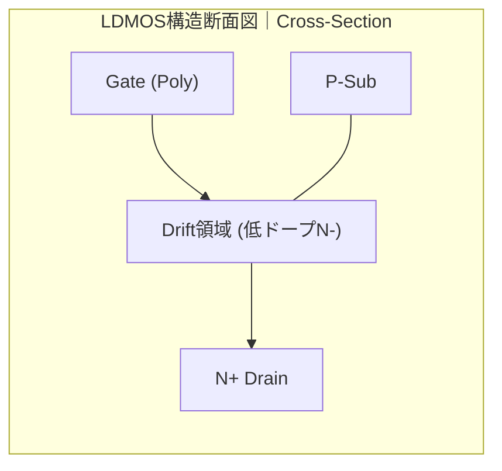
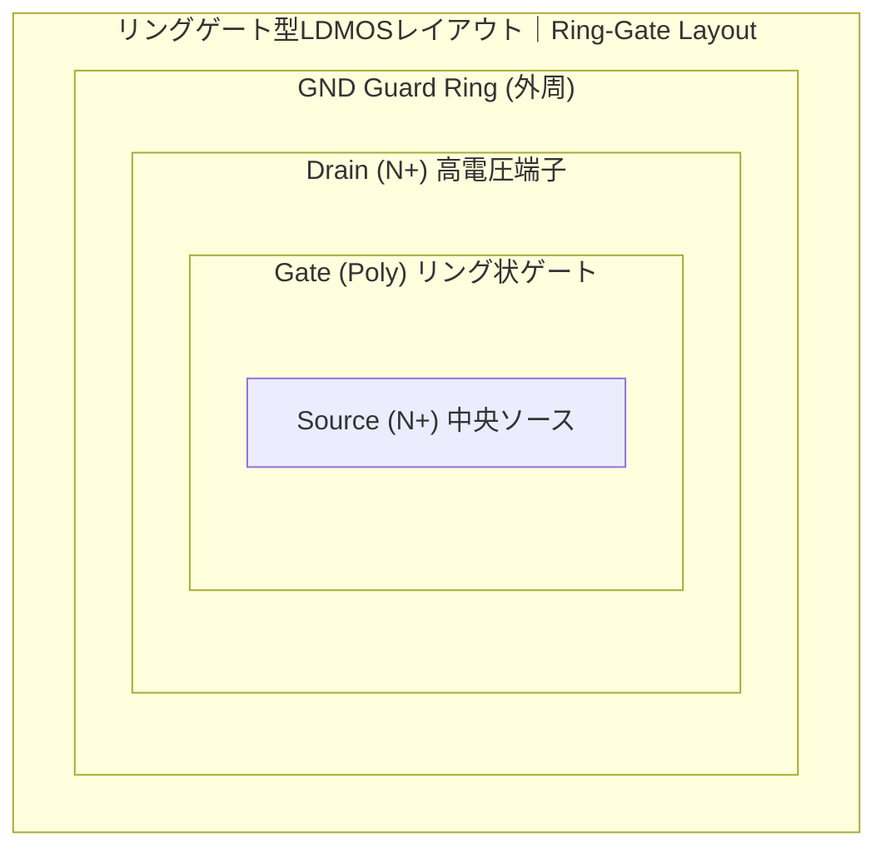

---

# ⚡ LDMOS（Laterally Diffused MOS）

---

## 📘 概要｜Overview

**LDMOS（Laterally Diffused MOS）** は、**高電圧に対応するための横方向拡散型のMOSトランジスタ構造**です。  
**LDMOS** is a laterally diffused MOS transistor structure designed for high-voltage applications.

**主な用途｜Main applications:**

- **パワーマネジメントIC（PMIC）**  
  *Power management ICs*
- **モータ・LEDドライバ**  
  *Motor and LED drivers*
- **車載用SoC（高耐圧I/O含む）**  
  *Automotive SoCs including high-voltage I/Os*

---

## 🏗️ 構造と特徴｜Structure and Features





---

## 📐 特性と設計パラメータ｜Characteristics and Design Parameters

| 項目｜Item | 解説｜Description |
|--------|--------|
| **耐圧範囲**<br>Breakdown Voltage | 30V〜700V（構造・プロセスに依存）<br>30V–700V depending on structure/process |
| **オン抵抗**<br>On-Resistance | Drift長に比例。低抵抗化にはセル配置やレイアウトの工夫が必要<br>Proportional to drift length; optimized via layout |
| **ゲート酸化膜**<br>Gate Oxide | 厚膜酸化（>10nm）で高電圧動作をサポート<br>Thick oxide prevents breakdown |
| **寄生素子**<br>Parasitic Effects | 高電圧印加時の寄生npnトランジスタ・ラッチアップ対策が重要<br>Suppression of latch-up is critical |

---

## ⚙️ SOI基板構造による高耐圧化｜SOI-Based High Voltage Structure

```text
【SOI LDMOS構造｜SOI LDMOS Cross-Section】

    ┌──────────────┐
    │   Metal / Passivation  │
    ├──────────────┤
    │       Gate (Poly)       │
    ├──────────────┤
    │   Drift / N− Region    │ ← 高耐圧ドレイン拡散
    ├──────────────┤
    │   P-Body / N+ Source   │
    ├──────────────┤
    │   SOI Layer (Si)       │ ← トランジスタ層
    ├──────────────┤
    │   BOX (SiO₂)           │ ← Buried Oxide 絶縁層
    ├──────────────┤
    │   Handle Wafer (Sub)   │ ← 基板バルク不要（浮遊）
    └──────────────┘
```

| 特徴｜Feature | 解説｜Description |
|--------|--------|
| **寄生素子抑制**<br>Parasitic Suppression | 寄生npn構造をBOXで絶縁<br>BOX layer eliminates latch-up path |
| **電界集中抑制**<br>Field Relaxation | BOXが基板方向の電界を抑制し高耐圧<br>Electric field diverted from bulk |
| **高速応答**<br>Fast Switching | Junction容量が小さくスイッチング損失が少ない<br>Low parasitic capacitance |
| **熱設計**<br>Thermal Consideration | 熱がBOXに閉じ込められるため放熱設計が必要<br>Requires thermal-aware layout |

---

## 🧪 実装上の注意点｜Implementation Notes

- **空乏層拡張方向の考慮**  
  *Layout must account for lateral depletion extension*
- **寄生バイポーラ抑制**  
  *Use guard rings to prevent latch-up*
- **セル密度と放熱のトレードオフ**  
  *Balance between packing density and heat dissipation*

---

## 📚 教材的意義｜Educational Relevance

- **横方向拡散と電界制御の理解**に最適  
  *Ideal to understand lateral diffusion and field control*
- **HV-CMOSとの構造比較**ができる  
  *Supports structural comparison with HV-CMOS*
- **パワーSoC設計への導入技術**として重要  
  *Key knowledge for power SoC design*

---

## 🔗 関連リンク｜Related Topics

- [📘 応用編 第2章｜高耐圧デバイス 全体README](../d_chapter2_high_voltage_devices/README.md)  
  **章全体の構成と関連技術の導入**  
  *Chapter 2 Top: Overview of high-voltage devices and structure of this section*

- [`hvcmos.md`](./hvcmos.md)  
  **CMOSプロセス互換での高耐圧化技術**  
  *High-voltage CMOS with process compatibility*

- [`layout_rules.md`](./layout_rules.md)  
  **LDMOSレイアウト制約と最適化**  
  *Layout constraints and optimization for LDMOS*

- [基礎編 第4章｜MOSトランジスタの特性](../chapter4_mos_characteristics/)  
  **MOS構造と寄生素子の理解**  
  *Understanding MOS structure and parasitic elements*

---

© 2025 Shinichi Samizo / MIT License
