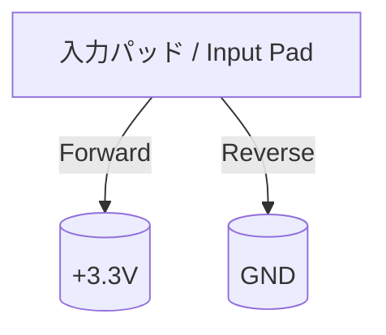

---

# 🔧 ESD保護素子の構造と動作原理  
**🔧 Structure and Operating Principles of ESD Protection Devices**

---

## 📘 概要 / Overview

ESD保護回路では、**高電圧スパイクを安全に逃がすための素子**が重要な役割を果たします。  
ここでは、代表的なESD保護素子の構造とその動作原理について解説します。

In ESD protection circuits, **devices that safely divert high-voltage pulses** are crucial.  
This section explains the **structure and operation** of commonly used ESD protection devices.

---

## 🔋 主なESD保護素子と特徴 / Typical ESD Devices and Characteristics

| 素子名 / Device | 特徴 / Characteristics | 主な用途 / Typical Use |
|-----------------|-------------------------|-------------------------|
| **ダイオード**<br>Clamp Diode | 単純・高速・低容量<br>Simple, fast, low capacitance | 低電圧I/Oの基本構成<br>Basic for low-voltage I/O |
| **GGNMOS**<br>Gate-Grounded NMOS | 放電時のみ動作・低ON抵抗<br>Conducts only during discharge, low resistance | パッド横・電源ライン保護<br>Pad-side, power rail |
| **SCR**<br>Silicon Controlled Rectifier | 高電流耐性・トリガ必要<br>Handles high current, needs trigger | パワーライン・高耐圧I/O<br>Power, high-voltage I/O |
| **TLP/TVS**<br>Transient Protection Diodes | パッケージ外付け・応答高速<br>Fast, external protection | センサ端子・外部IF<br>Sensor, external interface |

---

## 📌 各素子の構造と動作原理 / Structure & Operation of Each Device

### ① クランプダイオード（Clamp Diode）



- ➕ 順方向：VDD側に電流を逃がす  
- ➖ 逆方向：GND側へ電流を吸収  
- ✅ 特徴：**高速応答・低容量・構造が単純**  
- ⚡ 対象：CMOSの標準セルや低電圧I/O保護に有効

---

### ② GGNMOS（Gate-Grounded NMOS）

```mermaid
flowchart TB
    IO[入力 I/O Pad]
    D[Drain]
    S[Source]
    G[Gate (GND固定)]

    IO --> D
    D -. 放電時導通 .-> S
    S --> GND
    G --> GND
```

- 🔒 **ゲートをGNDに固定**し、常時OFF  
- ⚡ 放電時（V > Vt + Δ）でNMOSが急激にON  
- 🔁 **寄生バイポーラ（n+/p-sub/n+）が動作し大電流を処理**  
- ⬇️ 電流はソース→ドレインへ逃がす（パッド→GND）

---

### ③ SCR（Silicon Controlled Rectifier）

- 🔋 **NPN-PNPの寄生構造**を利用（四層構造）  
- ⚡ 一度トリガされると**非常に低いオン抵抗で導通維持**  
- 💥 誤トリガや回復困難なラッチ状態が課題  
- 🧪 **LVTSCR（Low-Voltage Triggered SCR）**で制御性を改善

```mermaid
flowchart LR
    A[Anode (+)]
    Pp[P+]
    N1[N-]
    P2[P-]
    N2[N+]
    K[Cathode (−)]

    A --> Pp --> N1 --> P2 --> N2 --> K
    Pp -. 寄生NPN .- P2
    N1 -. 寄生PNP .- N2
```

---

## ⚖️ 各素子の比較 / Device Comparison Table

| 指標 / Metric | ダイオード<br>Diode | GGNMOS | SCR |
|----------------|-----------------------|--------|-----|
| **応答速度**<br>Response Speed | ◎ Very Fast | ○ Moderate | △ Triggered |
| **電流耐性**<br>Current Handling | △ Limited | ○ Good | ◎ Excellent |
| **容量負荷**<br>Capacitance | 小 Small | 中 Medium | 大 Large |
| **レイアウト面積**<br>Layout Area | 小 Small | 中 Medium | 大 Large |

---

## 📚 教材的意義 / Educational Significance

- 各素子の**構造・応答モード**の違いを理解  
  Understand how device structure affects ESD response

- **ON条件・動作モード**を設計目線で学習  
  Learn trigger conditions and operation paths relevant to design

- 実際の**I/Oセルやパッド回路設計の理解**への導入  
  Gateway to I/O cell and pad circuit implementation

---

## 🔗 次のセクション / Next Section

👉 [`esd_layout.md`](./esd_layout.md)：保護素子を活かすレイアウト設計へ  
👉 [`esd_layout.md`](./esd_layout.md): Applying Devices to Layout Strategy

---

## 🧭 章全体への導線 / Link to Chapter Overview

📂 [ESD保護設計の章トップへ](../d_chapter3_esd_protection_design/README.md)  
📂 [Back to Chapter Overview: ESD Protection Design](../d_chapter3_esd_protection_design/README.md)

---

© 2025 Shinichi Samizo / MIT License
