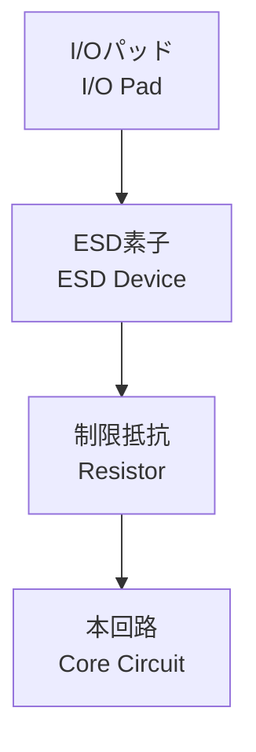

---

# 🧩 レイアウトにおけるESD設計の工夫  
**🧩 Layout Techniques for ESD Protection Design**

---

## 📘 概要 / Overview

ESD保護素子の設計だけでは不十分であり、**物理レイアウト上で適切な配置・接続パスを確保する**ことがESD耐性を左右します。  
高電流を逃がすには、「**広い配線パス」「短い距離」「確実な接地**」が必要です。

Designing the ESD protection device alone is not sufficient —  
**Proper physical layout, current discharge path, and grounding are critical** to ensure ESD robustness.  
Wide metal paths, short distances, and solid connections to ground are essential.

> 🎯 **本セクションでは、ESDレイアウト設計の重要技術を解説します。**  
> 🎯 **This section explains key layout techniques for ESD-aware physical design.**

---

## 🔀 基本ESDレイアウト構成 / Basic ESD Layout Structure



- ✅ **順序：パッド → 保護素子 → 本回路**  
  Strictly follow the order: Pad → Protection Device → Core

- ⚡ **放電電流は回路ではなくESD素子で逃がす**  
  ESD current must bypass the core and be discharged via ESD devices

- 🛠️ **制限抵抗（typ. 数百Ω）**で過電流緩和  
  Series resistor (typically hundreds of ohms) helps reduce stress on the core

---

## 🔄 DPP距離（Discharge Path Proximity）

- **DPP = ESD素子とGND/VDD間の最短距離**  
  DPP = Minimum distance between ESD device and GND/VDD pad

- 📏 距離が長いと**寄生インダクタンスによる電圧上昇**が発生  
  Longer paths cause voltage spikes due to parasitic inductance

- ✅ **1〜2μm以内**が望ましく、PDKで制限されることも  
  Target DPP ≤ 1–2 μm, often specified in PDK rules

---

## 🛡️ ガードリングの配置 / Guard Ring Structure

- 🧩 **P+ や N+ のリングを素子周囲に配置**  
  Surround ESD devices with P+/N+ diffusion guard rings

- 🔰 **ラッチアップ防止や電界の集中を回避**  
  Prevent latch-up and reduce electric field concentration

- 🌐 GND側は**複数リング構成で効果向上**  
  GND guard rings in multiple rings enhance robustness

**Top View（例 / Example）**:
```
┌──────────────┐
│  P+ GND Ring │ ← 接地 / GND
│              │
│  ESD Device  │ ← 内部素子 / ESD Core
│              │
│  N+ VDD Ring │ ← 保護電圧 / VDD
└──────────────┘
```

---

## ⚠️ レイアウト時の注意点まとめ / Layout Design Checklist

| 項目 / Item | 内容 / Description | 設計意図 / Purpose |
|-------------|---------------------|---------------------|
| **配線幅**<br>Metal Width | 数μm以上の太配線を使用<br>Use wide metal (≥ few μm) | 高電流耐性、熱損傷防止<br>Prevent thermal damage |
| **接地経路**<br>Grounding | GND/VSSへの最短接続<br>Shortest path to GND | 電位上昇の防止<br>Suppress voltage rise |
| **シールド**<br>Shielding | 金属層での隣接回路シールド<br>Use metal shielding | 隣接回路への干渉防止<br>Reduce crosstalk |
| **対称性**<br>Symmetry | 双方向I/Oでは左右対称構成<br>Mirror layout for bidirectional I/O | 保護性能の均一化<br>Balanced protection |

---

## 📚 教材的意義 / Educational Significance

- 📐 回路図だけでは見えない**物理的設計力を養成**  
  Enhances layout-level thinking beyond schematics

- 🔍 ガードリングやDPPなど**PDKルールに基づく判断力**  
  Trains students to follow and interpret PDK layout constraints

- 🏭 **設計と製造現場の接点**を理解する教材に最適  
  Bridges layout design with real-world ESD concerns in manufacturing
  
---

## 🧠 補足：ESDレイアウトは“理屈”だけでは決まらない  
## 🧠 Supplement: ESD Layout Often Defies Pure Theory

ESDレイアウト設計は、教科書的なルールに従っても、**実際のチップでは想定通りに機能しないことが多々あります**。  
寄生インダクタンス、電流パスのばらつき、GND密度、DRC制約などが複雑に絡むため、**単一の理論最適解が存在しない**のが実情です。

Even if layout guidelines are followed correctly, **real-world ESD robustness often depends on factors that defy simple theory** — such as parasitic inductance, current path distribution, GND mesh density, and DRC constraints.

> ✅ 最適なESDレイアウトは、**複数の配置案を試作して評価しながら決定する**のが一般的です。  
> ✅ The best ESD layout is often found by **evaluating multiple layout samples on silicon**.

このように、ESD設計は**理論・設計ルール・実評価の三位一体**で成立する実践的領域です。

---

## 🔗 次のセクション / Next Section

👉 [`esd_spec.md`](./esd_spec.md)：ESD試験モデル（HBM, MM, CDMなど）と評価項目へ  
👉 [`esd_spec.md`](./esd_spec.md): ESD Models and Test Specifications

---

## 🧭 章全体への導線 / Link to Chapter Overview

📂 [ESD保護設計の章トップへ](../d_chapter3_esd_protection_design/README.md)  
📂 [Back to Chapter Overview: ESD Protection Design](../d_chapter3_esd_protection_design/README.md)

---

© 2025 Shinichi Samizo / MIT License
