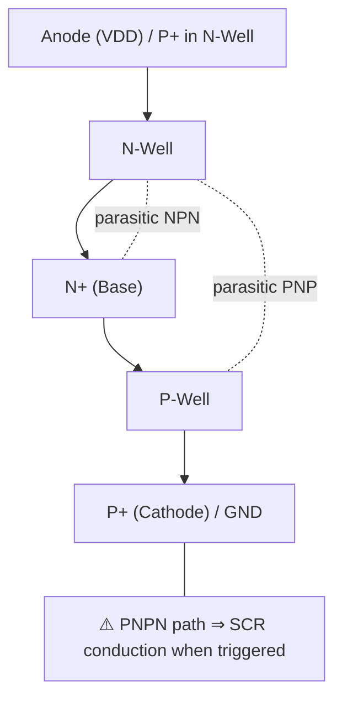

---

# 🛡️ ラッチアップ防止と寄生トランジスタ対策  
**🛡️ Latch-up Prevention and Parasitic Transistor Countermeasures**

---

## 📘 概要 | Overview

CMOSプロセスでは、**基板内に形成される寄生バイポーラ構造**により、  
「ラッチアップ（latch-up）」と呼ばれる**破壊的な電流経路**が生じる可能性があります。  
In CMOS processes, **parasitic bipolar structures** within the substrate can cause  
a destructive current path known as **latch-up**.

本節では、**ラッチアップの発生メカニズムと防止策をレイアウト視点から**整理します。  
This section outlines the **mechanism of latch-up and layout-based prevention techniques**.

---

## ⚠️ ラッチアップとは？ | What is Latch-up?

| 項目 / Item | 内容 / Description |
|-------------|---------------------|
| **構造 Structure** | P-Well / N-Well 間に形成される **PNPN構造（SCR）** Unintentional **PNPN (SCR)** structure between wells |
| **誘因 Triggers** | 静電気、電源ノイズ、過渡電圧など ESD, power noise, transient voltage spikes |
| **現象 Phenomenon** | 寄生バイポーラ素子が自己持続的に導通 Parasitic BJTs enter self-sustaining conduction |
| **結果 Result** | 電源-GND間に大電流が流れ素子が破壊 High current between VDD-GND → Device damage |

---

## 🔬 発生モデル：寄生SCR構造 | Parasitic SCR Model

> 🔍 このSCR構造により、**外部トリガで自励振動的に電流が流れる**ため、  
> **物理的隔離と電位制御**が設計上不可欠となります。  
> Once triggered, the SCR conducts persistently, making **physical isolation and potential control essential**.

---

## 🛠️ レイアウトでの主な対策 | Layout-Based Prevention Techniques

| 対策方法 / Method | 内容 / Description |
|-------------------|---------------------|
| **Guard Ring** | GND/VDDに接続したP+/N+リングで寄生電流の経路を外へ逃がす P+/N+ ring connected to GND/VDD that diverts parasitic currents |
| **Well Tap配置** | Wellの電位を固定し、ベース浮遊を防止 Stabilizes well potential to avoid floating base |
| **ディープウェル導入** | P-WellとN-Well間を深いN型拡散層で隔離（HVプロセス等） Use of deep N-well to isolate P-Well and N-Well (e.g., in HV processes) |
| **デバイス間距離の確保** | 最小隔離距離の設計ルールを厳守 Maintain minimum spacing between P/N devices per design rules |

---

## 📐 設計ルールの一例（0.18μm世代）  
## 📐 Example Design Rules (0.18μm Node)

- **Guard Ring幅 / Width**：3μm以上（電流値に応じて拡張）  
  *Minimum 3μm, larger for higher current handling*
- **Well Tap間隔 / Spacing**：40〜60μm以内に定期配置  
  *Placed every 40–60μm to stabilize potential*
- **Latchup Check（LUP）**：DRCとは別に**専用ツール**でチェック  
  *Latch-up rule checking is done separately from DRC, often using dedicated tools*

---

## 🎯 教材的意義 | Educational Perspective

- ⚠️ **回路図には現れない「構造的リスク」**を意識する思考訓練  
  Recognize **physical risks not visible in schematics**
- 🧩 ガードリングやウェルタップの**機能と重要性を構造で理解**  
  Understand the **function and necessity of guard rings and well taps** structurally
- 📐 **混載ICやアナログ設計に不可欠な視点**を養う  
  Develop layout strategies essential for **mixed-signal and analog designs**

---

## 🔗 次のセクション | Next Section

➡ [`layout_case_study.md`](./layout_case_study.md)：DRCルールとレイアウト事例の実践へ  
➡ *DRC Rule Application and Real Layout Case Studies*

---

🧱 応用編 第4章：レイアウト設計と最適化 /  
🧱 *Applied Chapter 4: Layout Design and Optimization*  
[📘 セクション一覧 / Section Index](../d_chapter4_layout_optimization/README.md)

---

© 2025 Shinichi Samizo / MIT License
