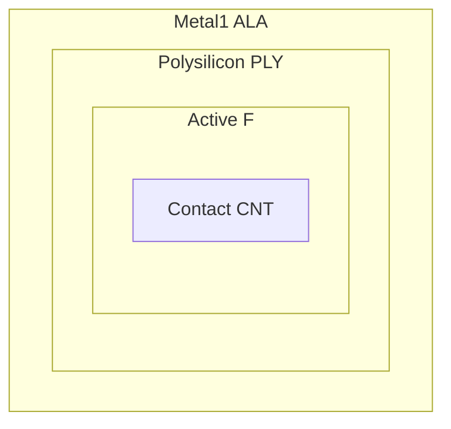

---

# 🧩 レイヤー整合とオーバーレイ設計原則  
**🧩 Layer Alignment and Overlay Design Principles**

---

## 📘 概要 | Overview

ICレイアウト設計において、各層（Poly、Metal、Viaなど）の**重なり（Overlay）**と**基準（Reference Layer）**は、  
DRCルールの中核を成し、**製造ばらつきや電気的接続の信頼性**を大きく左右します。  
In IC layout design, the **overlay and reference relationships** between layers (Poly, Metal, Via, etc.) are crucial for  
ensuring **manufacturability and connectivity reliability**.

本資料では、**PLY / CNT / ALA / HL（Metal1〜Via1）**の関係を中心に、**物理的整合性と設計指針**をまとめます。  
This document focuses on **PLY / CNT / ALA / HL** layers, explaining their **physical alignment and design guidelines**.

---

## 🔤 用語補足：Overlay と Overlap の違い  
## 🔤 Terminology Note: Overlay vs. Overlap

| 用語 / Term | 意味 / Meaning | 設計における使われ方 / In Design Context |
|-------------|----------------|-------------------------------------------|
| **Overlay（オーバーレイ）** | マスク間の**位置ずれ・整合性** *Mask misalignment or registration* | 製造誤差を考慮した**中心合わせ・マージン設計**に関わる *Affects centering and margin in lithography* |
| **Overlap（オーバーラップ）** | 図形同士の**重なり・包含関係** *Geometric overlap or enclosure* | CNT ⊆ ALA や PLY ⊇ F のような**被覆・接続設計**に関わる *Used for enclosures like CNT within ALA* |

> 💡 *In this document, we focus on “Overlay” as the manufacturing alignment between masks, while “Overlap” refers to intentional geometric enclosures between layers.*  
> 💡 本資料では「Overlay（整合誤差）」を主に扱いますが、「Overlap（幾何的重なり）」も設計意図として重要です。

---

## 📐 各レイヤーの基準層とオーバーレイ関係  
## 📐 Reference Layers and Overlay Relationships

| レイヤー / Layer | 基準層 / Reference Layer | オーバーレイ関係 / Overlay Relationship | 説明 / Description |
|------------------|--------------------------|-------------------------------------------|---------------------|
| **PLY** (Polysilicon) | **F** (Active region) | **PLY ⊇ F** (Fを完全に覆う) | ゲート形成用。Active領域にPolyを重ねてFETを形成 *Used for gate formation; overlaps Active (F) for FET* |
| **CNT** (Contact) | **PLY**, **ALA** | **CNT ⊆ PLY または ALA** (CNTはPLY/ALA内に収まる) | PolyやMetal1への接続孔。エンクロージャが必須 *Connects to Poly or ALA; full enclosure required* |
| **ALA** (Metal1) | **CNT** | **ALA ⊇ CNT** (CNTをエンクロージャ) | Contactを確実に被覆する最下層Metal。信号配線に使用 *Bottom metal layer enclosing contacts; used for routing* |
| **HL** (Via1) | **ALA**, **ALB** | **HL ⊆ ALA ∩ ALB** (上下Metal内に収める) | Metal1〜Metal2間の接続用Via。上下層に完全に重なる必要 *Via between Metal1 and Metal2; must fit within both layers* |

---

---

## 🛠️ 設計ルールのポイント | Design Rule Highlights

| 項目 / Item | 指針 / Guideline |
|-------------|------------------|
| **最小エンクロージャ** Minimum Enclosure | CNT→PLYやCNT→ALAで**0.06μm以上**（PDK依存） ≥ 0.06μm enclosure for CNTs by PLY/ALA (depends on PDK) |
| **Overlayマージン** Overlay Margin | 各マスク誤差±0.04μm程度を許容。**中心合わせが基本** Mask misalignment margin ±0.04μm; centering is standard |
| **中心配置原則** Centering Rule | Contact/Viaは上下層の**中心に配置**してマージン確保 Place contacts/vias at center of top/bottom layers |
| **密度・CMP考慮** Density / CMP | Dummy Fillとの干渉防止、**Spacingルールとの整合が重要** Ensure compatibility with dummy fills and spacing rules |

---

## 🔍 オーバーレイ不良の例 | Examples of Overlay Misalignment

- ❌ CNTがALAから**はみ出す** → 接続不良、リーク、歩留まり低下  
  *CNT extends beyond ALA → connection failure or leakage*
- ❌ HLがALAやALBから**ずれる** → Viaオープンや抵抗増加  
  *HL misaligned with ALA/ALB → via open or increased resistance*

---

## 🎯 教材的意義 | Educational Perspective

- DRCチェックだけでなく、**物理的重なりの設計意図**を理解する  
  Understand not just DRC, but the **design rationale behind overlay**
- PDKルールの**“重なり”と“被覆”の意味**を構造図で直感化できる  
  Visualize the **meaning of overlap and enclosure** in layout structures
- 自動配置ツールの制約も**手動レイアウト理解を通じて補完**可能  
  Compensate for auto-layout limitations via manual design insights

---

## 🔗 関連セクション | Related Sections

- [`layout_principles.md`](./layout_principles.md)：レイアウト基本構造とルール  
- [`cmp_dummy_pattern.md`](./cmp_dummy_pattern.md)：CMP均一化の設計配慮  
- [`ir_drop_and_em.md`](./ir_drop_and_em.md)：配線信頼性とVia対策  
- [`d_chapter6_pdk_and_eda_environment/`](../d_chapter6_pdk_and_eda_environment/)：PDKルール全体像とEDAツール連携

---

🧱 応用編 第4章：レイアウト設計と最適化 /  
🧱 *Applied Chapter 4: Layout Design and Optimization*  
[📘 セクション一覧 / Section Index](./README.md)

---

© 2025 Shinichi Samizo / MIT License
