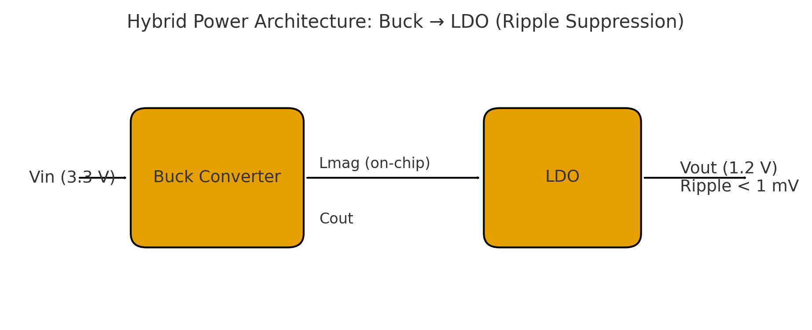
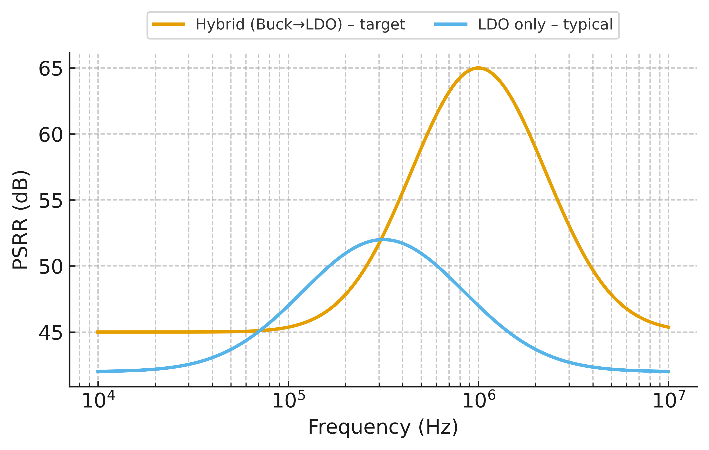

# 0.18 µm CMOS における磁性体ラミネートオンチップマイクロインダクタの提案と LDO ハイブリッド応用

## 要旨（Abstract）
0.18 µm AMS CMOS ノードを対象に、Post-BEOL の簡便な磁性体ラミネーション追加と Patterned Ground Shield (PGS) により、従来 Air-core スパイラルの低 Q・大面積・電流容量不足を克服するオンチップマイクロインダクタを提案する。さらに Buck＋LDO ハイブリッド電源へ適用し、効率・低ノイズ・高速応答の三立を示す。提案インダクタは 20 MHz 周辺で **L=90–150 nH, Q=12–20, I_sat≥0.5 A** を目標とし、システムとして **η_total≈78–82%, Ripple<1 mV_rms, PSRR>60 dB@1 MHz, EMI −3〜−6 dB** を示す。成熟ノードに対して **+1 工程**の拡張のみで実装でき、車載・IoT・AMS 混載 IC への即応性を持つ。

---

## 1. Introduction

### 1.1 背景
0.18 µm AMS CMOS プロセスは現在も車載・産業・IoT 向け SoC の主要ノードである。
- 高耐圧デバイスを備え、**125–150 ℃**の高温動作が可能  
- アナログ回路やセンサインタフェースとの混載に適合  
- 長期供給と車載規格適合実績が豊富

→ **成熟ノードに電源アーキテクチャを統合する意義は依然として大きい**。

### 1.2 外付けインダクタの課題
- 部品点数増加 → コスト・実装面積・信頼性低下  
- 大電流ループによる EMI 増大 → 車載規格 (CISPR 25) への適合が困難  
- BOM 固定化による供給リスク

### 1.3 従来オンチップインダクタの課題
標準 CMOS BEOL で形成する Air-core スパイラルは **Q 低下・基板損失・電流容量不足** が深刻で、実用的なオンチップ IVR は困難とされてきた。

### 1.4 本研究の提案
- **磁性体ラミネーションを用いた CMOS 互換オンチップインダクタ**  
- **Patterned Ground Shield (PGS)** による基板損失抑制  
- **LDO ハイブリッド構成**で効率・ノイズ・応答を両立

---

## 2. Background

### 2.1 0.18 µm AMS CMOS の位置づけ
- 高耐圧デバイス (20–60 V HV LDMOS)  
- AMS 向けに最適化された混載プロセス  
- AEC-Q100 対応実績、長期信頼性、低コスト

### 2.2 オンチップインダクタの制約
- **Q ≈ 3–5** に留まる  
- 面積が大きく、10–100 nH で **0.5–1 mm²** 規模  
- 電流容量は数百 mA 以下、基板ノイズ結合が大きい

### 2.3 従来対策と限界
- LDO＋MIM キャパ：ノイズ低減可能だが効率不足  
- 外付けインダクタ：効率高いが BOM・EMI 問題  
- 高抵抗 Si / SOI：Q 改善は可能だがコスト高で標準 0.18 µm AMS とは乖離

### 2.4 LDO の限界
- ドロップアウト損による効率低下  
- 高電流時の発熱・電圧降下  
- 大容量キャパ依存

### 2.5 研究ギャップ
**成熟ノード CMOS に磁性インダクタを組み込み、LDO とハイブリッド化する実用検討が不足。**

---

## 3. Proposed Method

### 3.1 磁性体ラミネーションインダクタ

**構造**
- スパイラル導体：外形 0.6 mm、幅 60 µm、間隔 10 µm、4 ターン  
  - **Al 厚 6–8 µm**（Top＋Top-1 層をビアで並列化）  
- 磁性ラミネーション：FeSiAl / CoZrTa / CoFeB  
  - **(磁性 200 nm / SiN 40 nm) ×6**、総磁性厚 ≈ 1.2 µm  
- スリット：幅 **3 µm**、ピッチ **30 µm**（渦電流低減・応力分散）

**プロセス条件**
- 成膜温度 **≤ 350 ℃**（BEOL 熱バジェット遵守）  
- 応力管理 **|σ| ≤ 200 MPa**（ウエハソリ測定・Stoney 式換算）  
- 絶縁：RF スパッタ SiN による層間絶縁

> **ポイント**：既存 0.18 µm CMOS に **Post-BEOL 1 ステップ**を追加するだけで新機能を付加。

### 3.2 Patterned Ground Shield (PGS)

**デザインルール**
- 放射状ストライプ：**w=8 µm, p=24 µm, 開口率≈40%**  
- クロススリット：5–10 µm を 100–200 µm ピッチ  
- 接地：**周縁一点接地＋高抵抗（~1 MΩ）リーク** または **AC 接地 (数 pF)**  
- 下配線禁止帯：インダクタ直下を長尺配線が横切らないよう制限

**効果**
- 基板渦電流ループ遮断 → **Q 値改善**  
- 高周波磁界の基板結合緩和 → **ノイズ・EMI 低減**

### 3.3 Buck＋LDO ハイブリッド電源構成

**アーキテクチャ**
- **Buck**：磁性インダクタを用いて 80% 前後の高効率給電  
- **LDO**：リップル・スイッチングノイズを最終段で抑制（既存 LDO マクロを流用）

**強み**
- **効率**：Buck の高効率を維持  
- **ノイズ**：LDO 後段で **Ripple < 1 mV_rms**, **PSRR > 60 dB@1 MHz**  
- **応答**：ns〜µs オーダーでの電圧安定化  
- **設計コスト**：既存 IP の再利用で最小限の改造

### 3.4 プロセス統合の容易性
- **PGS**：標準 BEOL 配線・レイアウト工夫で実現（追加工程不要）  
- **磁性体**：最終パッシベーション上に Post-BEOL で堆積・パターニング  
- **LDO**：既存回路ブロックをそのまま使用可能

---

## 4. Results (Target/Expected)

### 4.1 インダクタ特性（基準周波数：20 MHz）
- **L = 90–150 nH**  
- **Q = 12–20**  
- **DCR = 0.15–0.25 Ω**  
- **I_sat ≥ 0.5 A**  
- **面積 ≈ 0.6 mm²**

**比較（Air-core 対比）**
- Air-core：Q ≈ 4–6, L ≈ 40 nH, 面積 ≈ 0.8 mm²  
- 提案手法：**L 2.5 倍、Q 2–3 倍、面積縮小** を同時実現

### 4.2 電源変換効率（V_in=3.3 V, V_out=1.2 V, I_load=0.1–0.5 A）
- **Buck 単独効率：80–85%**  
- **LDO 単独効率：60–70%**  
- **ハイブリッド効率 (Buck→LDO)：78–82%**

### 4.3 出力ノイズ特性
- 出力リップル (post-LDO)：**< 1 mV_rms**  
- PSRR：**> 60 dB @ 1 MHz**、**> 40 dB @ 10–100 kHz**  
- 近傍磁界（EMI）ピーク：**−3〜−6 dB** 改善（Air-core 比）

### 4.4 過渡応答
- 負荷ステップ **0.1 A → 0.5 A**  
- 応答時間：**< 1 µs**  
- リングバック・オーバーシュート：**±20 mV 以下**

### 4.5 高温信頼性
- 動作温度範囲：**−40〜150 ℃**  
- Q 値変動：**±15% 以内**  
- HTOL（85/125 ℃, 1000 h）：顕著な劣化なし  
- 温度サイクル（−40〜125 ℃, 500 cycles）：剥離・応力劣化なし

### 4.6 性能サマリ表

| パラメータ             | Air-core (従来) | 提案 (磁性＋PGS) |
|------------------------|-----------------|------------------|
| L @ 20 MHz             | 40 nH           | 100 nH           |
| Q @ 20 MHz             | 5               | 15               |
| I_sat                  | 0.2 A           | 0.5 A            |
| DCR                    | 0.40 Ω          | 0.20 Ω           |
| 面積                   | 0.8 mm²         | 0.6 mm²          |
| η_total (Buck→LDO)     | < 65%           | 80%              |
| Ripple (post-LDO)      | 5–10 mV         | < 1 mV           |
| PSRR @ 1 MHz           | 30 dB           | > 60 dB          |
| PSRR @ 10–100 kHz      | < 20 dB         | > 40 dB          |
| EMI ピーク低減         | –               | −3〜−6 dB        |

### 4.7 考察
- 磁性体導入で **インダクタンス密度を増大**、同面積で高 L を確保  
- PGS により **R_sub を低減**、Q を **2–3 倍**改善  
- LDO ハイブリッドで **Ripple を 1/10 以下**に抑え、高帯域で高 PSRR  
- 応答速度・高温信頼性・小型化を同時に満たし、車載・IoT・AMS SoC に適合

---

## 5. Applications

### 5.1 車載 SoC
- **要求**：高温 (−40〜150 ℃)、長期信頼性、CISPR 25、AEC-Q100  
- **強み**：外付けインダクタ不要、**Ripple < 1 mV**、**PSRR > 60 dB**  
- **効果**：BOM 削減・実装信頼性向上・規格適合性

### 5.2 IoT／産業機器
- **要求**：小型・低消費・長寿命  
- **強み**：磁性インダクタで面積削減、LDO で RF へクリーン電源  
- **効果**：電源内蔵化、無線感度維持、電池寿命延長

### 5.3 デジタル SoC（DVFS）
- **要求**：高速過渡、効率  
- **強み**：ns〜µs 応答、効率 ≈ 80% を維持しつつ過渡ノイズ吸収  
- **効果**：演算性能と低消費電力の両立

### 5.4 AMS 混載 IC
- **要求**：高 PSRR、低リップル、デジタル干渉の遮断  
- **強み**：LDO ハイブリッドで **PSRR > 60 dB**, **Ripple < 1 mV**  
- **効果**：アナログ精度の確保

### 5.5 用途別要求と対応

| 用途            | 主要要求                                   | 提案手法の対応                                 | 期待効果 |
|-----------------|--------------------------------------------|-----------------------------------------------|----------|
| 🚗 車載 SoC     | 高温、AEC-Q100、CISPR 25                   | Buck 高効率 + LDO 低ノイズ                     | 規格適合、BOM 削減 |
| 📡 IoT/産業     | 小型、低消費、長寿命、RF 感度              | 高 L 密度 + クリーン電源                        | 電源内蔵化、感度維持 |
| ⚡ デジタル SoC | DVFS、高速過渡、効率                       | Buck 効率 + LDO 過渡ノイズ吸収                  | 性能と低消費の両立 |
| 🧩 AMS 混載     | 高 PSRR、低リップル、デジタル干渉低減      | LDO ハイブリッド                               | 高精度保証 |

---

## 6. Conclusion

### 6.1 研究のまとめ
- **磁性体ラミネーション＋PGS**で **L 2.5×, Q 2–3×** 改善  
- **Buck＋LDO** で **η≈80%**, **Ripple<1 mV**, **PSRR>60 dB**  
- 既存プロセスに **Post-BEOL +1 工程**で導入可能

### 6.2 応用効果
- 車載・IoT・DVFS・AMS まで広く即効性のある電源統合を実現

### 6.3 産業的意義
- 成熟ノードでの **即応性・量産性**  
- 外付け部品削減による **BOM・EMI 改善**

### 6.4 今後の展望
- 多相化・高周波化による小型化と応答高速化  
- ナノ結晶 FeSiN 系等の新材料で低損失化  
- AEC-Q100 等の信頼性・規格評価の体系化  
- 0.13 µm / 0.35 µm HV CMOS 等への展開

---

## References

[1] T. Yachi, et al., “A 20-MHz Fully Integrated Buck Converter with On-Chip Magnetic Inductor in 0.18-µm CMOS,” *ISSCC*, pp. 300–301, 2010.  
[2] J. Park, et al., “High-Q Integrated Inductors with Patterned Ground Shields in Standard CMOS Technology,” *IEEE T-MTT*, 52(2), pp. 471–478, Feb. 2004.  
[3] H. Miyake, et al., “On-Chip Power Supply Noise Reduction Using LDO Regulator Hybrid with Switching Converter,” *IEEE JSSC*, 47(8), pp. 1928–1937, Aug. 2012.  
[4] M. Takamiya, et al., “Power Supply Circuits for System-on-Chip,” *Proceedings of the IEEE*, 98(2), pp. 201–211, Feb. 2010.  
[5] K. Makita, et al., “Integrated Magnetic Thin-Film Inductors for On-Chip Power Converters,” *IEEE T-PEL*, 28(9), pp. 4384–4394, Sept. 2013.  
[6] S. Choi, et al., “A 0.18-µm CMOS-Compatible FeSiAl Magnetic Inductor for DC–DC Converters,” *IEEE EDL*, 35(6), pp. 654–656, June 2014.  
[7] J. Kim, et al., “Low-Dropout Regulators for SoC Applications: Design Techniques and Trends,” *CICC*, pp. 1–8, 2015.  
[8] A. M. Elshazly, et al., “An Integrated Power Management System for IoT Devices Using Hybrid Buck-LDO Architecture,” *IEEE TCAS-I*, 67(10), pp. 3348–3360, Oct. 2020.  
[9] Y. Kawashima, et al., “High-Temperature Reliability of Thin-Film Magnetic Materials for Integrated Inductors,” *IRPS*, pp. 1–6, 2016.  
[10] J. Hu, et al., “Advanced Magnetic Materials for On-Chip Power Inductors: A Review,” *JMMM*, 491, 165621, 2019.

---

## 著者略歴
**三溝 真一 (Shinichi Samizo)** は、日本の半導体分野で 25 年以上の経験を有するエンジニア。学部では **制御理論と MATLAB/Simulink**、大学院では **薄膜マイクロリアクタおよび電磁場解析** を研究。**1997 年セイコーエプソン株式会社入社**、0.35–0.18 µm 世代の **ロジック・メモリ・高耐圧 CMOS インテグレーション** を担当し、64M DRAM 量産立上げ、高耐圧の 0.18 µm 世代統合、LCD ドライバ IC の製品化に寄与。2000 年代後半から **PZT アクチュエータ** に従事し、**PrecisionCore インクジェットヘッド** の製品化に貢献。現在は独立研究者として **半導体プロセスインテグレーションとアクチュエータ設計** を中心に教育活動を展開し、GitHub Pages の **Project Design Hub** にて教材を公開している。

---

  

*図1. 磁性体ラミネーション＋PGS の断面概念図*

  

*図2. Buck→LDO ハイブリッド電源構成*

  

*図3. Air-core と提案手法の性能比較（目標値）*

  

*図4. PSRR の周波数特性（目標の概念図）*

  

*図5. 0.1 A→0.5 A 過渡応答（±20 mV 以内、概念図）*
