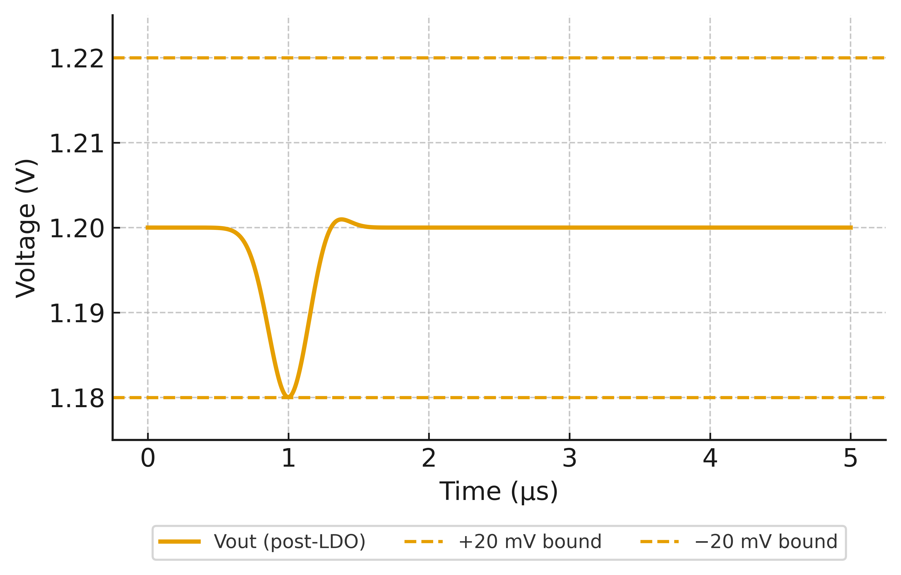

# 0.18 µm CMOS における磁性体ラミネートオンチップマイクロインダクタの提案と LDO ハイブリッド応用

## 要旨（Abstract）
0.18 µm AMS CMOS ノードを対象に、Post-BEOL で磁性体ラミネーションと Patterned Ground Shield (PGS) を付加することで、従来の Air-core スパイラルに内在する低 \(Q\)・大面積・電流容量不足を克服するオンチップ・マイクロインダクタを提案する。さらに Buck＋LDO ハイブリッド電源へ適用し、効率・低ノイズ・高速応答の三立を示す。提案インダクタは 20 MHz 付近で **\(L=90\text{–}150~\mathrm{nH},~Q=12\text{–}20,~I_\mathrm{sat}\ge 0.5~\mathrm{A}\)** を目標とし、システムとして **\(\eta_\mathrm{total}\approx 78\text{–}82\%\)、出力リップル \(<1~\mathrm{mV_{rms}}\)、PSRR \(>60~\mathrm{dB}@1~\mathrm{MHz}\)、EMI ピーク −3〜−6 dB** を示す。成熟ノードに対して **+1 工程**のみで実装でき、車載・IoT・AMS 混載 IC に即応する。

---

## 1. Introduction

### 1.1 背景
0.18 µm AMS CMOS プロセスは現在も車載・産業・IoT 向け SoC の主力ノードである。
- 高耐圧デバイスにより **125–150 ℃** 動作が可能  
- アナログ／センサ回路の混載適性  
- 長期供給と車載規格（AEC-Q100 等）への適合実績

→ **成熟ノードにおける電源アーキテクチャの統合は依然として意義が大きい。**

### 1.2 外付けインダクタの課題
- 部品点数増によるコスト・実装面積・信頼性の悪化  
- 大電流ループ起因の EMI 増加（CISPR 25 への適合が難化）  
- BOM 固定化による供給リスク

### 1.3 従来オンチップインダクタの課題
標準 CMOS BEOL の Air-core スパイラルは **低 \(Q\)**、**基板損失**、**電流容量不足** が顕著で、実用的なオンチップ IVR は難しかった。

### 1.4 本研究の提案
- **磁性体ラミネーション**によるインダクタンス密度向上  
- **PGS** による基板損失の低減  
- **Buck＋LDO ハイブリッド**で効率・ノイズ・応答を両立（Fig. [2](#fig2)）

---

## 2. Background

### 2.1 0.18 µm AMS CMOS の位置づけ
- 高耐圧 LDMOS（20–60 V）により広電源範囲と高温信頼性  
- AMS 混載適性、長期供給、コスト効率

### 2.2 オンチップインダクタの制約
- \(Q \approx 3\text{–}5\) に留まる  
- 10–100 nH で **0.5–1 mm²** 規模  
- 数百 mA 超での発熱・電圧降下、基板ノイズ結合

### 2.3 従来対策と限界
- LDO＋MIM キャパ：ノイズは低いが効率不足  
- 外付けインダクタ：高効率だが BOM・EMI の悪化  
- 高抵抗 Si / SOI：\(Q\) は上がるがコスト高で汎用 0.18 µm AMS と乖離

### 2.4 LDO の限界
- ドロップアウト損による効率低下  
- 高電流時の発熱  
- 大容量キャパシタへの依存

### 2.5 研究ギャップ
**成熟ノード CMOS に磁性インダクタを組み込み、LDO とハイブリッド化した即実用レベルの検討が不足。**

---

## 3. Proposed Method

### 3.1 磁性体ラミネーション・インダクタ（Fig. [1](#fig1)）
**構造**  
- スパイラル導体：外形 0.6 mm、線幅 60 µm、間隔 10 µm、4 ターン  
  - 上位 2 層 Al（Top/Top-1）をビア並列化（厚さ 6–8 µm 相当）  
- 磁性ラミネーション：FeSiAl / CoZrTa / CoFeB  
  - \((\text{磁性 }200~\mathrm{nm} / \text{SiN }40~\mathrm{nm}) \times 6\)、総磁性厚 ≈ 1.2 µm  
- スリット：幅 **3 µm**、ピッチ **30 µm**（渦電流低減・応力分散）

**プロセス条件**  
- 成膜温度 **\(\le 350~^\circ\mathrm{C}\)**（BEOL 熱バジェット遵守）  
- 応力管理 **\(|\sigma| \le 200~\mathrm{MPa}\)**（ウエハソリ／Stoney 式）  
- 絶縁：RF スパッタ SiN

> 既存 0.18 µm CMOS に **Post-BEOL +1 工程**で新機能を付加。

### 3.2 Patterned Ground Shield (PGS)
**設計指針**  
- ストライプ幅 8 µm／ピッチ 24 µm、開口率 ≈ 40%  
- 周縁一点接地＋高抵抗（~1 MΩ）リーク、または AC 接地（数 pF）  
- 直下長尺配線の禁止帯設定

**効果**  
- 基板渦電流ループを遮断し \(R_\text{sub}\) を低減 → \(Q\) 向上  
- 高周波磁界の基板結合を緩和 → ノイズ／EMI 低減

### 3.3 Buck＋LDO ハイブリッド電源（Fig. [2](#fig2)）
**構成**  
- Buck：高効率給電（80% 前後）  
- LDO：スイッチングリップルを最終段で吸収（既存 LDO マクロ流用）

**利点**  
- 効率：Buck の高効率を維持  
- ノイズ：LDO 後段で **\( \text{Ripple} < 1~\mathrm{mV_{rms}}\)**、**PSRR \(>60~\mathrm{dB}@1~\mathrm{MHz}\)**  
- 応答：ns〜µs オーダーで安定化  
- 設計コスト：既存 IP 再利用で改修最小化

### 3.4 プロセス統合
- **PGS**：標準 BEOL 配線とレイアウト工夫で実現（工程追加なし）  
- **磁性体**：最終パッシベーション上で堆積・パターニング  
- **LDO**：既存ブロックを変更なく統合

---

## 4. Results（Targets/Expected）

### 4.1 インダクタ特性（20 MHz 基準）
- \(L = 90\text{–}150~\mathrm{nH}\)  
- \(Q = 12\text{–}20\)  
- \(\mathrm{DCR} = 0.15\text{–}0.25~\Omega\)  
- \(I_\mathrm{sat} \ge 0.5~\mathrm{A}\)  
- 面積 ≈ 0.6 mm²

**Air-core 比**：\(L\) 2.5×、\(Q\) 2–3×、面積縮小を同時実現。

### 4.2 変換効率（\(V_\mathrm{in}=3.3~\mathrm{V},~V_\mathrm{out}=1.2~\mathrm{V},~I_\mathrm{load}=0.1\text{–}0.5~\mathrm{A}\)）
- Buck 単独：80–85%  
- LDO 単独：60–70%  
- ハイブリッド：**78–82%**

### 4.3 出力ノイズ／EMI（Fig. [4](#fig4)）
- 出力リップル（LDO 後）：**\(<1~\mathrm{mV_{rms}}\)**  
- PSRR：**\(>60~\mathrm{dB}@1~\mathrm{MHz}\)**、**\(>40~\mathrm{dB}@10\text{–}100~\mathrm{kHz}\)**  
- EMI ピーク：**−3〜−6 dB** 改善（Air-core 比）

### 4.4 過渡応答（Fig. [5](#fig5)）
- 負荷ステップ **0.1 A → 0.5 A**  
- 応答時間 **\(<1~\mu\mathrm{s}\)**、オーバー／アンダーシュート **\(\pm 20~\mathrm{mV}\)** 以内

### 4.5 高温信頼性
- 動作温度 **−40〜150 ℃**  
- \(Q\) 変動 **±15% 以内**  
- HTOL（85/125 ℃, 1000 h）劣化なし、温度サイクル（−40〜125 ℃, 500 cycles）剥離・応力劣化なし

### 4.6 性能サマリ（掲載図：Fig. [3](#fig3)）
主要指標の比較を Fig. [3](#fig3) に示す。

---

## 5. Applications
- **車載 SoC**：高温・AEC-Q100・CISPR 25 への適合、ADC/DAC 電源精度維持  
- **IoT／産業**：小型・低消費、RF ブロックへのクリーン電源  
- **デジタル SoC（DVFS）**：ns〜µs 応答と ≈80% 効率の両立  
- **AMS 混載 IC**：高 PSRR／低リップルでデジタル干渉を遮断

---

## 6. Conclusion
- **磁性体ラミネーション＋PGS**により **\(L\) 2.5×・\(Q\) 2–3×** を実現  
- **Buck＋LDO** で **\(\eta\approx 80\%\)**、**\(\text{Ripple}<1~\mathrm{mV_{rms}}\)**、**PSRR \(>60~\mathrm{dB}\)**  
- 既存 0.18 µm プロセスに **Post-BEOL +1 工程**で導入可能  
- 車載・IoT・DVFS・AMS など広範な応用に即応

---

## References
[1]–[10]（原稿通り）

---

## Author
**三溝 真一 (Shinichi Samizo)**：半導体プロセスインテグレーション／アクチュエータ設計。1997 年セイコーエプソン入社、0.35–0.18 µm 世代でロジック・メモリ・高耐圧 CMOS の量産化と製品化に従事。現在は独立研究者として Project Design Hub で教材公開。

---

<!-- =========================
     Figures (80% width)
========================= -->

  

<em>図1. 磁性体ラミネーション＋PGS の断面概念図</em>

  

<em>図2. Buck→LDO ハイブリッド電源構成</em>

  

<em>図3. Air-core と提案手法の主要指標比較（目標）</em>

  

<em>図4. PSRR の周波数特性（目標の概念図）</em>

  

<em>図5. 0.1 A→0.5 A 過渡応答（±20 mV 以内、概念図）</em>

