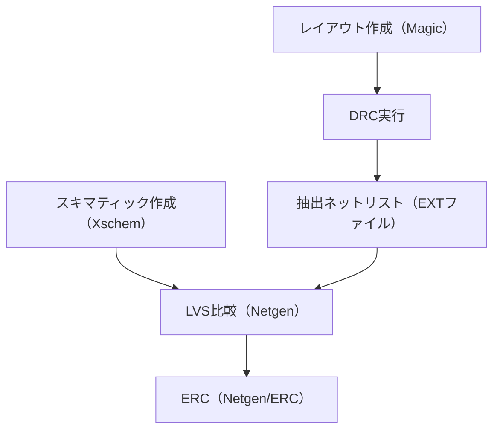

# ✅ DRC, LVS, ERCのチェックフロー

---

## 📘 概要

LSI設計においては、回路設計後の**物理検証**が品質保証の要です。  
DRC（Design Rule Check）、LVS（Layout vs Schematic）、ERC（Electrical Rule Check）は、設計意図と実装の整合性・安全性を検証する基本的手法です。

---

## 🧪 各チェックの概要

| チェック種別 | 内容 | 主な検出対象 |
|--------------|------|----------------|
| DRC | 設計ルール違反の検出（配線幅、間隔など） | 製造不能なレイアウト、歩留り低下要因 |
| LVS | 回路図とレイアウトの整合性チェック | ネット接続ミス、未接続、ミスピン |
| ERC | 電気的な制約違反の検出 | フローティングノード、ドライバ強度不一致 |

---

## 🔁 チェックフロー全体像（例：Sky130系）

- `Magic` で DRC → `Netgen` で LVS → `ERC` スクリプトで最終確認  
- `sky130` などでは `Makefile` による自動フローも整備されている

---

## 🧩 チェック実行時のポイント

### ✔️ `DRC`
- 配線幅、層間距離、ベースラインからの高さ（リソグラフィ制限）に注意  
- `CMP` や寄生素子対策として `ダミーパターン` 挿入が必要なケースも

### ✔️ `LVS`
- スキマティックとレイアウトで `インスタンス名` や `端子名` を統一する  
- `ブラックボックスマクロ（.subckt）` の整合確認にも注意

### ✔️ `ERC`
- `フローティングノード（未接続ノード）` は設計ミスの温床  
- 入出力の駆動能力に応じた `ドライバレベルのチェック` を組み込む

---

## 🧰 商用ツールとの違い

| 項目 | 商用ツール | OSS（`Sky130`） |
|------|------------|------------------|
| 実行UI | `GUI中心` | `CLI + スクリプト中心` |
| 検出精度 | `高精度な補正・演算あり` | `一部手動補正やスクリプト前提` |
| エラー表示 | `詳細・視覚的` | `コンソールログ中心（KLayout等で補完）` |

---

## 🎯 教材的意義

- 各チェックの `意味と順序` を理解することが、実装と仕様の一致確認に直結する  
- OSSツールの利用により、検証フローを `構造として把握` しやすくなる  
- 不一致が起きた場合に `どこで何が問題かを説明できる能力` が養われる

---

## 🔗 関連資料

- [`eda_toolchain.md`](./eda_toolchain.md)：EDAツール全体との接続構成へ  
- [`pdk_structure.md`](./pdk_structure.md)：ルールファイルの構成と依存関係

---

© 2025 Shinichi Samizo / MIT License
