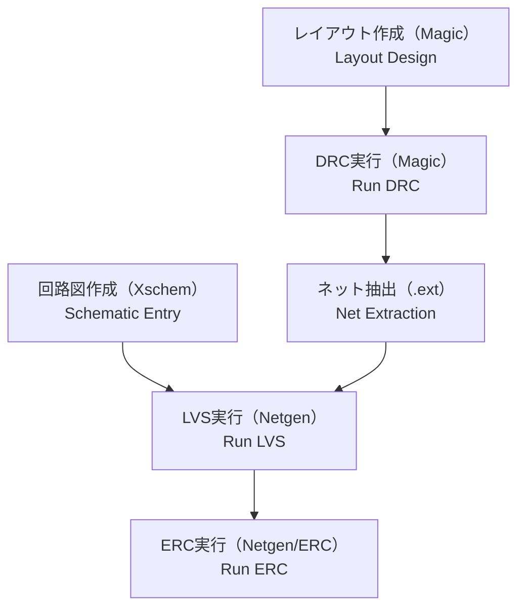

# ✅ DRC, LVS, ERCのチェックフロー  
# ✅ DRC, LVS, and ERC Check Flow

---

## 📘 概要｜Overview

LSI設計においては、回路設計後の**物理検証**が品質保証の要です。  
**DRC（Design Rule Check）**、**LVS（Layout vs Schematic）**、**ERC（Electrical Rule Check）**は、設計と実装の**整合性と安全性を検証する基本的手法**です。

In LSI design, **physical verification** is essential for ensuring design quality.  
**DRC**, **LVS**, and **ERC** are the three fundamental checks used to verify consistency and reliability between the schematic and layout.

---

## 🧪 各チェックの概要｜Check Types and Purposes

| ✅ **チェック種別｜Check Type** | 📘 **内容｜Description** | 🔍 **主な検出対象｜Main Errors Detected** |
|-----------------------------|--------------------------|--------------------------------|
| **DRC** | 配線幅や間隔など設計ルール違反の検出 Checks geometric rule violations | 製造不能な形状、歩留まり低下リスク Non-manufacturable shapes, yield risks |
| **LVS** | 回路図とレイアウトの論理整合性確認 Verifies layout vs schematic consistency | 接続ミス、未接続、ピン名相違 Netlist mismatches, floating pins |
| **ERC** | 電気的なルール違反の検出 Detects electrical constraint violations | フローティングノード、駆動能力不一致 Floating nodes, driver mismatch |

---

## 🔁 チェックフロー全体像（Sky130系）｜Overall Flow Example (Sky130)

- `Magic` によるDRC → `.ext`によるネット抽出 → `Netgen` によるLVS／ERCの流れ  
- Sky130では `Makefile` による**一括実行スクリプト**も提供されている

---

## 🧩 チェック実行時のポイント｜Execution Tips by Check Type

### ✔️ **DRC**
- 配線幅・間隔・層構成などの**リソグラフィ制約**を遵守  
- CMPや寄生対策として**ダミーパターン**の挿入が必要な場合も

### ✔️ **LVS**
- **インスタンス名・端子名の一致**を意識して設計  
- **ブラックボックスマクロ（`.subckt`）**との整合に注意

### ✔️ **ERC**
- フローティングノード（未接続）を確実に検出  
- **ドライバ強度の整合**も検証項目に含める

---

## 🧰 商用ツールとの違い｜Commercial vs OSS Tools

| 🔍 **項目｜Aspect** | 💼 **商用ツール｜Commercial** | 🧪 **OSS / Sky130系｜Open Source** |
|---------------------|------------------------------|------------------------------------|
| 実行環境 | GUI中心 GUI-oriented | CLI & スクリプトベース CLI/script based |
| エラー表示 | 視覚的、ログ連携 Visual + logs | テキストログ中心、補完にKLayout等使用 Text logs, visualized via KLayout |
| 精度・補正 | 高精度なエンジン搭載 Highly tuned | 設定ファイル・補正は手動対応が多い Manual scripting or patching often needed |

---

## 🎯 教材的意義｜Educational Significance

- 各検証の**意味・順序・結果の因果関係**を構造として理解する  
  *Understand cause-effect structure of each check and their order*
- OSSツールにより、**PDK・ルールファイル・チェックロジック**の見える化が可能  
  *OSS makes verification rules and flows transparent and traceable*
- エラー時に「**どこが、なぜ、どう違うのか**」を説明できる力を養う  
  *Develops the ability to analyze and explain verification failures*

---

## 🔗 関連資料｜Related Materials

- [`eda_toolchain.md`](./eda_toolchain.md)：EDAツール全体との接続構成へ  
  *EDA tool integration and flow overview*
- [`pdk_structure.md`](./pdk_structure.md)：PDKルールファイルの構成と役割へ  
  *Structure and role of PDK rule files*

---

### 🛠️ 応用編 第6章：PDKとEDA環境｜PDK and EDA Environment  
[➡️ 章の詳細へ進む｜Go to Chapter](./README.md)

---

© 2025 **Shinichi Samizo** / MIT License
