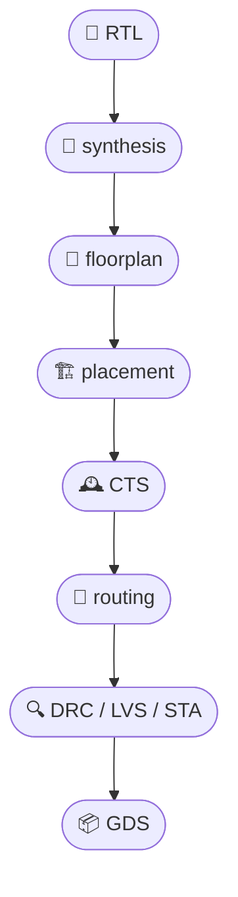

# 🧪 OpenLaneによる実装検証とログ解析  
**🧪 Implementation Verification and Log Analysis with OpenLane**

---

## 📘 概要｜Overview

本節では、オープンソースの物理設計ツールフロー **OpenLane** を活用して、  
**配置配線後の検証（DRC / LVS / STA）** と **ログファイルの読み解き方** を解説します。  
> In this section, we explore how to use **OpenLane**, an open-source physical design flow,  
> to perform **post-placement verification (DRC / LVS / STA)** and analyze **log files**.

OpenLaneは **Sky130PDK** に対応しており、教育・研究用途でも広く使われています。  
> OpenLane supports **Sky130PDK**, making it ideal for educational and research applications.

---

## 🔧 OpenLane構成と自動検証フロー  
**🔧 OpenLane Flow and Built-in Verifications**

OpenLaneは各ステージで自動的に検証処理を実行します。  
> OpenLane automatically performs verification at each design stage.

### 🔁 OpenLane設計フロー（Mermaid形式）｜OpenLane Flow (Mermaid)

[GitHubでMermaidフローチャートを確認する](https://github.com/Samizo-AITL/Edusemi-v4x/blob/main/d_chapter7_automation_and_verification/openlane_validation.md)



---

### ✔️ 各段階での自動チェック｜Stage-wise Auto Checks

| ⏱️ ステージ｜Stage | 🧪 自動検証｜Verification | 📋 内容例｜Details |
|----------------|--------------------|----------------------------------|
| `synthesis`    | `lint`             | 論理記述の静的検証<br>Lint check of RTL |
| `placement`    | `overlap check`    | セルの重なり確認<br>Cell overlap detection |
| `routing`      | `DRC`, `antenna check` | 配線ルール違反・アンテナ効果<br>DRC & antenna rule checks |
| `final`        | `LVS`, `STA`       | 回路一致・タイミング検証<br>Layout/schematic match & timing |

---

## 📂 ログファイルの構造と分析ポイント  
**📂 Log File Structure and Analysis Points**

OpenLaneは各ステージごとに `logs/` ディレクトリ以下にログを出力します。  
> Each stage in OpenLane generates log files under the `logs/` directory.

```text
designs/your_block/runs/your_run/logs/
├── synthesis/
│   └── yosys.log
├── placement/
│   └── tapcell.log
├── routing/
│   └── tritonRoute.log
├── lvs/
│   └── netgen.lvs.log
├── sta/
│   └── openroad.log
```

---

### 🔍 よく見るべきログ項目｜Key Log Items

- **DRC**：`# violations`, 違反座標, 層情報  
  > *Violation count, coordinates, layer info*
- **LVS**：`Netlists match: YES/NO`, ポート不一致など  
  > *Match result, port mismatches, black boxes*
- **STA**：`slack`, `critical path`, セットアップ／ホールド違反  
  > *Slack summary, timing violations, critical path stats*

---

## 📈 Pythonによるログ解析の実装例  
**📈 Sample Python Script for Log Parsing**

OpenLaneのログはプレーンテキストで構造が明確なため、  
Pythonを使って自動的に違反情報を抽出できます。  
> OpenLane logs are well-structured and can be parsed with Python.

```python
# openlane_log_parser.py の一部例
def extract_drc_violations(log_file):
    with open(log_file) as f:
        lines = f.readlines()
    return [l for l in lines if "violation" in l.lower()]
```

- **面積・セル数・消費電力**なども `reports/` ディレクトリから自動取得可能  
  > *Area, cell count, and power reports can also be parsed automatically*

---

## 🎯 教材的意義｜Educational Value

- 商用EDAと同様の **一貫検証フロー** を体験できる  
  > *Simulates commercial-grade verification flow*
- **ログ読解スキル** を通じて設計状況の把握力を強化  
  > *Improves design analysis skill via log inspection*
- **自動抽出・可視化**により、検証〜改善のループを直感的に理解  
  > *Enables intuitive iteration via automation and visualization*

---

## 🔗 関連章｜Related Sections

- [`drc_lvs_erc.md`](./drc_lvs_erc.md)：基本的なDRC/LVSの構造と理論  
  > *Fundamentals of layout rule checks*
- [`ci_cd_designflow.md`](./ci_cd_designflow.md)：CI/CDによる継続的検証自動化  
  > *Continuous verification with CI/CD pipelines*

---

## 🔗 GitHub上の教材ディレクトリ｜GitHub Directory

📂 [`Samizo-AITL/Edusemi-v4x/d_chapter7_automation_and_verification`](https://github.com/Samizo-AITL/Edusemi-v4x/tree/main/d_chapter7_automation_and_verification)  
> 本教材ファイルと関連リソースを含むGitHubリポジトリへアクセスできます。  
> *Visit the GitHub directory containing this material and related files.*

---

### 🤖 応用編 第7章：自動化と実装検証技術｜Applied Chapter 7: Automation and Implementation Verification  
[➡️ 章の詳細へ進む｜Go to Chapter](./README.md)

---

© 2025 **Shinichi Samizo** / MIT License
