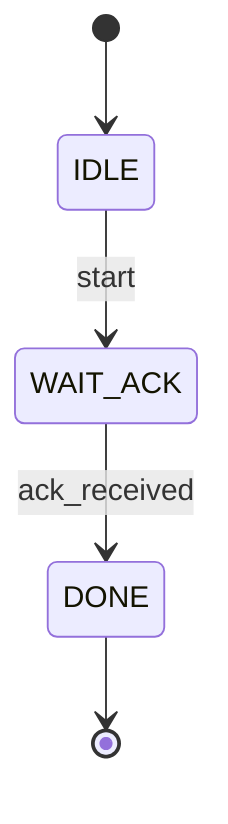

# 🔄 状態遷移図と状態表｜*State Diagrams and Transition Tables*

---

## 📘 状態の可視化とは？｜*What is State Visualization?*

FSM設計では、まず**状態とその遷移関係を明示的に可視化**することが重要です。  
*In FSM design, it is crucial to explicitly visualize states and their transitions.*  

視覚的に確認することで、**設計ミスの早期発見と論理の整理**が容易になります。  
*Visualization helps catch design errors early and organize logic clearly.*

---

## 🌀 状態遷移図｜*State Diagram*

状態遷移図は、**状態ノードと遷移矢印**で構成される構造図です。  
*A state diagram consists of **nodes (states)** and **directed edges (transitions).***

> ⚠️ このページではMermaidフローチャートは表示されません  
> 👉 **以下のリンクからGitHubで視覚化表示をご確認ください：**  
> [📎 GitHubでMermaidフローチャートを見る](https://github.com/Samizo-AITL/Edusemi-v4x/blob/main/d_chapter8_fsm_design_basics/fsm_state_transition.md)

- **ノード｜*Node***：IDLE、WAIT_ACK、DONE  
- **矢印｜*Arrow***：遷移を表す（トリガ条件付き）  
  *Arrows represent transitions with trigger conditions.*

🛠 **作図ツール例｜*Diagram Tools***  
| 種類｜*Type* | ツール例｜*Examples* |
|-------------|----------------|
| テキスト系｜*Text-based* | PlantUML、Mermaid |
| GUI系｜*Graphical* | Logisim、Graphviz |

---

## 🗂 状態遷移表｜*State Transition Table*

状態遷移表は、**状態・入力・次状態・出力**を明示的にまとめた表形式の仕様書です。  
*It is a table showing the relationship between current state, input, next state, and output.*

| **現在の状態｜*Current State*** | **入力｜*Input*** | **次の状態｜*Next State*** | **出力｜*Output*** |
|-------------------|---------------|------------------|----------------|
| IDLE              | 0             | IDLE             | 0              |
| IDLE              | 1             | WAIT_ACK         | 0              |
| WAIT_ACK          | 0             | WAIT_ACK         | 0              |
| WAIT_ACK          | 1             | DONE             | 1              |
| DONE              | X             | IDLE             | 0              |

📌 `X` は**ドントケア（Don't Care）**を意味します。  
*`X` indicates a “don’t care” condition.*

---

## 🔧 設計演習のすすめ方｜*Recommended Design Steps*

1. 状態を洗い出す（例：IDLE、WAIT、DONE）  
   *List functional states (e.g., IDLE, WAIT, DONE)*  
2. 状態遷移図を描く（条件付き矢印）  
   *Draw a state diagram with conditional transitions*  
3. 状態遷移表に整理  
   *Organize behavior into a state table*  
4. HDL（Verilog）でコーディング（次節で解説）  
   *Implement with Verilog (explained in the next section)*  

---

## 🎓 教材的意義｜*Educational Significance*

| 学習ポイント｜*Learning Point* | 内容｜*Details* |
|------------------|-----------------------------|
| **視覚化力** | 設計意図を図や表で共有しやすくなる  *Improves communication of design intent with diagrams and tables* |
| **論理整理** | 実装前に動作仕様を明確化  *Defines functional behavior clearly before implementation* |
| **実装支援** | Verilog記述の下地を形成  *Provides a solid foundation for FSM coding in Verilog* |

---

## ⏭️ 次の節へ｜*Next Section*  
[`fsm_hdl_description.md`](./fsm_hdl_description.md)：状態遷移のVerilog記述｜*FSM Implementation in Verilog*

---

### 🔁 応用編 第8章：FSM設計（有限状態機械）｜*Applied Chapter 8: FSM Design*  
[➡️ 章の詳細へ進む｜*Go to Chapter*](./README.md)
