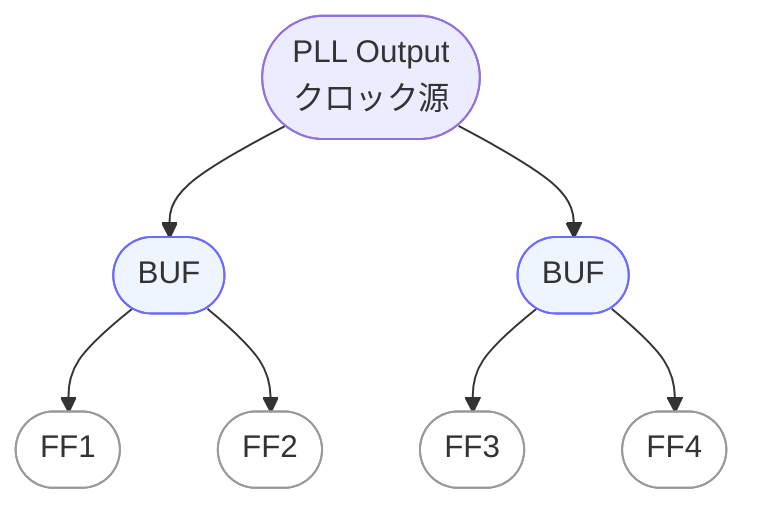
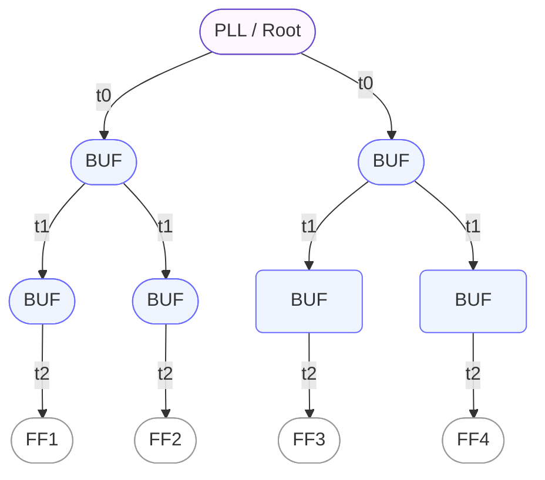

---

# 🌳 `clock_tree_design.md` – クロックツリー設計と遅延最小化  
**Clock Tree Synthesis and Delay Optimization**

---

## 📘 概要｜*Overview*

クロックツリー設計（Clock Tree Synthesis, CTS）は、チップ内の全てのクロック供給先に対して、  
**同じタイミングでクロックが届くように設計**する工程です。  
*CTS ensures that clock signals arrive simultaneously at all sinks within the chip.*

The goal of CTS is to **minimize skew and latency**,  
*ensuring proper setup/hold timing and improving overall reliability.*

---

## 🛠️ クロックツリーの基本構成｜*Clock Tree Structure*

クロックツリーは、PLLからのクロックを各フリップフロップへ均一に届けるための配線構造です。  
*The clock tree distributes PLL outputs uniformly to all flip-flops.*  

代表的な手法として `バイナリツリー型` や `H-tree型` があり、EDAツールによる自動CTSが一般的です。  
*Typical topologies include binary-tree and H-tree, with most EDA tools providing automatic CTS.*

---

### 🌱 シンプル構成（導入用）｜*Simple Structure (Introductory)*

PLL出力からバッファを経由して各FFへ分配する、基本的なバイナリツリー構造を示します。  
*This is the simplest binary-tree distribution from PLL output to flip-flops.*

---

### 🌳 H-tree構成（遅延最小化）｜*H-tree Structure (Delay Optimization)*

実務でよく用いられる **H-tree型トポロジー** です。  
各経路に同じ遅延（t0, t1, t2）が入るように設計し、スキューを抑えます。  
*An H-tree topology equalizes path delays (t0, t1, t2) to minimize skew.*

---

📌 **まとめ｜*Summary***  
- シンプル構成 → **概念の導入に最適**  
  *Simple structure is best for introducing the concept.*  
- H-tree構成 → **遅延均一化とスキュー抑制の実務例**  
  *H-tree is a practical design for equalized delay and minimized skew.*

---

## 🧮 最適化の観点｜*Optimization Targets*

| 観点｜Aspect | 説明｜*Description* |
|---------------|----------------------|
| **スキュー（Skew）** | フロップ間のクロック到達時間差。通常 `< 100ps` が望ましい  *Clock arrival time difference between flip-flops. Typically <100ps.* |
| **バッファ数** | 線長調整・負荷分散のためにバッファを追加  *Buffers are inserted to balance load and adjust wire length.* |
| **レイテンシ（Latency）** | PLLからフロップまでのクロック遅延。均一性が重要  *Latency from PLL to flip-flops; uniformity is crucial.* |

---

## ⚠️ 実装時の注意点｜*Implementation Notes*

- クロックネットは **高層金属層**（Metal 5〜6など）を使用してIRとEM対策。  
  *Use upper metal layers (M5–M6) to mitigate IR drop and electromigration.*  
- 長距離・高負荷経路では **EM（エレクトロマイグレーション）対策** を考慮。  
  *Consider EM effects in long, high-load paths.*  
- CTS後には **ポストCTS STA**（Static Timing Analysis）を実施して検証。  
  *Perform post-CTS STA to validate timing.*

---

## 📚 関連章｜*Related Chapters*

- [第5章 SoC設計フロー｜*Chapter 5: SoC Design Flow*](../chapter5_soc_design_flow/README.md)  
- [`jitter_and_skew.md`](./jitter_and_skew.md)：スキューとジッタ対策の詳細  
  *Details of skew and jitter handling*

---

### ⏰ 応用編 第9章：PLLとクロック設計｜*Applied Chapter 9: PLL and Clock Design*  
[➡️ 章の詳細へ進む｜*Go to Chapter*](./README.md)

