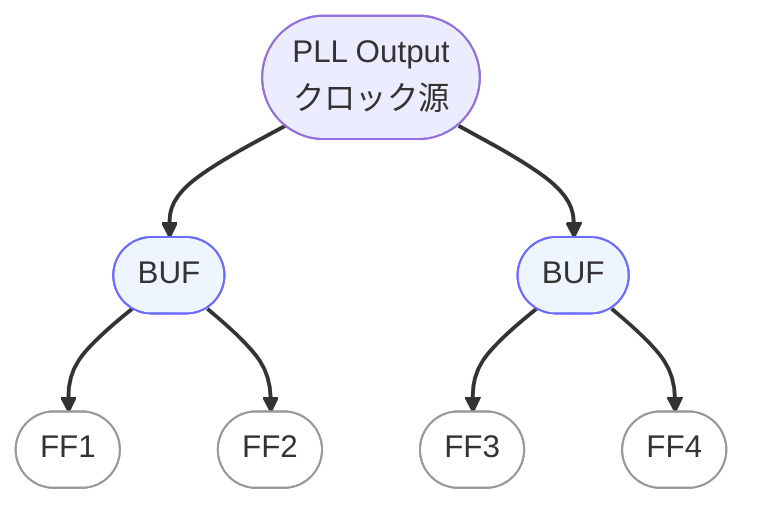

---

# 🌳 `clock_tree_design.md` – クロックツリー設計と遅延最小化  
**Clock Tree Synthesis and Delay Optimization**

---

## 📘 概要｜Overview

クロックツリー設計（Clock Tree Synthesis, CTS）は、チップ内の全てのクロック供給先に対して、  
**同じタイミングでクロックが届くように設計**する工程です。  

The goal of CTS is to **minimize skew and latency**, ensuring proper setup/hold timing and improving overall reliability.

---

## 🛠️ クロックツリーの基本構成｜Clock Tree Structure

- クロックツリーは `H型` や `バイナリツリー型` のトポロジーがよく使われます。
- `バッファ挿入`や`リピータ配置`で、クロック伝播のタイミングを揃えます。
- 多くのEDAツールは `自動CTS機能` を提供し、レポートも自動出力されます。

```
             ┌──────┐
             │ Root │ ← PLLからのクロック
             └──┬───┘
                │
        ┌───────┴────────┐
     ┌──┴──┐          ┌──┴──┐
     │ BUF │          │ BUF │
     └─┬───┘          └──┬──┘
       │                 │
   ┌───┴───┐         ┌───┴───┐
   │ FF1   │         │ FF2   │   ← 各フロップへ
   └───────┘         └───────┘
```



---

## 🧮 最適化の観点｜Optimization Targets

| 観点｜Aspect | 説明｜Description |
|---------------|----------------------|
| **スキュー（Skew）** | フロップ間のクロック到達時間差。通常 `< 100ps` が望ましい |
| **バッファ数** | 線長調整・負荷分散のためにバッファを追加 |
| **レイテンシ（Latency）** | PLLからフロップまでのクロック遅延。均一性が重要 |

---

## ⚠️ 実装時の注意点｜Implementation Notes

- クロックネットは、**高層金属層**（Metal 5〜6など）を使用してIRとEM対策。
- 長距離・高負荷経路では、**EM（エレクトロマイグレーション）対策**を考慮。
- CTS後には、**ポストCTS STA**（Static Timing Analysis）を実施して検証。

---

## 📚 関連章｜Related Chapters

- [第5章 SoC設計フロー｜Chapter 5: SoC Design Flow](../chapter5_soc_design_flow/README.md)
- [`jitter_and_skew.md`](./jitter_and_skew.md)：スキューとジッタ対策の詳細

---

### ⏰ 応用編 第9章：PLLとクロック設計｜Applied Chapter 9: PLL and Clock Design  
[➡️ 章の詳細へ進む｜Go to Chapter](./README.md)

---

© 2025 Shinichi Samizo / MIT License
