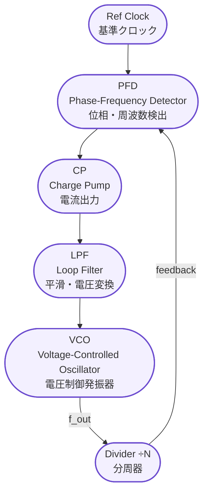

---

# 🔧 `pll_basics.md` – PLLの基本構造と動作原理  
**PLL Basics and Operation Principles**

---

## 📘 概要｜Overview

**PLL（Phase-Locked Loop）** は、基準信号（通常は外部クロック）に対して  
**位相と周波数を一致させる回路構成**であり、SoC/ASIC内の**内部クロック生成**に広く使用されます。

In this section, we explain the **basic structure of PLL**, the **role of each block**, and the **principle of frequency synthesis**.

---

## 🧱 PLLの基本構成｜Basic Components of a PLL

典型的なPLLは、以下の5つの主要ブロックで構成されます：

| ブロック名 | 英語名 | 役割｜Role |
|------------|--------|------------|
| `PFD` | Phase Frequency Detector | 位相差・周波数差の検出 |
| `CP`  | Charge Pump             | 差に応じた電流出力     |
| `LPF` | Loop Filter             | 高周波成分の除去と電圧変換 |
| `VCO` | Voltage Controlled Oscillator | 電圧に応じて周波数変化 |
| `Divider` | Frequency Divider    | VCO出力の分周（÷N） |



---

## 🔄 周波数合成の原理｜Frequency Synthesis Principle

- PLLは、基準信号とVCO出力の**位相差を最小化**するようループ制御します。
- 分周器（÷N）を用いることで、**N倍の出力周波数**を生成できます。
- 出力周波数の関係式：

```
f_out = N × f_ref
```

- 例：外部クロック `f_ref = 25MHz`、分周比 `N = 20` → 出力 `f_out = 500MHz`
- **電源電圧や温度変動にも追従**するため、高信頼な周波数合成が可能です。

---

## 🎓 教材的意義｜Educational Significance

- PLLは**高精度クロック生成**の要であり、**タイミング設計や同期システム**の根幹技術です。
- アナログとデジタルの融合設計例として、**回路系・物理設計教育**の題材にも最適です。

---

### ⏰ 応用編 第9章：PLLとクロック設計｜Applied Chapter 9: PLL and Clock Design  
[➡️ 章の詳細へ進む｜Go to Chapter](./README.md)  

---

© 2025 Shinichi Samizo / MIT License
