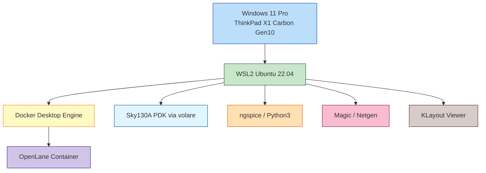

---

# 💻 付録A：実験用マシン仕様  
**Appendix A: Reference Hardware Specification**

本書（第0〜第6章）の *Python → Sky130 PDK → ngspice → OpenLane → Magic → KLayout*  
すべての工程を **同一マシンで完全検証した環境**を記載します。

教材の再現性確保のため、読者が近い性能のマシンを準備できるよう参考資料として公開します。

---

## ✅ 1. 実験用マシン概要｜*Machine Overview*

| 項目 / Item | 内容 / Details |
|-------------|----------------|
| **モデル / Model** | Lenovo ThinkPad X1 Carbon Gen10（中古 B品） |
| **CPU** | Intel Core i5-1235U（12th Gen, 10 cores） |
| **メモリ / RAM** | 16GB |
| **ストレージ / Storage** | NVMe SSD 512GB |
| **OS** | Windows 11 Pro |
| **仮想化環境** | WSL2（Ubuntu 22.04 LTS） |
| **Docker** | Docker Desktop 最新版（2025時点） |
| **無線 / Wireless** | Wi-Fi 6E |
| **ポート / Ports** | USB4 / Thunderbolt 4 |
| **セキュリティ** | 指紋認証 + 顔認証カメラ |
| **用途 / Usage** | 全章の実験を通して使用し、OpenLane 完走を確認 |

---

## ✅ 2. マシン構成の詳細｜*Detailed Hardware Description*

### ● CPU: Intel Core i5-1235U（12世代・10コア）
- Pコア × 2  
- Eコア × 8  
- 最大 4.4GHz  
OpenLane の並列処理（Yosys / OpenROAD）が安定して動作。

### ● RAM: 16GB（最低ライン）
- OpenLane、Magic、volare が同時動作しても枯渇しない最低構成  
- 8GB だと Docker コンテナで OOM が発生しやすい

### ● NVMe SSD: 512GB
- Sky130 PDK（volare）は ~7GB  
- Docker image（OpenLane）は ~12GB  
- 高速 SSD は必須

### ● OS: Windows 11 Pro + WSL2
- WSL2 上で Ubuntu 22.04 を使用  
- Docker Desktop と連携し OpenLane を実行  
- Magic / Netgen / KLayout も WSL2 内で動作確認済み

---

## ✅ 3. ソフトウェアスタック｜*Software Stack Used for Validation*

```yaml
SoftwareStack:
  OS: Windows 11 Pro
  WSL2: Ubuntu 22.04 LTS
  Python: "3.10 / 3.11"
  PDK: "Sky130A (via volare)"
  SPICE: "ngspice 36+"
  LayoutTools:
    - Magic VLSI
    - Netgen
    - KLayout
  Docker:
    Engine: Docker Desktop (2025)
    Container: OpenLane latest
```

---

## ✅ 4. YAML 形式（完全版）｜*Full YAML Specification*

```yaml
ReferenceMachine:
  Hardware:
    Model: "Lenovo ThinkPad X1 Carbon Gen10 (Used/B-rank)"
    CPU: "Intel Core i5-1235U, 12th Gen, 10 cores"
    RAM: "16GB"
    Storage: "NVMe SSD 512GB"
    Display: "14-inch"
    Wireless: "Wi-Fi 6E"
    Ports: "USB4 / Thunderbolt 4"
    Security:
      - Fingerprint
      - Face Recognition Camera
  OperatingSystem:
    Windows: "Windows 11 Pro"
    WSL2:
      Distro: "Ubuntu 22.04 LTS"
      Kernel: "WSL2-Linux Kernel"
  Tools:
    Python: "Python 3.10+"
    Docker:
      Engine: "Docker Desktop 2025"
      Container: "OpenLane latest"
    PDK: "Sky130A (volare)"
    SPICE: "ngspice 36+"
    LayoutTools:
      Magic: "Magic VLSI"
      Netgen: "Netgen"
      KLayout: "KLayout GDS Viewer"
  Notes:
    - "All chapters validated on this machine."
    - "OpenLane full flow successfully completed."
    - "System stable during PDK installation, synthesis, STA, routing."
```

---

## ✅ 5. OpenLane 実測時間｜*Measured Performance*

| タスク | 時間 |
|--------|------|
| 初回 `openlane` イメージ pull | 約 6 分 |
| volare PDK インストール | 約 3〜5 分 |
| Inverter チュートリアル（RTL → GDS） | 約 8〜12 分 |
| Magic で GDS/OASIS 読み込み | 1〜2 秒 |
| KLayoutViewer の起動 | 数秒 |

---

## ✅ 6. アーキテクチャ概要図｜*System Architecture Diagram*



---

## ✅ 7. この構成を採用した理由｜*Why This Configuration Is Used*

- ✅ OpenLane のメモリ要求（12〜14GB）を満たす  
- ✅ Docker Desktop が安定動作する  
- ✅ Sky130 PDK が高速で扱える NVMe SSD  
- ✅ Magic / Netgen / KLayout の GUI も軽快  
- ✅ 持ち運び可能な 14-inch  
- ✅ 中古で安価に入手可能（8万円前後）

---

## ✅ 8. 推奨スペックとの比較

| 項目 | 最低ライン | 推奨 | 本マシン |
|------|------------|-------|-----------|
| CPU | 第8世代以上 | 第10世代以上 | ✅ 第12世代 |
| RAM | 8GB | 16GB | ✅ 16GB |
| SSD | SATA SSD | NVMe SSD | ✅ NVMe |
| OS | Win10 | Win11 + WSL2 | ✅ Win11 + WSL2 |
| Docker | 必須 | 最新版推奨 | ✅ 最新版 |

---

## ✅ 9. まとめ｜Summary

本マシンは、Sky130〜OpenLane の一連のフローを実用的な速度で処理できるバランス構成です。  
読者が同等スペックを使用することで、本書の内容を **そのまま再現可能** です。

---

## 🔙 戻る

🏠 [Top](../)  
📘 [第0章 Environment Setup](./)

---
