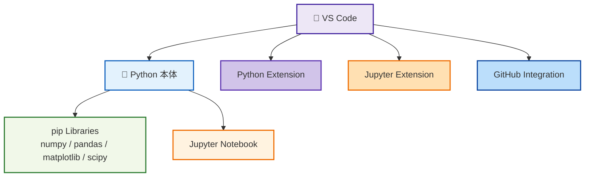

---

# 🛠️ 01_python_setup  
**Python ＋ VS Code 開発環境セットアップ（詳細版）**  
*Python + VS Code Development Environment Setup (Enhanced Version)*

---

## 📘 概要｜Overview
本節では、Sky130 実験・OpenLane フロー自動化・SPICE シミュレーション解析を実行できる  
**完全な Python + VS Code 開発環境**を構築します。

This section builds a **complete Python + VS Code environment**  
required for Sky130 experiments, OpenLane automation, and SPICE simulation workflows.

---

## ✅ 1. Python のインストール｜*Install Python*

| 項目 / Item | 内容 / Details |
|------------|----------------|
| 推奨バージョン<br>*Recommended Version* | **Python 3.10–3.12** |
| 公式ダウンロード<br>*Official Download* | https://www.python.org/downloads/ |
| インストール時の必須設定<br>*Important Option* | ✅ **Add Python to PATH** を必ず有効化 |

### ✅ 動作確認｜*Verify Installation*
```bash
python --version
pip --version
```

---

## ✅ 2. 必須ライブラリのインストール｜*Install Required Libraries*

### 🔧 標準科学計算ライブラリ  
*Standard scientific libraries:*

```bash
pip install numpy matplotlib pandas jupyter scipy
```

### 🔬 Sky130 解析向け（高度版・任意）  
*Advanced Sky130 analysis (optional):*

```bash
pip install pyspice
```

### 🧪 データ解析補助（任意）  
*Additional helpers (optional):*

```bash
pip install seaborn tqdm
```

---

## ✅ 3. VS Code のセットアップ｜*Install VS Code*

🔗 ダウンロード  
https://code.visualstudio.com/

### ✅ 必須拡張機能｜*Required Extensions*

| Extension | 用途 / Purpose |
|-----------|----------------|
| **Python** | Debug / Lint / LSP |
| **Pylance** | 高速インテリセンス |
| **Jupyter** | Notebook 実行 |
| **Jinja / Markdown Tools** | 教材編集に必須 |
| **GitHub Pull Requests** | GitHub Pages との統合 |

---

## ✅ 4. VS Code 基本操作｜*Basic VS Code Operations*

### 📁 フォルダを開く｜*Open Folder*
```
File → Open Folder
```

### 📝 Python ファイル作成｜*Create Python File*
```
main.py
```

### ▶️ 実行｜*Run Script*
```bash
python main.py
```
または右上の ▶️ ボタン  
*Or use the Run button.*

---

## ✅ 5. Jupyter Notebook の利用｜*Using Jupyter Notebook*

### ノートブック起動  
Launch notebook:
```bash
jupyter notebook
```

### VS Code で直接開く  
Open `.ipynb` directly in VS Code  
→ Jupyter Extension が自動起動

---

## ✅ 6. PATH 設定の確認（Windows）｜*Check PATH Configuration*

以下が PATH に含まれていること：

```
C:\\Users\\<username>\\AppData\\Local\\Programs\\Python\\Python3x\\
C:\\Users\\<username>\\AppData\\Local\\Programs\\Python\\Python3x\\Scripts\\
```

確認：
```bash
where python
where pip
```

---

## ✅ 7. 環境構成図（Mermaid）｜*Environment Diagram*



---

## ✅ 8. チェックリスト｜*Setup Checklist*

| チェック項目 / Item | OK? |
|---------------------|-----|
| Python が正しく動作する | ✅ |
| pip がエラーなく動作する | ✅ |
| VS Code が起動する | ✅ |
| Python 拡張機能が動作 | ✅ |
| Notebook が VS Code で開く | ✅ |
| グラフ描画が成功する（matplotlib） | ✅ |
| NumPy が利用可能 | ✅ |

---

## ✅ 9. 追加 tips｜*Extra Tips*

- ✅ pip の高速化（国内ミラー使用）
```bash
pip config set global.index-url https://pypi.ruby-china.com/simple
```

- ✅ VS Code のフォントを Source Han Code に  
- ✅ GitHub Copilot の併用で自動化効率 UP  

---

## 👤 Author
三溝 真一（Shinichi Samizo）  
GitHub: https://github.com/Samizo-AITL
