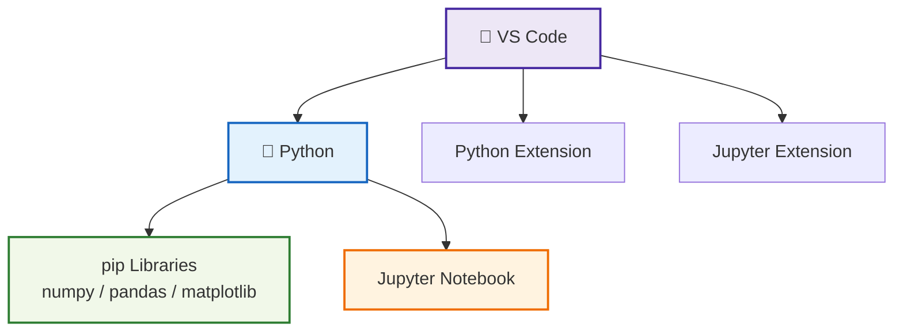

# 🛠️ 01_python_setup  
**Python ＋ VS Code 開発環境セットアップ（中厚版）**  
*Python + VS Code Development Environment Setup (Mid-Level Version)*

---

## 📘 概要｜Overview
Python と VS Code を用いた開発環境を構築し、後続の SPICE 実験・OpenLane 自動化・Sky130 データ処理を実行できる状態を整えます。  
*This section builds a full Python + VS Code environment required for SPICE experiments, OpenLane automation, and Sky130 data processing.*

---

## ✅ 1. Python のインストール｜*Install Python*

| 項目 / Item | 内容 / Details |
|------------|----------------|
| 推奨バージョン<br>*Recommended Version* | **Python 3.10–3.12** |
| ダウンロード<br>*Download* | https://www.python.org/downloads/ |
| 必須設定<br>*Required Option* | ✅ **Add Python to PATH** |

### ✅ 動作確認｜*Verify Installation*
```bash
python --version
pip --version
```

---

## ✅ 2. 必須ライブラリのインストール｜*Install Required Libraries*

| ライブラリ | 用途 / Purpose |
|-----------|----------------|
| numpy | 数値計算 / Numerical computing |
| matplotlib | グラフ描画 / Plotting |
| pandas | データ解析 / Data analysis |
| jupyter | Notebook 実行 / Jupyter notebooks |
| scipy | 数値最適化 / Numerical routines |

```bash
pip install numpy matplotlib pandas jupyter scipy
```

Sky130 SPICE 高度解析用（任意）  
*Optional for advanced Sky130 SPICE work:*
```bash
pip install pyspice
```

---

## ✅ 3. VS Code のセットアップ｜*Install VS Code*

- 公式サイト｜*Download:*  
  https://code.visualstudio.com/

### ✅ 必須拡張機能｜*Required Extensions*

| Extension | 用途 / Purpose |
|-----------|----------------|
| Python | Lint / Debug / LSP |
| Pylance | 高速インテリセンス / Fast IntelliSense |
| Jupyter | Notebook 直実行 |
| Markdown Preview Enhanced | 教材編集に便利 |

---

## ✅ 4. VS Code 基本操作｜*Basic VS Code Operations*

### 📁 フォルダを開く｜*Open Folder*
```
File → Open Folder
```

### 📝 Python ファイル作成｜*Create Python File*
```
main.py
```

### ▶️ 実行｜*Run Script*
```bash
python main.py
```
または右上 ▶️  
*Or click the Run button.*

---

## ✅ 5. 動作テスト｜*Quick Test*

```python
print("Python + VS Code setup is OK!")
```

実行できれば環境は正常。  
*If this runs, your setup is correct.*

---

## ✅ 6. 環境構成図（Mermaid）｜*Environment Diagram*



---

## ✅ 7. チェックリスト｜*Setup Checklist*

| チェック項目 / Item | OK? |
|---------------------|-----|
| Python が動く｜*Python works* | ✅ |
| pip が動く｜*pip works* | ✅ |
| VS Code 起動｜*VS Code launches* | ✅ |
| Python 拡張有効｜*Python extension active* | ✅ |
| Jupyter Notebook 動作｜*Jupyter works* | ✅ |

---

## 👤 Author
三溝 真一（Shinichi Samizo）  
GitHub: https://github.com/Samizo-AITL
