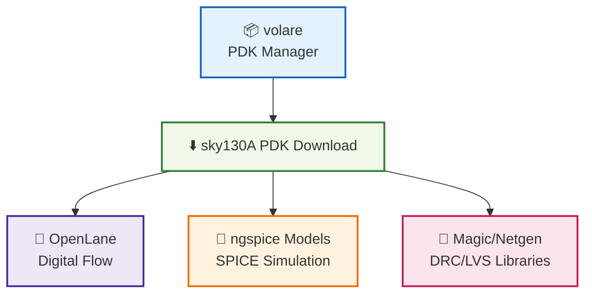

---

# 🛠️ 02_sky130_pdk_setup  
**Sky130 PDK セットアップ（詳細版）**  
*Sky130 PDK Setup with volare (Enhanced Version)*

---

## 📘 概要｜Overview
本節では、OpenLane・ngspice・Magic/Netgen 向けに  
**SkyWater Sky130 PDK を volare で完全セットアップする手順**をまとめます。

This section explains how to fully install and enable the **SkyWater Sky130 PDK**  
using `volare` for OpenLane, ngspice, and Magic/Netgen workflows.

---

## ✅ 1. volare のインストール｜*Install volare*

`volare` は Sky130 PDK の **取得・バージョン管理ツール**です。  
*`volare` manages PDK fetching and version control.*

### ✅ pip でインストール  
```bash
pip install volare
```

---

## ✅ 2. Sky130A PDK の取得｜*Download Sky130A PDK*

OpenLane 2024 以降は **volare の使用が事実上の標準**。  
*For OpenLane 2024+, `volare` is the recommended method.*

### ✅ 最新安定版の取得  
```bash
volare enable sky130A
```

### ✅ 特定バージョンを取得する場合  
```bash
volare enable sky130A <commit_hash>
```

---

## ✅ 3. PDK の配置パス｜*PDK Installation Path*

### Linux / WSL2 の標準位置：
```
$HOME/.volare/sky130A/
```

### OpenLane が参照する場所：
```
/pdks/sky130A/
```

必要に応じてコピー：

```bash
mkdir -p ~/openlane/pdks
cp -r ~/.volare/sky130A ~/openlane/pdks/
```

---

## ✅ 4. PDK 内容の確認｜*Check PDK Contents*

以下の重要ファイルが存在すること：

| 種類 / Type | パス例 / Example Path |
|-------------|------------------------|
| Magic Tech | `libs.tech/magic/sky130A.tech` |
| SPICE models | `libs.tech/ngspice/*.spice` |
| Netgen setup | `libs.tech/netgen/sky130A_setup.tcl` |
| GDS libs | `libs.ref/gds/` |

確認コマンド：

```bash
ls ~/openlane/pdks/sky130A/libs.tech/magic
```

---

## ✅ 5. ngspice でモデル読み込み｜*Using SPICE Models*

SPICE ファイルで以下を追加：

```spice
.include "/pdks/sky130A/libs.tech/ngspice/sky130.lib.spice"
```

FET モデル例：

```spice
.include "/pdks/sky130A/libs.tech/ngspice/models/sky130_fd_pr__nfet_01v8.spice"
```

---

## ✅ 6. OpenLane での利用｜*Use with OpenLane*

OpenLane 実行時の環境設定：

```bash
export PDK=sky130A
export PDK_ROOT=/pdks
```

Docker 版の例：

```bash
docker run --rm -it \
  -v "$HOME/openlane/pdks":/pdks \
  -v "$HOME/openlane/designs":/openlane/designs \
  -e PDK=sky130A \
  -e PDK_ROOT=/pdks \
  efabless/openlane:2024.09.11 bash
```

---

## ✅ 7. Mermaid 図で理解｜*PDK Setup Diagram*



---

## ✅ 8. チェックリスト｜*Setup Checklist*

| チェック項目 / Item | OK? |
|---------------------|-----|
| volare が正常動作 | ✅ |
| sky130A PDK が enable 済み | ✅ |
| Magic tech ファイルが存在 | ✅ |
| ngspice モデルが読み込み可 | ✅ |
| OpenLane で PDK が認識される | ✅ |

---

## ✅ 9. トラブル対処｜*Troubleshooting*

### ⚠️ PDK が見つからない（OpenLane 内）
→ `-e PDK_ROOT=/pdks` の指定忘れ。

### ⚠️ Magic が minimum.tech を読み込んでしまう  
→ tech を明示する：

```bash
magic -T /pdks/sky130A/libs.tech/magic/sky130A.tech
```

### ⚠️ ngspice がモデルを読まない  
→ `.include` の絶対パスを使う。

---

## 👤 Author
三溝 真一（Shinichi Samizo）  
GitHub: https://github.com/Samizo-AITL
