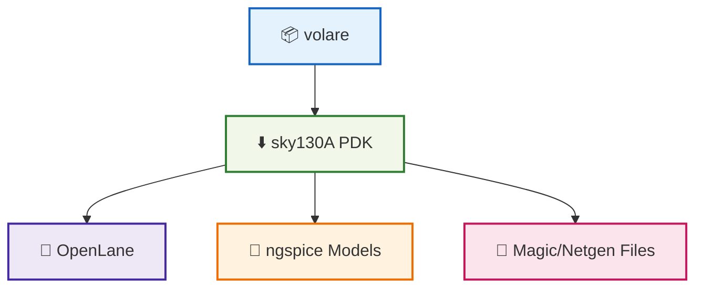

# 🛠️ 02_sky130_pdk_setup  
**Sky130 PDK セットアップ（中厚版）**  
*Sky130 PDK Setup with volare (Mid-Level Version)*

---

## 📘 概要｜Overview
本節では、OpenLane・ngspice・Magic/Netgen で利用する **SkyWater Sky130 PDK** を  
`volare` を用いて確実にセットアップします。  
*This section explains how to install and enable the SkyWater Sky130 PDK using `volare` for OpenLane, ngspice, and Magic/Netgen.*

---

## ✅ 1. volare のインストール｜*Install volare*

`volare` は PDK の取得・管理ツールです。  
*`volare` is a tool for fetching and managing PDK versions.*

### ✅ pip でインストール  
```bash
pip install volare
```

---

## ✅ 2. Sky130A PDK の取得｜*Download Sky130A PDK*

OpenLane 2024 以降の標準推奨は **volare の使用一択**。  
*Using `volare` is the recommended method for OpenLane (2024+).*

### ✅ 最新安定版の取得  
```bash
volare enable sky130A
```

### ✅ 特定バージョンを取得したい場合  
```bash
volare enable sky130A <commit_hash>
```

---

## ✅ 3. PDK の配置パス｜*PDK Installation Path*

### Linux / WSL2 の標準位置：
```
$HOME/.volare/sky130A/
```

### OpenLane 使用時：
```
/pdks/sky130A/
```

必要に応じてコピーする：

```bash
mkdir -p ~/openlane/pdks
cp -r ~/.volare/sky130A ~/openlane/pdks/
```

---

## ✅ 4. PDK 内容の確認｜*Check PDK Contents*

以下のファイルが存在すること：

| 種類 / Type | パス例 / Example Path |
|------------|------------------------|
| Magic Tech | `libs.tech/magic/sky130A.tech` |
| SPICE models | `libs.tech/ngspice/*.spice` |
| Netgen setup | `libs.tech/netgen/sky130A_setup.tcl` |
| GDS libs | `libs.ref/gds/` |

確認コマンド：

```bash
ls ~/openlane/pdks/sky130A/libs.tech/magic
```

---

## ✅ 5. ngspice でモデル読み込み｜*Using SPICE Models*

SPICE ファイルで以下を include：

```spice
.include "/pdks/sky130A/libs.tech/ngspice/sky130.lib.spice"
```

FET モデル例：

```spice
.include "/pdks/sky130A/libs.tech/ngspice/models/sky130_fd_pr__nfet_01v8.spice"
```

---

## ✅ 6. OpenLane での利用｜*Use with OpenLane*

OpenLane 実行時に環境変数を指定：

```bash
export PDK=sky130A
export PDK_ROOT=/pdks
```

Docker 版実行例：

```bash
docker run --rm -it   -v "$HOME/openlane/pdks":/pdks   -v "$HOME/openlane/designs":/openlane/designs   -e PDK=sky130A   -e PDK_ROOT=/pdks   efabless/openlane:2024.09.11 bash
```

---

## ✅ 7. Mermaid 図で理解｜*PDK Setup Diagram*



---

## ✅ 8. チェックリスト｜*Setup Checklist*

| チェック項目 / Item | OK? |
|---------------------|-----|
| volare が動く | ✅ |
| sky130A PDK が enable 済み | ✅ |
| Magic tech ファイル存在 | ✅ |
| ngspice モデル読み込み可 | ✅ |
| OpenLane で認識される | ✅ |

---

## 👤 Author
三溝 真一（Shinichi Samizo）  
GitHub: https://github.com/Samizo-AITL
