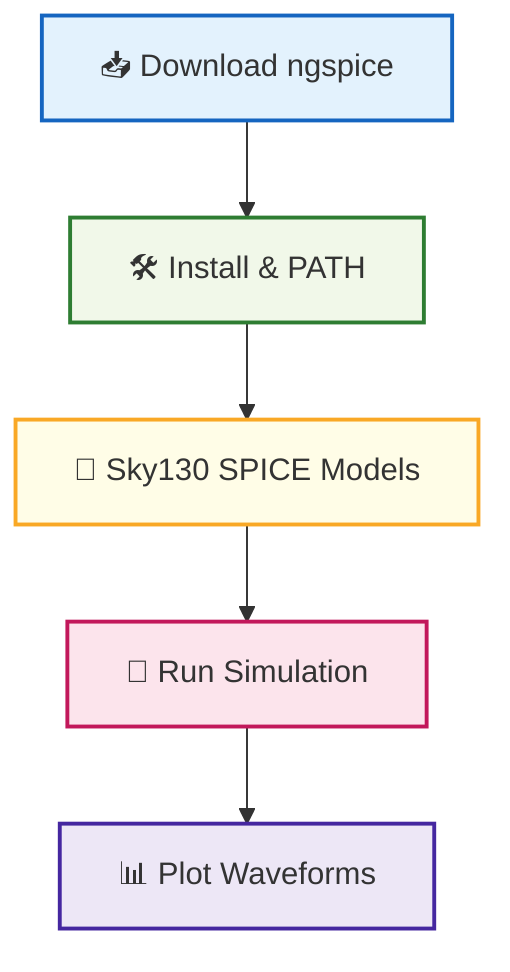

# 🛠️ 03_ngspice_setup  
**ngspice セットアップ（詳細版）**  
*ngspice Setup for Circuit Simulation (Enhanced Version)*

---

## 📘 概要｜Overview
本節では、Sky130 デバイス特性解析・CMOS インバータ・アナログ回路の  
シミュレーションに必須となる **ngspice** を Windows / WSL / Linux で  
確実に動作させるためのセットアップ手順をまとめます。

This section outlines how to properly install and configure **ngspice**  
for Sky130 device analysis and circuit simulations on Windows / WSL / Linux.

---

## ✅ 1. ngspice の入手｜*Download ngspice*

| OS | ダウンロードリンク / Link |
|----|----------------------------|
| **Windows** | https://sourceforge.net/projects/ngspice/files/ |
| **Linux** | `sudo apt install ngspice` |
| **macOS** | `brew install ngspice` |

### ✅ Windows の推奨版  
```
ngspice-45_64bit → Spice64/bin/ngspice.exe
```

---

## ✅ 2. PATH 設定（Windows）｜*Add to PATH (Windows)*

以下を PATH に追加：

```
C:\Users\<User>\Downloads\ngspice-45\Spice64\bin
```

確認：

```bash
ngspice -v
```

---

## ✅ 3. Sky130 モデルファイル読み込み｜*Load Sky130 Models*

Sky130 PDK の SPICE モデルを include：

```spice
.include "/pdks/sky130A/libs.tech/ngspice/sky130.lib.spice"
```

特定デバイス例：

```spice
.include "/pdks/sky130A/libs.tech/ngspice/models/sky130_fd_pr__nfet_01v8.spice"
```

---

## ✅ 4. サンプル動作テスト｜*Quick Simulation Test*

`inverter.cir` を作成：

```spice
* CMOS Inverter Test
.include "/pdks/sky130A/libs.tech/ngspice/sky130.lib.spice"

Vdd vdd 0 1.8
Vin in 0 PULSE(0 1.8 1n 0.1n 0.1n 5n 10n)

XM1 out in vdd vdd sky130_fd_pr__pfet_01v8 L=150n W=1u
XM2 out in 0   0   sky130_fd_pr__nfet_01v8 L=150n W=1u

.tran 0.05n 20n
.control
run
plot v(in) v(out)
.endc
.end
```

実行：

```bash
ngspice inverter.cir
```

---

## ✅ 5. CLI / GUI の違い｜*CLI vs GUI*

| 実行ファイル | 説明 / Description |
|-------------|---------------------|
| `ngspice.exe` | GUI（波形表示あり） |
| `ngspice_con.exe` | CLI（スクリプト実行向け） |

---

## ✅ 6. Windows × WSL 統合利用｜*Using ngspice with WSL*

WSL2 内でも ngspice は動作：

```bash
sudo apt install ngspice
ngspice test.cir
```

VS Code Remote-WSL による統合が推奨。

---

## ✅ 7. Mermaid 図で理解｜*Environment Diagram*



---

## ✅ 8. チェックリスト｜*Setup Checklist*

| 項目 / Item | OK? |
|-------------|-----|
| ngspice インストール | ✅ |
| GUI / CLI 起動確認 | ✅ |
| Sky130 モデル include 成功 | ✅ |
| サンプル回路が動作 | ✅ |
| 波形のプロット成功 | ✅ |

---

## ✅ 9. トラブル対処｜*Troubleshooting*

### ⚠️ モデルが見つからない  
→ `.include` の絶対パスを指定する。

### ⚠️ GUI が起動しない  
→ `ngspice.exe` ではなく `ngspice_con.exe` を呼んでいる。

### ⚠️ 波形が線しか出ない  
→ MOS 電流は `@m.xm1.msky130...[id]` ではなく  
`plot -vd#branch vs v(d)` を使う。

---

## 👤 Author
三溝 真一（Shinichi Samizo）  
GitHub: https://github.com/Samizo-AITL
