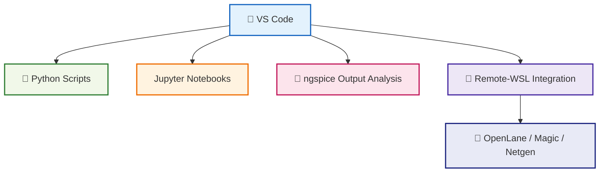

---

# 🛠️ 04_vscode_setup  
**VS Code セットアップ（詳細版）**  
*VS Code Setup for Python / SPICE / OpenLane Workflows (Enhanced Version)*

---

## 📘 概要｜Overview
Python 自動化・ngspice シミュレーション・Sky130 PDK 実験・OpenLane 解析を  
**VS Code 一つで完結させるための最適開発環境構築**を行います。

This section explains how to configure **VS Code** for fully integrated workflows:
Python automation, ngspice simulations, Sky130 experiments, and OpenLane analysis.

---

## ✅ 1. VS Code のインストール｜*Install VS Code*

公式サイト：

🔗 https://code.visualstudio.com/

Windows / macOS / Linux 共通  
*Available for all major platforms.*

---

## ✅ 2. 必須拡張機能｜*Required Extensions*

Sky130 × Python × OpenLane の統合環境に必須：

| Extension | 用途 / Purpose |
|-----------|----------------|
| **Python** | 実行・Lint・デバッグ |
| **Pylance** | 高速インテリセンス |
| **Jupyter** | Notebook 実行 |
| **Remote - WSL** | WSL2 で OpenLane を使う |
| **Markdown Preview Enhanced** | 教材制作 |
| **GitHub Pull Requests** | GitHub 管理 |

---

## ✅ 3. WSL2 との統合（重要）｜*VS Code + WSL Integration*

OpenLane・Magic・Netgen は Linux 環境で動作するため：

```
VS Code → Remote-WSL → Ubuntu → Docker → OpenLane
```

という構成が最適解。

### ✅ Remote-WSL の起動  
コマンドパレット（Ctrl+Shift+P）で：

```
Remote-WSL: New Window
```

WSL 内で VS Code が開き、Linux の Python/Docker が直接利用可能。

---

## ✅ 4. Python 実行設定｜*Python Execution Setup*

### ✅ ターミナルを開く  
```text
Ctrl + `
```

### ✅ Python スクリプト実行  
```bash
python main.py
```

### ✅ または VS Code の右上 ▶️  

---

## ✅ 5. Jupyter Notebook の利用｜*Run Jupyter Notebooks*

- `.ipynb` を開くだけで Notebook モードへ  
- SPICE 波形解析、Sky130 デバイス特性可視化に最適  
*Ideal for waveform analysis and Sky130 measurements.*

---

## ✅ 6. VS Code で GitHub を使う｜*GitHub Integration*

### ✅ クローン  
```bash
git clone https://github.com/<user>/<repo>.git
```

### ✅ VS Code のソース管理  
- 変更ファイル一覧  
- コミットメッセージ入力  
- ✅ を押してコミット  
- Push ボタンで GitHub へ同期  

教材編集の更新管理にも最適。

---

## ✅ 7. VS Code ワークフロー図｜*VS Code Workflow Diagram*



---

## ✅ 8. 推奨 VS Code フォルダ構成｜*Recommended Folder Structure*

```
project_root/
 ├── python_scripts/
 ├── spice/
 ├── openlane/
 ├── reports/
 └── notebooks/
```

Sky130・OpenLane・Python 自動化を一つのワークスペースで管理可能。

---

## ✅ 9. チェックリスト｜*Setup Checklist*

| 項目 / Item | OK? |
|-------------|-----|
| VS Code インストール | ✅ |
| Python / Jupyter 拡張有効 | ✅ |
| Remote-WSL が動作 | ✅ |
| GitHub コミットと Push | ✅ |
| Python / Notebook 実行 | ✅ |
| OpenLane 用フォルダ構成 | ✅ |

---

## ✅ 10. トラブルシューティング｜*Troubleshooting*

### ⚠️ Remote-WSL が開かない  
→ WSL2 が起動していない可能性  
```bash
wsl --status
```

### ⚠️ Notebook が遅い  
→ Python カーネルを WSL 側に切り替える。

### ⚠️ Docker が認識されない  
→ WSL 統合設定を確認：  
Docker Desktop → Settings → WSL → ✅ Enable integration

---

## 👤 Author
三溝 真一（Shinichi Samizo）  
GitHub: https://github.com/Samizo-AITL
