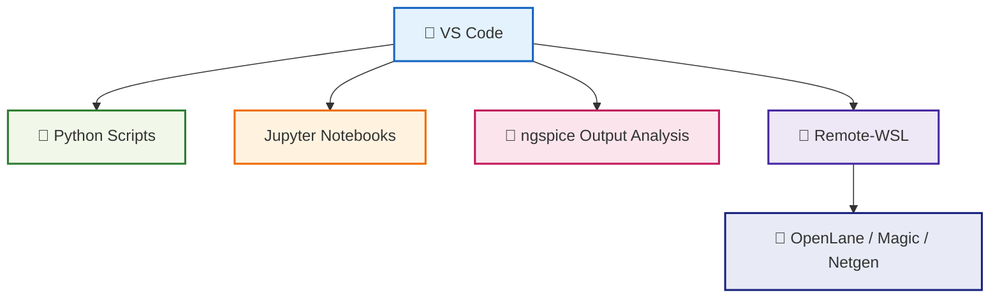

# 🛠️ 04_vscode_setup  
**VS Code セットアップ（中厚版）**  
*VS Code Setup for Python / SPICE / OpenLane Workflows (Mid-Level Version)*

---

## 📘 概要｜Overview
本節では、Python 自動化・ngspice シミュレーション・Sky130 PDK 実験・OpenLane 解析を  
**VS Code 一つで完結させるための開発環境構築**を行います。  
*This section explains how to configure VS Code for fully integrated workflows: Python automation, ngspice simulations, Sky130 experiments, and OpenLane analysis.*

---

## ✅ 1. VS Code のインストール｜*Install VS Code*

公式サイト：

🔗 https://code.visualstudio.com/

Windows / macOS / Linux 共通です。  
*Available for all major platforms.*

---

## ✅ 2. 必須拡張機能｜*Required Extensions*

以下は Sky130 × Python × OpenLane で必須：

| Extension | 用途 / Purpose |
|-----------|----------------|
| **Python** | 実行・デバッグ |
| **Pylance** | 高速インテリセンス |
| **Jupyter** | Notebook 実行 |
| **Remote - WSL** | WSL2 連携（OpenLane 用） |
| **Markdown Preview Enhanced** | 教材編集 |
| **GitHub Pull Requests** | GitHub 操作 |

---

## ✅ 3. WSL2 との連携（重要）｜*VS Code + WSL Integration*

OpenLane・Magic・Netgen は Linux で動作するため：

```
VS Code → Remote-WSL → Ubuntu → Docker → OpenLane
```

という構成が最適解。

### ✅ Remote-WSL の起動  
コマンドパレット（Ctrl+Shift+P）で：

```
Remote-WSL: New Window
```

---

## ✅ 4. Python 実行設定｜*Python Execution Setup*

### ✅ ターミナルを開く  
```
Ctrl + `
```

### ✅ 実行方法  
```
python main.py
```

### ✅ または右上 ▶️  

---

## ✅ 5. Notebook 実行｜*Run Jupyter Notebooks*

- `.ipynb` を開くと Notebook モードに切り替わる  
- Sky130 実験ログのプロット、SPICE 解析に便利  
*Ideal for plotting SPICE results and Sky130 measurements.*

---

## ✅ 6. VS Code での GitHub 使用｜*GitHub Integration*

### ✅ リポジトリのクローン
```
git clone https://github.com/<user>/<repo>.git
```

### ✅ ソース管理メニュー  
- 変更ファイル表示  
- コミットメッセージ入力  
- ✅ を押してコミット  
- Push をクリック  

教材編集の反映もこれで OK。

---

## ✅ 7. VS Code ワークフロー図｜*VS Code Workflow Diagram*



---

## ✅ 8. 推奨 VS Code フォルダ構成｜*Recommended Folder Structure*

```
project_root/
 ├── python_scripts/
 ├── spice/
 ├── openlane/
 ├── reports/
 └── notebooks/
```

Sky130 実験・OpenLane・Python 自動化を全て一つにまとめられる。

---

## ✅ 9. チェックリスト｜*Setup Checklist*

| 項目 / Item | OK? |
|-------------|-----|
| VS Code インストール | ✅ |
| Python / Jupyter 拡張有効 | ✅ |
| Remote-WSL 起動 | ✅ |
| GitHub 連携 | ✅ |
| Python / Notebook 実行 | ✅ |
| OpenLane 用フォルダ構成 | ✅ |

---

## 👤 Author
三溝 真一（Shinichi Samizo）  
GitHub: https://github.com/Samizo-AITL
