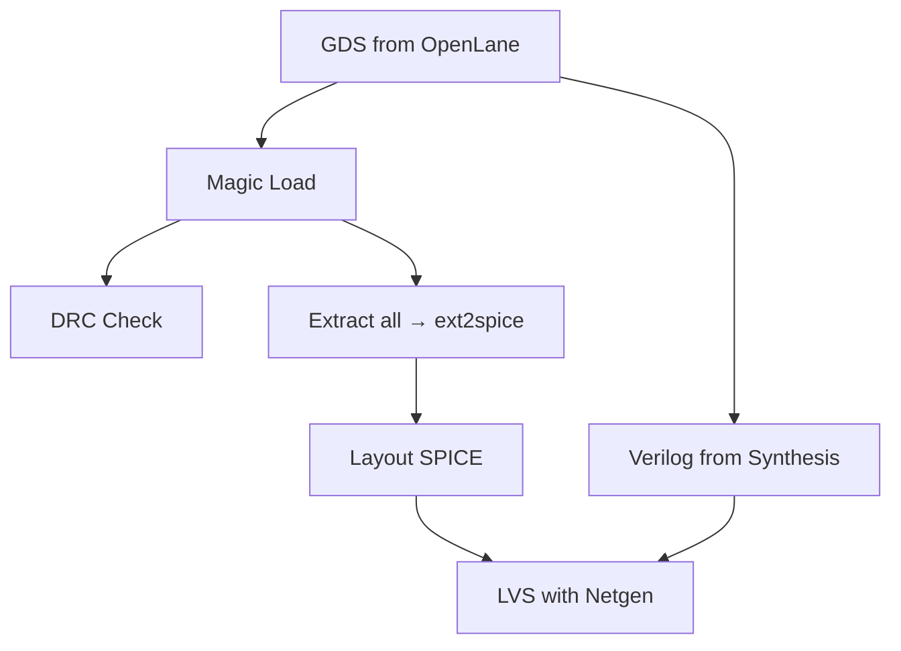

---

# 🛠️ 07_magic_lvs_drc_setup  
**Magic ＋ Netgen：DRC / LVS セットアップ（中厚版）**  
*Magic + Netgen: DRC / LVS Setup (Mid-Level Version)*

## 📘 概要｜Overview
本章では OpenLane が生成した GDS を用いて  
**Magic による DRC（デザインルールチェック）と  
Netgen による LVS（回路一致チェック）を実行するための環境構築**を行います。  
*This chapter explains how to set up Magic for DRC and Netgen for LVS using GDS files generated from OpenLane.*

## ✅ 1. 必須ツールのインストール｜*Install Required Tools*
| Tool | Version | Purpose |
|------|---------|---------|
| **Magic** | 8.3.x | Layout viewer, DRC |
| **Netgen** | 1.5.x | LVS comparison |
| **KLayout（任意）** | 最新 | GDS viewer |

### Linux / WSL2 インストール
```bash
sudo apt install magic netgen klayout -y
```

## ✅ 2. Magic の起動と GDS 読み込み｜*Open GDS in Magic*
```bash
export PDK_ROOT="$HOME/openlane/pdks"
magic -d XR   -T $PDK_ROOT/sky130A/libs.tech/magic/sky130A.tech   ~/openlane/designs/simple_inv/runs/*/results/final/gds/inverter.gds &
```

正しくロードされていれば：
```
Technology: sky130A
```

## ✅ 3. DRC の実行｜*Run DRC in Magic*
```tcl
drc check
drc count
drc why
```

## ✅ 4. Extract → SPICE 抽出｜*Layout Extraction*
```tcl
extract all
ext2spice
```

## ✅ 5. 権限問題の回避（重要）｜*Fix Permission Issue*
```bash
RUN_DIR=$(ls -d ~/openlane/designs/simple_inv/runs/RUN_* | tail -1)
sudo chown -R $USER:$USER "$RUN_DIR"
```

## ✅ 6. Netgen LVS セットアップ｜*Prepare Netgen LVS*
```bash
VERILOG=$RUN_DIR/results/synthesis/inverter.v
LAYOUT=$RUN_DIR/results/final/gds/inverter.spice
SETUP=$PDK_ROOT/sky130A/libs.tech/netgen/sky130A_setup.tcl

netgen -batch lvs   "$VERILOG inverter"   "$LAYOUT inverter"   $SETUP   lvs_report.out
```

成功例：
```
Circuits match uniquely.
```

## ✅ 7. Mermaid 図：DRC/LVS フロー


## ✅ 8. よくあるエラー｜*Common Issues*
| エラー | 原因 | 対処 |
|--------|------|-------|
| minimum.tech がロードされる | tech ファイル未指定 | -T sky130A.tech 指定 |
| Cannot open output file | 権限不足 | chown -R |
| No matching nets | ブラックボックス不足 | setup.tcl を確認 |
| Unknown layer | GDS ロード誤り | safe-mode 起動 |

## ✅ 9. チェックリスト
| 項目 | OK |
|------|----|
| Magic で GDS を開ける | ✅ |
| DRC 実行 | ✅ |
| extract → ext2spice 成功 | ✅ |
| Netgen LVS が完走 | ✅ |
| Circuits match が出る | ✅ |

## 👤 Author
三溝 真一（Shinichi Samizo）  
GitHub: https://github.com/Samizo-AITL
