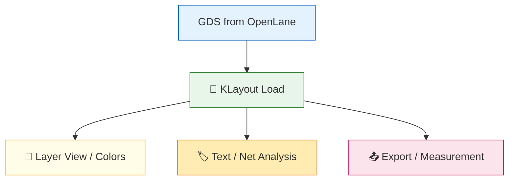

# 🛠️ 08_klayout_viewer_setup  
**KLayout レイアウトビューア設定（中厚版）**  
*KLayout Layout Viewer Setup (Mid-Level Version)*

---

## 📘 概要｜Overview
本章では、Sky130 の **GDSII / OASIS レイアウトを正しく閲覧・解析**するために  
KLayout のセットアップ・基本操作・レイヤ管理・Text/Net 解析方法をまとめます。  
*This chapter explains how to configure KLayout for proper viewing and analysis of Sky130 GDS/OASIS layouts.*

---

# ✅ 1. KLayout のインストール｜*Install KLayout*

| OS | 方法 |
|----|------|
| **Windows** | https://www.klayout.de → Installer |
| **macOS** | dmg / Homebrew（`brew install klayout`） |
| **Linux** | AppImage / パッケージ |

---

# ✅ 2. GDS を開く｜*Open GDS File*

```
File → Open → inverter.gds
```

OpenLane 生成物のパス例：

```
~/openlane/designs/simple_inv/runs/.../results/final/gds/inverter.gds
```

---

# ✅ 3. UI 主要パネル｜*Main UI Panels*

| パネル | 役割 |
|--------|------|
| **Layers** | レイヤ表示・色変更 |
| **Cells** | セル階層管理 |
| **Navigator** | 領域移動 |
| **Properties** | 選択情報表示 |

---

# ✅ 4. 基本操作｜*Basic Navigation*

| 操作 | 動作 |
|------|------|
| 🖱 ホイール | ズーム |
| 中ボタンドラッグ | Pan |
| `F2` | Select |
| `F3` | Move |
| `Ctrl + F` | Text/Net 検索 |

---

# ✅ 5. レイヤ管理｜*Layer Control*

### ✅ レイヤ表示の ON/OFF  
Layers パネルの目のアイコンをクリック。

### ✅ 色変更  
レイヤを右クリック → **Color**

### ✅ Style（可視化方式）  
- Filled  
- Outline  
- Transparent  

### ✅ Stipple（ハッチング）  
密集領域の視認性改善。

---

# ✅ 6. Text / Net 情報の確認｜*Labels and Nets*

### ✅ Text のホバー表示  
例：  
```
dsa[11].y_out_next
```

### ✅ 検索  
```
Ctrl + F → Text Search
```

### ✅ 選択情報  
Status bar に：

```
selected: text("sig" r0 12345,67890) on 68/5
```

---

# ✅ 7. KLayout スクリプト（pya）｜*Scripting with pya*

### 例：GDS レイヤ一覧表示  
```python
import pya
layout = pya.Layout.read("inverter.gds")
for li in layout.layer_indexes():
    print(layout.get_info(li))
```

---

# ✅ 8. Mermaid：KLayout Workflow  


---

# ✅ 9. よくある問題｜*Common Issues*

| 問題 | 原因 | 対処 |
|------|------|------|
| GDS が重い | Cairo 描画 | Setup → Rendering → OFF |
| Text が見えない | レイヤ非表示 | Layers で該当レイヤ ON |
| レイヤ番号が不明 | GDS 設計者依存 | Layer Properties を確認 |

---

# ✅ 10. チェックリスト｜*Checklist*

| 項目 | OK |
|------|----|
| KLayout 起動 | ✅ |
| GDS 読み込み | ✅ |
| レイヤ表示管理 | ✅ |
| Text/Net の解析 | ✅ |
| スクリプト実行 | ✅ |

---

## 👤 Author
三溝 真一（Shinichi Samizo）  
GitHub: https://github.com/Samizo-AITL
