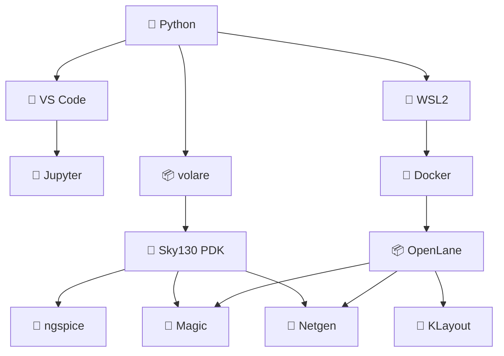

---

# ✅ 09_complete_environment_checklist  
**セットアップ総合チェックリスト（第0章 最終仕上げ）**  
*Complete Environment Checklist (Final Section of Chapter 0)*

## 📘 概要｜Overview
本章は **第0章：環境構築** の総仕上げとして、  
Python → Sky130 PDK → ngspice → VS Code → WSL2 → Docker → OpenLane → Magic → KLayout  
までの **全ツール動作確認を一括で行うチェックリスト** をまとめています。  
*This chapter provides a full checklist to verify the entire toolchain from Python to Sky130 PDK, ngspice, WSL2, Docker, OpenLane, Magic, and KLayout.*

# ✅ 1. Python / VS Code チェック｜*Python / VS Code Check*

| 事項 | OK? |
|------|-----|
| `python --version` が動作 | ✅ |
| `pip list` が動作 | ✅ |
| VS Code が起動 | ✅ |
| Python / Jupyter 拡張が有効 | ✅ |
| Notebook が実行できる | ✅ |

# ✅ 2. Sky130 PDK チェック｜*Sky130 PDK Check*

| 項目 | OK? |
|------|-----|
| `volare enable sky130A` が成功 | ✅ |
| `~/.volare/sky130A` が存在 | ✅ |
| Magic tech ファイルの存在 | ✅ |
| Netgen setup ファイルの存在 | ✅ |
| SPICE モデル include が成功 | ✅ |

# ✅ 3. ngspice チェック｜*ngspice Check*

| 項目 | OK? |
|------|-----|
| `ngspice -v` が動く | ✅ |
| CMOS インバータがシミュレーション可能 | ✅ |
| プロット表示（GUI）が動く | ✅ |

# ✅ 4. WSL2 チェック｜*WSL2 Check*

| 項目 | OK? |
|------|-----|
| `wsl --status` が正常 | ✅ |
| Ubuntu が起動 | ✅ |
| `sudo apt update` が動作 | ✅ |

# ✅ 5. Docker チェック｜*Docker Check*

| 項目 | OK? |
|------|-----|
| Docker Desktop が起動 | ✅ |
| WSL Integration が ON | ✅ |
| `docker ps` が動作 | ✅ |

# ✅ 6. OpenLane 初回実行チェック｜*OpenLane First Run Check*

| 項目 | OK? |
|------|-----|
| コンテナ起動 (`openlane:2024.09.11`) | ✅ |
| `flow.tcl -design simple_inv` が完走 | ✅ |
| GDS が生成される | ✅ |

# ✅ 7. Magic DRC / Extract チェック｜*Magic DRC / Extract Check*

| 項目 | OK? |
|------|-----|
| Magic で GDS を読み込める | ✅ |
| `drc check` が動作 | ✅ |
| `extract all` → `ext2spice` が成功 | ✅ |

# ✅ 8. Netgen LVS チェック｜*Netgen LVS Check*

| 項目 | OK? |
|------|-----|
| Verilog vs Layout SPICE の照合 | ✅ |
| `Circuits match uniquely.` | ✅ |

# ✅ 9. KLayout チェック｜*KLayout Check*

| 項目 | OK? |
|------|-----|
| KLayout 起動 | ✅ |
| GDS が表示される | ✅ |
| レイヤ表示・色変更が可能 | ✅ |
| Text / Net が確認できる | ✅ |

# ✅ 10. セットアップ全体アーキテクチャ（Mermaid）  
*Full Setup Architecture Diagram*

# ✅ 11. 全体チェックまとめ｜*Full Summary Checklist*

| 区分 | 成否 |
|------|------|
| Python が動作 | ✅ |
| VS Code 完了 | ✅ |
| PDK 完了 | ✅ |
| ngspice 完了 | ✅ |
| WSL2 完了 | ✅ |
| Docker 完了 | ✅ |
| OpenLane 完了 | ✅ |
| Magic / Netgen 完了 | ✅ |
| KLayout 完了 | ✅ |
| **全フロー合格** | ✅🎉 |

## 👤 Author  
三溝 真一（Shinichi Samizo）  
GitHub: https://github.com/Samizo-AITL
