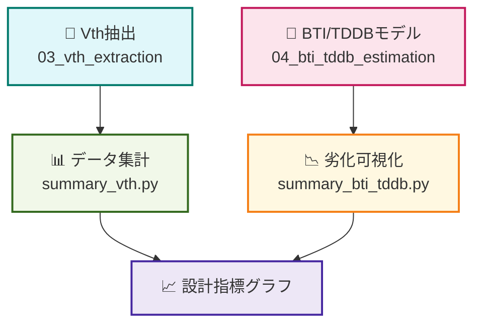

---

# 📊 05_data_summary - SPICE評価結果の集計と可視化  
**Summary and Visualization of SPICE-Based Device Evaluation**

---

## 📄 概要｜Overview

このフォルダでは、前章までで取得した `.log` や `.dat` ファイルから、  
**MOSトランジスタ特性（Vth・BTI・TDDB）を統合的に可視化**します。  
複数実験結果をまとめて、設計指標として扱いやすい形式に整理します。

This folder summarizes and visualizes **Vth extraction and degradation models** (BTI / TDDB),  
using previously obtained `.log` and `.dat` files. The goal is to make data readily interpretable for design considerations.

---

## 📁 フォルダ構成｜Folder Structure

| ファイル名 / Folder | 内容｜Description |
|---------------------|------------------------------------------------|
| [`summary_vth.py`](./summary_vth.py) | Vth抽出データの統合・W/L依存の描画 |
| [`summary_bti_tddb.py`](./summary_bti_tddb.py) | 劣化モデル（BTI/TDDB）の比較グラフ作成 |
| [`data/`](./data/) | 各章から出力された `.dat` or `.csv` を格納 |
| [`output/`](./output/) | グラフ画像・加工済データの保存先 |

---

## 🔧 使用環境｜Requirements

```bash
pip install matplotlib pandas numpy
```

---

## 🚀 実行方法｜How to Run

```bash
python3 summary_vth.py
python3 summary_bti_tddb.py
```

---

## 📈 出力内容｜Output Samples

- **Vth vs W/L** グラフ（スケーリング傾向の可視化）
- **ΔVth（BTI） vs Time**、**MTTF（TDDB） vs Electric Field** の比較図
- **設計観点で重要な傾向整理**

---

## 🧠 教育的意義｜Educational Significance

| 項目｜Item | 内容｜Description |
|--------|---------------------------|
| 🧪 統合解析 | 各章の出力をつなげて意味のある形に整理 |
| 📏 設計応用 | 電源・W/Lサイズ・ばらつきに基づく指標化 |
| 📚 データ駆動設計 | SPICEデータを元に定量評価と設計フィードバック |

---

## 🔍 Mermaid図による構成可視化（Code Block）



> ※ MermaidはGitHub Pages（Jekyll）では表示されない場合があります。  
> 以下のエディタ等で確認できます：  
> 🔗 [https://mermaid.live/](https://mermaid.live/)

---

## 🔗 関連リンク｜Related Links

- [📘 03_vth_extraction - Vth自動抽出](../03_vth_extraction/README.md)
- [📘 04_bti_tddb_estimation - 劣化モデルの可視化](../04_bti_tddb_estimation/README.md)
- [🏠 第2章トップへ戻る](../README.md)

---
