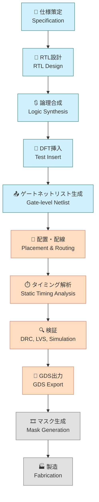

# 🏗️ 実践編 第3章：OpenLaneによるデジタル設計実習  
**Practical Chapter 3: Digital Design Practice Using OpenLane**

---

## 📘 概要｜Overview

本章では、オープンソースEDAツール「**OpenLane**」を用いて、  
**Verilog RTL から GDS 生成までのデジタルLSI設計フロー**を体験します。  

This chapter provides hands-on practice of a **digital implementation flow**,  
from Verilog RTL to GDS layout, using the open-source EDA framework **OpenLane**.

Sky130 PDKとの統合、制約記述、合成・配置・配線・DRCなど、  
実設計で必要なフロー全体を体験します。  

---

## 🎯 学習目標｜Learning Objectives

- ✅ RTL〜GDSまでの流れを把握し、実行できる  
  Understand the full flow from RTL to GDS  
- ✅ 各ステージ（合成・配置・配線・DRC等）の目的とツールを理解  
  Understand the roles of synthesis, placement, routing, DRC, etc.  
- ✅ 面積・タイミング・電力などのレポートを解釈し設計へ反映  
  Interpret reports on area, timing, and power, and feed back into design  
- ✅ `SDC`, `floorplan`, `PDN` などの制約記述に習熟  
  Get familiar with design constraints such as `SDC`, `floorplan`, and `PDN`  

---

## 📚 フォルダ構成｜Folder Structure

| フォルダ名｜Folder | 内容｜Description |
|----------------------|--------------------------------------------------|
| [`01_intro_openlane/`](01_intro_openlane/README.md) | OpenLane と Sky130 の概要｜Introduction to OpenLane & Sky130 |
| [`02_rtl_to_gds_flow/`](02_rtl_to_gds_flow/README.md) | Verilog から GDS までの設計フロー｜RTL-to-GDS Implementation |
| [`03_power_timing_report/`](03_power_timing_report/README.md) | レポート出力と解析｜Power, Timing, Area Analysis |
| [`04_custom_constraint/`](04_custom_constraint/README.md) | 制約ファイルのカスタマイズ｜Constraint Customization |

---

## 🛠️ 使用ツール｜Required Tools

| ツール｜Tool | 説明｜Description |
|-------------|---------------------------|
| 🧩 **OpenLane v2.x+** | メインのEDAフロー（デジタル実装） |
| 🧩 **Sky130 PDK (`sky130A`)** | 対応プロセス設計キット |
| 🐳 **Docker** | 推奨実行環境（OpenLaneはDocker対応） |
| 🐍 **Python 3.x** | レポート整形や補助スクリプト用 |

---

## 📦 OpenLane / Sky130 の準備｜Setup Guide

```bash
git clone https://github.com/The-OpenROAD-Project/OpenLane.git
cd OpenLane
make pull-openlane
make pull-sky130-pdk
```

🔎 詳細なセットアップ手順は → [`01_intro_openlane/`](01_intro_openlane/README.md)

---

## 🗺️ SoC設計の全体フロー（Mermaid図＋色分け＋アイコン）  
**🗺️ SoC Design Flow with Colored Mermaid Diagram and Icons**

> ⚠️ このページではMermaidフローチャートは表示されません。  
> 👉 **以下のリンクからGitHubで表示可能です：**  
> [📎 GitHubでMermaidフローチャートを確認](https://github.com/Samizo-AITL/Edusemi-v4x/blob/main/chapter5_soc_design_flow/5.1_soc_design_flow.md)



---

## 🔗 関連章｜Related Chapters

- [📁 第1章：Pythonによる自動化ツール群](../e_chapter1_python_automation_tools/README.md)  
- [📁 第2章：Sky130実験とSPICE特性評価](../e_chapter2_sky130_experiments/README.md)

---

## 📝 備考｜Notes

- ✅ Sky130 PDK に対応した最小構成回路を題材にしています  
- 🔁 実務応用では SoC、IPマクロ設計、タイミング最適化などへ拡張可能  
- 📤 GDS出力により、後工程（マスク設計、MPW発注）まで繋がる体験に対応  

---

## 👤 著者・ライセンス｜Author & License

| 項目｜Item | 内容｜Details |
|------------|-----------------------------|
| **著者｜Author** | 三溝 真一（Shinichi Samizo） |
| **GitHub** | [Samizo-AITL](https://github.com/Samizo-AITL) |
| **Email** | [shin3t72@gmail.com](mailto:shin3t72@gmail.com) |
| **ライセンス｜License** | MIT License（再配布・改変自由）<br>Redistribution and modification allowed |

---

## 🔙 戻る｜Back to Top

[🏠 Edusemi-v4x トップへ戻る｜Back to Edusemi-v4x Top](../README.md)
