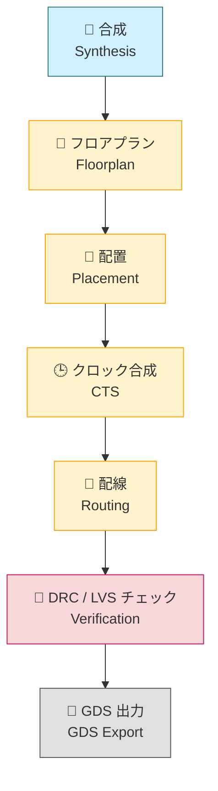

---

# 🏗️ 4.5 OpenLaneによる物理設計フロー  
**Physical Design Flow with OpenLane**

---

この節では、Verilogで記述された設計を物理チップとして実現するための一連のステップを、OpenLaneを使って実行する手順とともに解説します。RTL（論理設計）からGDS（製造データ）への変換には多くの中間工程があり、それぞれの意味と設計者としての理解が求められます。

---

## 🔧 OpenLaneとは

OpenLaneは、Sky130プロセスを前提とした**オープンソースの物理設計自動化ツールチェーン**です。以下の主要工程を統合的に実行可能です：

- 合成（Synthesis）
- フロアプラン（Floorplan）
- 配置（Placement）
- クロックツリー合成（CTS）
- 配線（Routing）
- 検証（DRC / LVS）
- GDS出力（製造マスクデータ生成）

---

## 🗺️ フローの全体像（Mermaid図）

> ⚠️ このページではMermaidフローチャートは表示されません。  
> 👉 GitHubページで以下を視覚的に確認できます：  
> [📎 GitHubでMermaidフローチャートを見る](https://github.com/Samizo-AITL/Edusemi-v4x/blob/main/e_chapter4_poc_spec_and_design/4.5_physical_design_flow.md)



---

## 🔁 各ステップの簡易解説

| 工程 | 概要 |
|------|------|
| **Synthesis** | RTLからゲートレベルネットリストを生成 |
| **Floorplan** | ダイサイズやピン位置などの配置制約を設定 |
| **Placement** | 標準セルを配置 |
| **CTS** | クロック配線＋バッファ挿入で遅延均一化 |
| **Routing** | 各ネットを配線 |
| **DRC/LVS** | レイアウト検証（ルール違反・回路一致） |
| **GDS Export** | 最終製造データ（マスク用GDSファイル）出力 |

---

## 🧪 実行構成と手順

### 📁 必須ファイル一覧（例：`designs/fsm/`）

- `config.tcl`：各種OpenLane設定
- `design.v`：Verilog RTL
- `sdc.tcl`：タイミング制約ファイル
- `Makefile`：簡易実行スクリプト

### ▶ 実行コマンド（例：fsm）

```sh
cd OpenLane/
make DESIGN=fsm
```

- 実行後、`runs/fsm/` に結果が生成されます。

---

## 📦 出力ファイル構成と確認ポイント

| ディレクトリ | 内容 |
|--------------|------|
| `results/placement/` | DEFファイル（配置結果） |
| `results/routing/`   | GDSファイル（配線含むレイアウト） |
| `reports/`           | 面積・タイミング・DRC・LVSのログ |

GTKWaveやKLayoutで確認可能。

---

## 🧩 config.tcl / Makefile の要点

- `config.tcl`の主要設定：

```tcl
set ::env(DESIGN_NAME) "fsm"
set ::env(CLOCK_PERIOD) "40.0"
set ::env(FP_CORE_UTIL) "30"
set ::env(PL_TARGET_DENSITY) "0.5"
```

- `Makefile`のターゲット例：

```sh
make DESIGN=fsm run_synthesis
make DESIGN=fsm run_floorplan
make DESIGN=fsm run_routing
```

---

## 🎓 教材としての意義

物理設計は、**「論理」→「物理」→「製造」**へのブリッジです。OpenLaneにより、自動化と可視化を通じてその全体像を体験できます。これにより、設計者としての理解が実務レベルに近づきます。

---

## 🔗 次節への接続

次節 [4.6: レイアウト結果と考察](4.6_layout_result_and_discussion.md) では、GDSやDRC/STAレポートなどの結果を元に、設計品質を評価・考察します。
