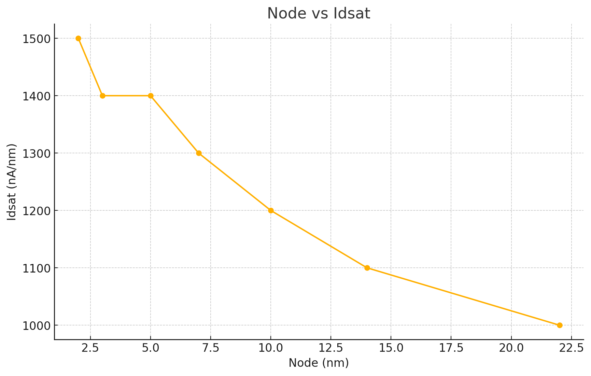
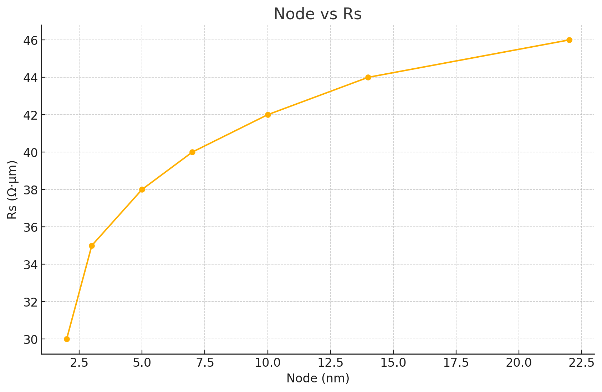
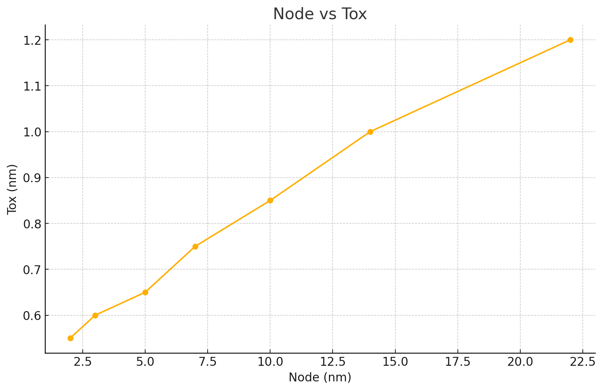
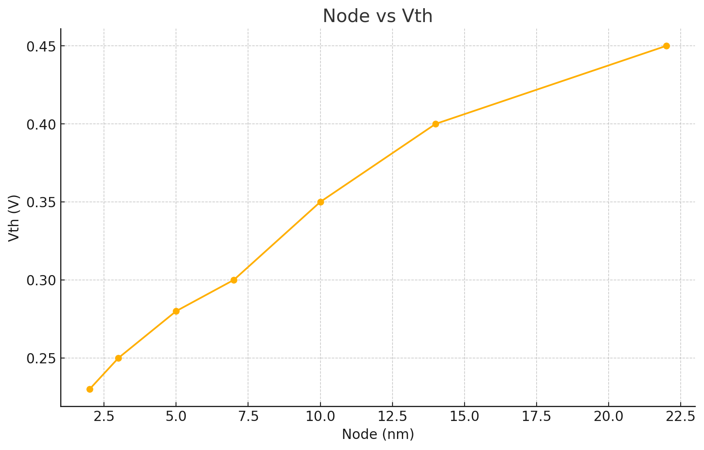
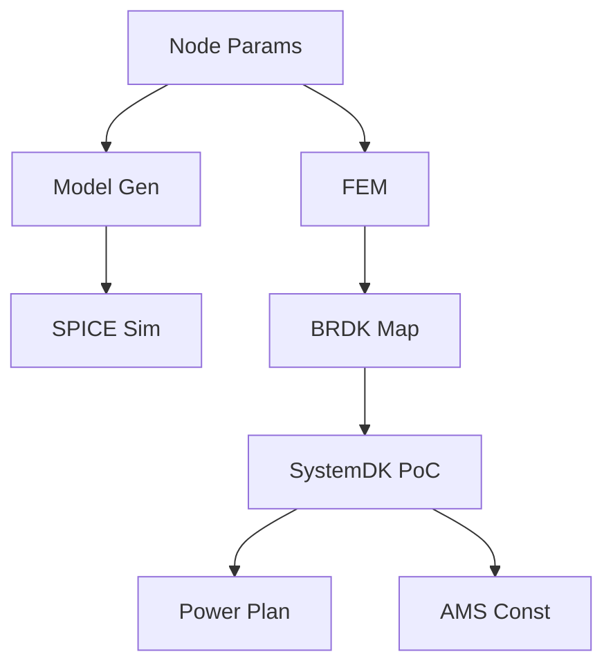

# 📊 appendixf1_05_node_params_FULLv3.md  
**FinFET / GAA 各ノード世代のパラメータ比較と完全設計応用資料（教育・PoC・FEM対応）**

---

## ✅ 1. ノード別パラメータ表

| Node (nm) | Idsat (nA/nm) | Rs (Ω·μm) | Tox (nm) | Vth (V) |
|-----------|----------------|------------|-----------|----------|
| 22        | 1000           | 46         | 1.2       | 0.45     |
| 14        | 1100           | 44         | 1.0       | 0.40     |
| 10        | 1200           | 42         | 0.85      | 0.35     |
| 7         | 1300           | 40         | 0.75      | 0.30     |
| 5         | 1400           | 38         | 0.65      | 0.28     |
| 3         | 1400           | 35         | 0.60      | 0.25     |
| 2         | 1500           | 30         | 0.55      | 0.23     |

---

## 📈 2. ノードトレンドグラフ






---

## 📐 3. 有効チャネル幅の数式

- FinFET:
  $$
  W_{\mathrm{total}} = n \cdot (2H_{\mathrm{fin}} + W_{\mathrm{fin}})
  $$
- GAA:
  $$
  W_{\mathrm{total}} = 2 \cdot (H + W) \cdot n
  $$

---

## 💾 4. BSIM-CMG `.model` 記述例（抜粋）

```verilog
.model n2nm_GAA BSIMCMG level=54
+ type=n tox=0.55e-9 lgate=12e-9 vth0=0.23
+ nsheet=4 sheetwidth=25e-9 sheetheight=6e-9
+ u0=370 rdsw=110 rs=30 rd=32
+ vsat=2.2e7
+ cgso=0.65e-10 cgdo=0.65e-10
+ version=4.7
```

📄 ファイル: `gate_test_n2nm_gaa.spice`

---

## 🔧 5. 設計応用例：GAA + MRAM統合

### 条件設定と電流計算
- Idsat = 1500 nA/nm, Rs = 30 Ω·μm, Wtotal = 248 nm
- 書込み電流 = 200 μA, パルス幅 = 5 ns

#### 熱発熱：
$$
P = I^2 R = (200\mu A)^2 \times 30\Omega = 1.2\mu W
$$

#### 電流密度：
$$
J = \frac{200e^{-6}}{248e^{-9} \cdot 5e^{-9}} \approx 1.6\times10^{13} \ A/m^2
$$

---

## 📘 6. 教育補足セクション（英日併記）

| 項目 | 日本語解説 | English Explanation |
|------|------------|---------------------|
| $I_{\mathrm{dsat}}$ | 微細化で増加。GAAはさらに高効率 | Increased with scaling; GAA efficient |
| $R_s$ | 減少。GAAでさらに低く | Decreases; lowest in GAA |
| $T_{\mathrm{ox}}$ | 薄膜化。リーク制御が課題 | Thinner; leakage control critical |
| $V_{\mathrm{th}}$ | 小さく。ノイズマージンが課題 | Smaller; noise margin design harder |

---

## 🧮 7. Sky130との比較セクション

| Parameter | Sky130 | FinFET 7nm | GAA 2nm |
|-----------|--------|-------------|---------|
| $L_g$     | 150 nm | 16 nm       | 12 nm   |
| $T_{ox}$  | 5.0 nm | 0.75 nm     | 0.55 nm |
| $V_{th}$  | ~0.6 V | ~0.3 V      | ~0.23 V |
| $I_{dsat}$| ~350   | ~1300       | ~1500   |
| $R_s$     | ~90    | ~42         | ~30     |

---

## 🧩 8. SystemDK連携図（GitHub最小構成対応）



---

## 📚 9. 出典・参考リンク

- BSIM-CMG: https://bsim.berkeley.edu/models/bsimcmg/
- Samsung GAA: https://ieeexplore.ieee.org/document/9744284
- Intel IEDM Rs: https://ieeexplore.ieee.org/document/9632273

---
