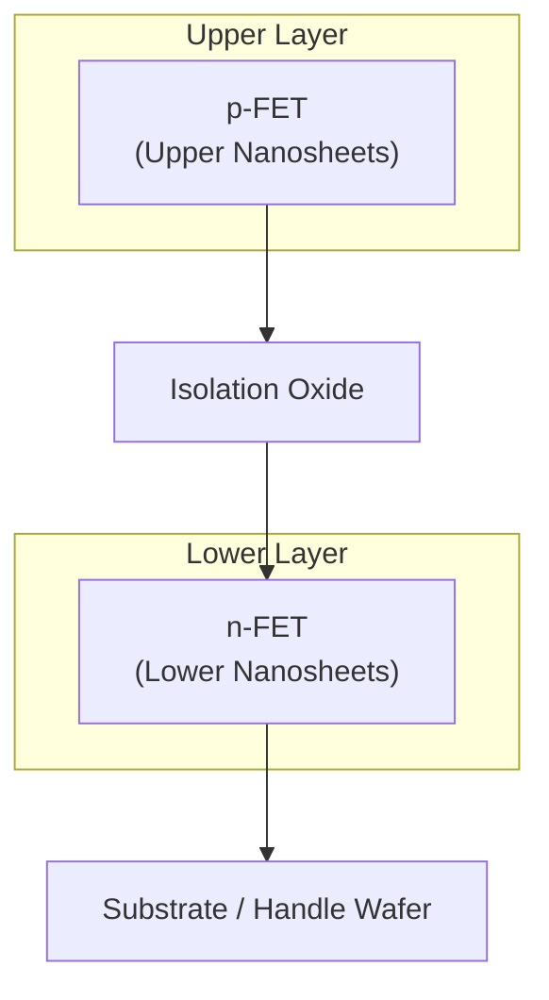
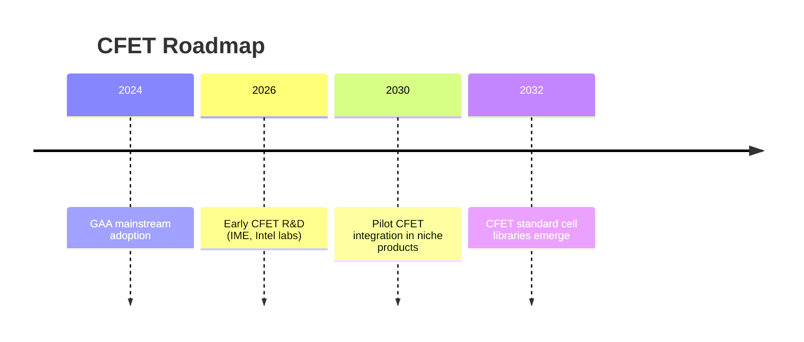

# 1.5 CFET構造とスタック型MOSの展望  
# 1.5 CFET Structure and Outlook for Stacked MOS

---

## 📘 概要｜Overview

**CFET（Complementary FET）** は、**nFETとpFETを垂直方向に積層**する次世代トランジスタ構造です。  
FinFET → GAA の進化を引き継ぎながら、**セル面積の大幅削減**と**配線自由度の拡大**を可能にします。

> CFET vertically stacks nFET and pFET, aiming for denser standard cells and improved routing flexibility beyond GAA.

---

## 🧱 構造原理｜Structural Concept


> **GAA**: n/p を同一層に並列配置  
> **CFET**: n/p を垂直積層し、レイアウト面積を縮小

---

## ⚡ 電気的特徴と設計影響｜Electrical Characteristics & Design Impact

| 🔍 項目 / Item | 💡 CFETの特性 / CFET Features |
|----------------|--------------------------------|
| ゲート制御 | GAAと同等の4面制御 / Same as GAA |
| n/p対称性 | 垂直構造でレイアウト対称性向上 |
| クロストーク | 層間干渉に対策必要 |
| 配線自由度 | BEOL空間の有効利用 |
| 設計難易度 | 高度PDK・抽象化必須 |

---

## 🏭 製造課題｜Manufacturing Challenges

- **チャネルごとのドーピング独立性**：nFETとpFETのドーピング分離が難しい  
- **熱処理ステップ分離**：下層が熱予算を超えやすい  
- **選択エピ成長とエッチング精度**：複数工程の整合が必須  
- **BEOL統合**：金属層高さやIRドロップの調整

> Independent doping, thermal budget control, selective epitaxy, and BEOL integration are critical for CFET fabrication.

---

## 🧩 モジュール統合効果｜Module-Level Integration Advantage

- **インバータモジュールを1セルで完結**  
- n/pの物理的分離が不要、**セル面積半減**  
- 標準セル密度が実質**2倍**

> CFET enables the tightest inverter integration, halving cell area and doubling density.

---

## 🔮 今後の展望｜Future Outlook



- **2030年代前半**：IntelやIMEが試作段階へ  
- **EDA/PDK整備**と**設計者教育**が必須  
- **システム・オン・スタック（SoS）**時代の中核技術へ

---

### 🔗 関連補足｜Related Appendices

- [`appendixf1_04_cfet.md`](appendixf1_04_cfet.md)  
- [`appendixf1_05a_cfet_params.md`](appendixf1_05a_cfet_params.md)  
- [`appendixf1_05_node_params_structural.md`](appendixf1_05_node_params_structural.md)  

---

[← 戻る / Back to Special Chapter 1 Top](../f_chapter1_finfet_gaa/README.md)


---

```mermaid
flowchart TB
%% CFET 断面の簡易3D風（擬似）イメージ
%% Mermaid v10+ を想定。色は教材向けに分類。

classDef metal fill:#cfd8dc,stroke:#333,stroke-width:1px,color:#111;
classDef contact fill:#dddddd,stroke:#333,stroke-width:1px,color:#111;
classDef oxide fill:#e6f2ff,stroke:#333,stroke-width:1px,color:#111;
classDef gate fill:#c8a37a,stroke:#333,stroke-width:1px,color:#111;
classDef si fill:#fff5f0,stroke:#333,stroke-width:1px,color:#111;
classDef nwell fill:#d8e6ff,stroke:#333,stroke-width:1px,color:#111;
classDef pwell fill:#ffd6e0,stroke:#333,stroke-width:1px,color:#111;
classDef dopN fill:#a6c0ff,stroke:#333,stroke-width:1px,color:#111;
classDef dopP fill:#ff9da6,stroke:#333,stroke-width:1px,color:#111;

%% ── BEOL ─────────────────────────────────────────────────────────
subgraph BEOL["BEOL (配線)"]
direction TB
M2[M2 Metal]:::metal
VIA12[Via (M1↔M2)]:::contact
M1[M1 Metal]:::metal
end

%% ── 上層：pFET（Upper） ─────────────────────────────────────────
subgraph PFET["pFET（上層）/ Upper Layer"]
direction TB
pS[p+ Source]:::dopP
pGate[Gate (GAA wrap)]:::gate
pNS2[Upper Nanosheet]:::si
pNS1[Lower Nanosheet]:::si
pD[p+ Drain]:::dopP
end

%% ── 中間絶縁 ───────────────────────────────────────────────────
Iso[Interlayer Oxide]:::oxide

%% ── 下層：nFET（Lower） ─────────────────────────────────────────
subgraph NFET["nFET（下層）/ Lower Layer"]
direction TB
nS[n+ Source]:::dopN
nGate[Gate (GAA wrap)]:::gate
nNS2[Upper Nanosheet]:::si
nNS1[Lower Nanosheet]:::si
nD[n+ Drain]:::dopN
end

%% ── バルク/ハンドル ────────────────────────────────────────────
SubW[Substrate / Handle]:::si

%% ── BEOL への接続（立体感：斜め配線の擬似表現） ───────────────
pS -->|Contact| CpS[W Plug]:::contact --> M1
pD -->|Contact| CpD[W Plug]:::contact --> M1
nS -->|Contact| CnS[W Plug]:::contact --> M1
nD -->|Contact| CnD[W Plug]:::contact --> M1
M1 --> VIA12 --> M2

%% ── 縦積みの関係（擬似3D：ずらし配置の接続） ──────────────────
pGate --- pNS2
pGate --- pNS1
nGate --- nNS2
nGate --- nNS1

%% ── 縦方向スタック連結 ────────────────────────────────────────
PFET --> Iso --> NFET --> SubW

%% ── 補足ラベル ───────────────────────────────────────────────
class M1,M2 metal
class CpS,CpD,CnS,CnD,VIA12 contact
```

```mermaid
flowchart TB
%% CFET 断面の簡易3D風（擬似）イメージ

classDef metal fill:#cfd8dc,stroke:#333,stroke-width:1px,color:#111;
classDef contact fill:#dddddd,stroke:#333,stroke-width:1px,color:#111;
classDef oxide fill:#e6f2ff,stroke:#333,stroke-width:1px,color:#111;
classDef gate fill:#c8a37a,stroke:#333,stroke-width:1px,color:#111;
classDef si fill:#fff5f0,stroke:#333,stroke-width:1px,color:#111;
classDef dopN fill:#a6c0ff,stroke:#333,stroke-width:1px,color:#111;
classDef dopP fill:#ff9da6,stroke:#333,stroke-width:1px,color:#111;

%% ── BEOL ─────────────────────────────────
subgraph BEOL["BEOL (配線)"]
direction TB
M2[M2 Metal]:::metal
VIA12[Via (M1↔M2)]:::contact
M1[M1 Metal]:::metal
end

%% ── 上層：pFET ────────────────────────────
subgraph PFET["pFET（上層）/ Upper Layer"]
direction TB
pS[p+ Source]:::dopP
pGate[Gate (GAA wrap)]:::gate
pNS2[Upper Nanosheet]:::si
pNS1[Lower Nanosheet]:::si
pD[p+ Drain]:::dopP
end

%% ── 中間絶縁 ─────────────────────────────
Iso[Interlayer Oxide]:::oxide

%% ── 下層：nFET ────────────────────────────
subgraph NFET["nFET（下層）/ Lower Layer"]
direction TB
nS[n+ Source]:::dopN
nGate[Gate (GAA wrap)]:::gate
nNS2[Upper Nanosheet]:::si
nNS1[Lower Nanosheet]:::si
nD[n+ Drain]:::dopN
end

%% ── バルク/ハンドル ──────────────────────
SubW[Substrate / Handle]:::si

%% 接続（擬似3D：斜め表現は矢印種で表現）
pS -->|Contact| CpS[W Plug]:::contact --> M1
pD -->|Contact| CpD[W Plug]:::contact --> M1
nS -->|Contact| CnS[W Plug]:::contact --> M1
nD -->|Contact| CnD[W Plug]:::contact --> M1
M1 --> VIA12 --> M2

%% ゲートとナノシートの囲み関係（擬似）
pGate --- pNS2
pGate --- pNS1
nGate --- nNS2
nGate --- nNS1

%% 縦積みスタック（ノード経由で接続）
pNS1 --> Iso --> nNS1 --> SubW

%% 仕上げのクラス指定
class M1,M2 metal;
class CpS,CpD,CnS,CnD,VIA12 contact;
```
