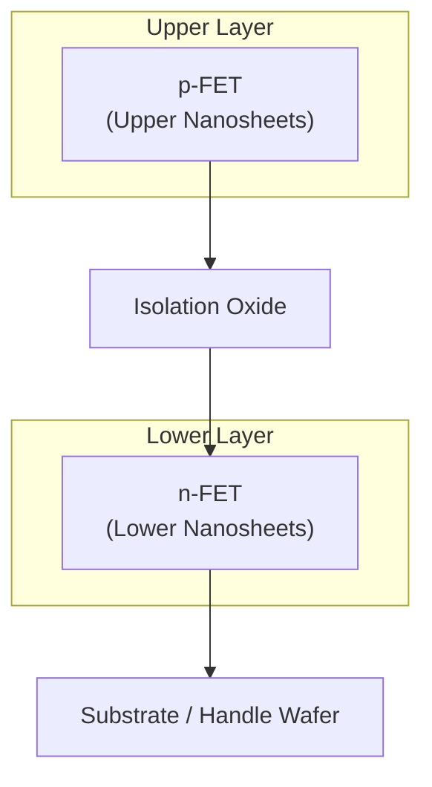
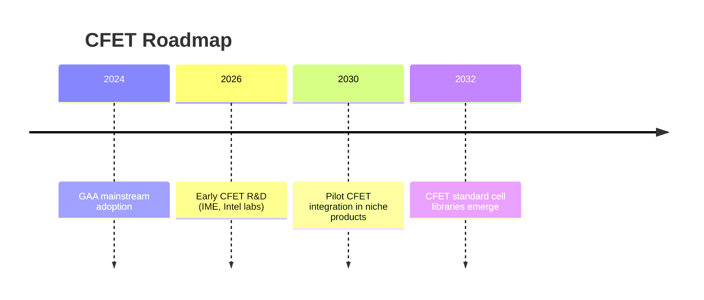

---

# 1.5 CFET構造とスタック型MOSの展望  
# 1.5 CFET Structure and Outlook for Stacked MOS

---

## 📘 概要｜Overview

**CFET（Complementary FET）** は、**nFETとpFETを垂直方向に積層**する次世代トランジスタ構造です。  
FinFET → GAA の進化を継承しながら、**セル面積の大幅削減**と**配線短縮による遅延改善**を可能にします。  

> CFET vertically stacks nFET and pFET, realizing CMOS inverters **within a single cross-section**, thereby doubling density and reducing delay.

---

## 🧱 構造原理｜Structural Concept

- **GAA**: n/p を同一層に横並び配置  
- **CFET**: n/p を上下積層 → **1断面でインバータ形成**

---

## ⚡ 電気的特徴と設計影響｜Electrical Characteristics & Design Impact

| 🔍 項目 / Item | 💡 CFETの特性 / CFET Features |
|----------------|--------------------------------|
| ゲート制御 | GAAと同等の全周制御 / Same as GAA |
| インバータ形成 | **断面そのものがCMOSインバータ** |
| 配線距離 | n/p上下直結 → RC低減・遅延減少 |
| 面積効率 | 標準セル密度 ≈ 2倍（理論値） |
| クロストーク | 層間干渉に対策必要 |
| 設計難易度 | 高度PDK・抽象化必須 |

---

## 📐 ソース／ドレイン配置｜Source/Drain Arrangement

- **平行型（Sequential CFET）**  
  - n/p チャネルは同方向。  
  - S/Dは上下に揃えて配置し、**垂直ビアで接続**。  
- **直交型（Forksheet-CFET構想）**  
  - nMOSが水平、pMOSが垂直に配置される例も研究中。  
  - 配線距離短縮やセル密度最適化が狙い。  

👉 いずれも「**インバータを1セル内で完結**」する点が共通。  

---

## 🏭 製造課題｜Manufacturing Challenges

- **ドーピング独立性**：上下でn/pを分離する制御の困難さ  
- **熱処理**：下層nMOSの熱影響が上層pMOSへ伝播  
- **エピ成長・エッチング**：多層構造の高精度プロセスが必要  
- **BEOL統合**：VDD/GND配線の分離とIRドロップ対策  

---

## 🧩 モジュール統合効果｜Module-Level Integration Advantage

- **インバータが断面単位で完成**  
- n/p分離が不要 → セル面積**半減**  
- 配線削減でRCが低減 → **遅延なし / 高速化**  
- 標準セルライブラリを再定義することで、**設計密度が実質2倍**  

---

## 🔮 今後の展望｜Future Outlook

- **2030年代前半**：Intel, IMECなどで試作段階へ  
- **EDA/PDK整備**と**設計者教育**が必須  
- 「**断面＝インバータ**」という新しい設計概念が、SoS (System-on-Stack) 時代の中核に  

---

### 🔗 関連補足｜Related Appendices

- [`appendixf1_04_cfet.md`](appendixf1_04_cfet.md)  
- [`appendixf1_05a_cfet_params.md`](appendixf1_05a_cfet_params.md)  
- [`appendixf1_05_node_params_structural.md`](appendixf1_05_node_params_structural.md)  

---

[← 戻る / Back to Special Chapter 1 Top](../f_chapter1_finfet_gaa/README.md)
