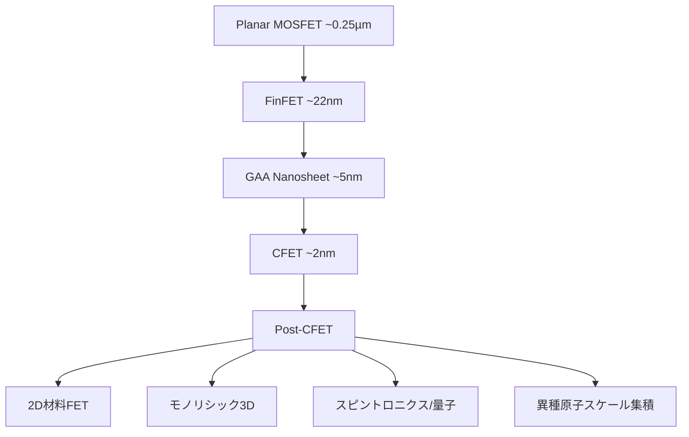
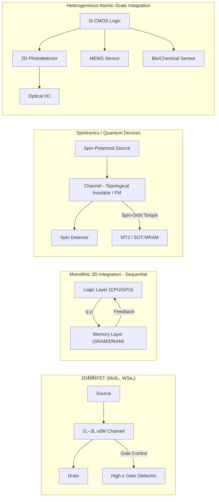
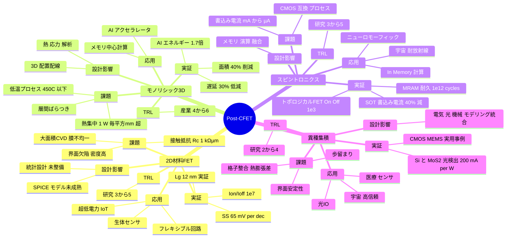

# Post-CFET デバイス・アーキテクチャ 論文草稿（詳細・図表完全版）

## 要旨（Abstract）
CMOS スケーリングは Planar MOSFET から FinFET、ゲート・オール・アラウンド（GAA）、そして Complementary FET（CFET）へと進化してきた。CFET は電気的制御性をさらに高め、短チャネル効果や配線ボトルネックを緩和するが、シリコン基盤の材料物性や熱拡散特性は限界に近づきつつある。本稿では、**Post-CFET デバイス候補**として、**二次元材料 FET、モノリシック 3D 集積、スピントロニクス／量子デバイス、異種原子スケール集積**を整理する。それぞれの物理原理、製造課題、定量的実証データ、信頼性指標、応用分野、設計フローへの影響を比較し、教育的意義を含めた展望を与える。

---

## 1. 序論（詳細版）

半導体産業は 1970 年代以降、**デバイス微細化（scaling）と新構造導入**によって 50 年以上にわたり進化を続けてきた。Moore 則が掲げる「18〜24か月でのトランジスタ数倍増」は、単なる寸法縮小だけでなく、トランジスタ構造の革新、材料工学、配線・パッケージ技術、設計手法の進展が相乗的に支えてきたものである。  

- **Planar MOSFET 時代（〜32 nm 世代）**  
  横方向の微細化によりチャネル長を短縮、性能と集積度を向上させた。しかしチャネルが数十 nm 以下になると、**短チャネル効果（DIBL, Vth roll-off）**やリーク電流の急増が顕在化し、電源電圧スケーリングも頭打ちになった。  

- **FinFET 時代（22 nm 世代〜）**  
  トライゲート構造によりチャネルを立体的に制御し、電気的制御性を大幅に改善。実際、FinFET は Ion/Ioff の向上やゲート制御性の強化に成功し、サーバ・モバイル両市場で標準技術となった。ただし、配線 RC 遅延やセル高さの制約が支配的になり始めた。  

- **GAA（Gate-All-Around）ナノシート時代（5 nm 世代〜）**  
  チャネルを完全にゲートで囲むことで、さらに短チャネル効果を抑制。ナノワイヤからナノシートへの進化によりドライブ電流も確保された。しかしプロセス複雑化、構造ばらつき、配線遅延の支配性はますます顕著となった。  

- **CFET（Complementary FET, ~2 nm 世代）**  
  nFET と pFET を垂直方向に積層することで、セル面積を削減し、配線長を短縮。2D レイアウト制約を超える「3D トランジスタ」としての革新性を持つ。しかし、**熱拡散の難しさ、層間ばらつき、プロセス複雑度**といった新しい制約が立ちはだかっている。  

---

### 現在の課題
CFET までの進化は「電気的制御性の強化」と「面積効率向上」に寄与してきたが、根本的な課題は残っている。  
1. **シリコン材料限界**：移動度の飽和、量子効果によるしきい値変動。  
2. **配線支配**：トランジスタのスイッチング性能よりも、配線 RC 遅延とクロストークがボトルネック。  
3. **熱問題**：消費電力密度が数 W/mm² を超える領域に達し、冷却が限界に近い。  
4. **経済性**：先端ノードでの露光装置・製造コストの急増。  

---

### ポストCFET時代への要請
これらの限界を踏まえ、産業界・学術界では「ポストCMOS」あるいは「ポストCFET」世代の研究が進んでいる。その方向性は以下のように大別できる：  
- **材料起点の革新**：二次元材料や極薄チャネルを用いた新しいトランジスタ。  
- **空間起点の革新**：モノリシック 3D 集積に代表される「垂直方向の集積拡張」。  
- **物理自由度の拡張**：スピン・量子・光子など、電子電荷以外の自由度を活用。  
- **異種機能の融合**：ロジック＋メモリ＋センサー＋フォトニクスを一体化。  

これらは単なる「微細化の延長」ではなく、**材料・物理・システムの統合的ブレークスルー**を志向しており、教育的にも「半導体＝微細化」の枠を超える新しい学習体系が必要となる。

---

## 2. CMOS から Post-CFET への進化経路（詳細版）

半導体デバイスは、トランジスタ構造の革新を通じて「電気的制御性」と「集積効率」を高めてきた。その進化経路は以下のように整理できる。  

---

### 2.1 Planar MOSFET から FinFET へ
- **背景**：90 nm → 45 nm ノードで短チャネル効果とオフリーク増大が深刻化。電源電圧を下げられず、発熱も増加。  
- **解決策**：トライゲート構造（Fin）によりチャネルを立体的に制御。  
- **成果**：Ion/Ioff 比の向上、リーク低減。サーバ・モバイル用途で標準技術化。  

---

### 2.2 FinFET から GAA ナノシートへ
- **背景**：セル高さの制約、Fin の幅制御限界。微細化でさらに電気的制御性が要求される。  
- **解決策**：チャネルを完全にゲートで囲む GAA 構造。ナノシート化でドライブ電流も確保。  
- **成果**：短チャネル効果抑制がさらに改善。FinFET より高い Ion を実現。  
- **課題**：多層ナノシート形成のプロセス難易度、ばらつき増大。  

---

### 2.3 GAA から CFET へ
- **背景**：2D レイアウトにおける面積効率の限界。配線 RC 遅延支配が顕在化。  
- **解決策**：nFET と pFET を垂直に積層する CFET 概念。  
- **成果**：セル面積を 50% 以上削減、配線長を短縮。  
- **課題**：熱拡散制御、層間ばらつき、歩留まり低下のリスク。  

---

### 2.4 CFET から Post-CFET へ
- **背景**：シリコン材料特性の限界、熱・配線支配の顕在化。  
- **方向性**：  
  1. **材料革新** → 2D 材料 FET（MoS₂, WS₂, BP など）  
  2. **空間拡張** → モノリシック 3D 集積  
  3. **物理拡張** → スピントロニクス／量子デバイス  
  4. **機能融合** → 異種原子スケール集積（光・MEMS・バイオ）  
- **意義**：Post-CFET は単なる「スケーリングの延長」ではなく、**材料・物理・システム統合の新時代**を象徴する。  

---

## 3. Post-CFET 候補技術（詳細版）

### 3.1 二次元材料 FET
- **実証例**  
  - IEDM 2021: MoS₂ FET (Lg=25 nm) → Ion/Ioff ≈ 10⁶、SS=72 mV/dec  
  - IEDM 2023: MoS₂ FET (Lg=12 nm) → Ion/Ioff ≈ 10⁷、SS=65 mV/dec  
  - 2024 報告: WSe₂ トランジスタでフレキシブル基板上駆動実証  
- **物理原理**：層厚 0.6–1 nm の vdW 材料チャネルにより、短チャネル効果を抑制し、理想に近いゲート制御を実現。  
- **課題**：  
  - 高接触抵抗 Rc ≈ 1 kΩ·µm → 金属/MoS₂ 界面での Fermi level pinning が原因  
  - CVD 膜の均一性（大面積で 5–10% のしきい値ばらつき）  
  - 酸化膜との界面欠陥密度が高い  
- **応用**：IoT ノード、ウェアラブル、バイオセンサー、フレキシブル SoC  
- **設計影響**：  
  - SPICE モデルが未成熟（温度依存性・ばらつき反映不足）  
  - 統計的設計や PDK 開発が進行中  

---

### 3.2 モノリシック 3D 集積（M3D）
- **実証例**  
  - IEDM 2019: SRAM 上下層積層 → 配線遅延 -30%、面積 -40%  
  - *Nature Electronics* 2022: AI チップでエネルギー効率 +1.7x  
- **物理原理**：トランジスタ層を順次積層し、ナノスケール ILV (Inter-Layer Via) で接続。2D 配線遅延を劇的に削減。  
- **課題**：  
  - 低温プロセス (<450℃) での結晶品質確保  
  - 層間での Vth ばらつき、応力・熱の集中  
  - 発熱密度 >1 W/mm² により局所冷却が必須  
- **応用**：  
  - AI アクセラレータ（メモリ帯域制約を解消）  
  - メモリ中心アーキテクチャ（Near-Memory/In-Memory Computing）  
- **設計影響**：EDA 拡張が必須（3D 配置配線、熱解析、機械応力解析）  

---

### 3.3 スピントロニクス・量子デバイス
- **実証例**  
  - IBM STT-MRAM: endurance 10¹² cycle, 保持 10 年以上 @125℃  
  - SOT-MRAM: 書込み電流を 30–40% 削減  
  - トポロジカル FET: 室温でオン/オフ比 10³ 実証  
- **物理原理**：  
  - 電子スピンやトポロジカル表面状態を利用した論理・記憶融合  
  - 不揮発性と演算機能を同時に持つ  
- **課題**：  
  - CMOS 互換プロセスの確立（リソ・材料適合）  
  - 書込み電流削減（mA → 数百 µA へ）  
- **応用**：ニューロモーフィック計算、宇宙用耐放射線システム、低消費電力演算  
- **設計影響**：Von Neumann アーキテクチャの制約を超える「処理＋記憶融合型設計」が必要  

---

### 3.4 異種原子スケール集積
- **実証例**  
  - *Nature Photonics* 2020: Si 導波路 + MoS₂ 光検出器 → Responsivity ≈ 200 mA/W @1.55 µm  
  - CMOS + MEMS: 圧力センサ統合チップの実用化事例多数  
- **物理原理**：Si CMOS ロジックに光子・MEMS・2D 材料を直接統合し、More-than-Moore 機能を実現。  
- **課題**：  
  - 界面安定性（格子整合・熱膨張差）  
  - 高温プロセス適合性  
  - 歩留まり低下の回避  
- **応用**：光インターコネクト、医療診断センサー、宇宙用高信頼デバイス  
- **設計影響**：Cross-domain EDA（電気・光・機械の統合モデリング）が必須  

---

## 4. デバイス概念ブロック図（詳細版）

---

### 解説（詳細版補足）

- **2D材料FET**：原子層チャネルによる短チャネル抑制とフレキシブル基板対応。高κ酸化膜との界面工学が重要。  
- **M3D**：ロジックとメモリを上下積層し、ナノスケール ILV によってレイテンシを最小化。熱管理が最大の課題。  
- **スピントロニクス**：スピン偏極源・トポロジカルチャネル・検出器を組み合わせ、不揮発演算を実現。SOT-MRAM と量子論理素子の橋渡し技術。  
- **異種集積**：CMOS ロジックをハブとして、光・MEMS・バイオデバイスを直接統合。IoT・宇宙・医療用途に直結。

---

## 5. Post-CFET 技術マインドマップ（詳細版）

---

## 6. 比較マトリクス表

| 技術            | 実証データ                                    | Rc/耐熱 | 信頼性             | 応用分野                   | TRL |
|-----------------|---------------------------------------------|---------|------------------|----------------------------|-----|
| 2D材料FET       | Ion/Ioff=10⁷, SS=65 mV/dec (IEDM 2023)      | Rc≈1kΩ·µm, 200℃ | 膜ばらつき 5–10% | IoT, フレキシブル, センサー | 3-5 |
| M3D             | 遅延 -30%, 面積 -40% (IEDM 2019)            | <450℃ | Vth 変動, 熱ホットスポット | AI, メモリ計算              | 4-6 |
| スピントロニクス | MRAM 10¹² cycle, 書込み電流 -40%           | 室温動作課題 | 書込み耐性, CMOS互換 | ニューロ, 宇宙, In-Mem.     | 3-5 |
| 異種集積        | Si+MoS₂ 光検出器 200 mA/W @1.55 µm          | 界面制約 | 歩留まり低         | 光I/O, 医療, 宇宙           | 2-4 |

---

## 7. 設計・教育的観点
- **SystemDK/AITL 必須**：熱・応力・量子効果統合。  
- **教育カリキュラム**：スケーリング史 → 技術レビュー → 多物理解析演習 → 応用ケーススタディ。  

---

## 8. 将来シナリオ
- **2030年代前半**：研究実証（2D+CFET, M3D+2D）。  
- **2030年代後半**：IoT/AI Edge 導入。  
- **2040年代**：HPC・宇宙応用で主流化。  

---

## 9. 結論
Post-CFET は構造スケーリングの限界を超え、材料・集積・物理統合による新パラダイムを切り拓く。教育・設計・応用を包含した体系的視点が不可欠である。  

---

## 参考文献
1. IRDS, *International Roadmap for Devices and Systems*, 2024  
2. Takagi, S. et al., IEDM Tech Digest, 2023  
3. Liu et al., *Nature Electronics*, 2022  
4. Fert et al., *Rev. Mod. Phys.*, 2019  
5. Wong, H.-S. P., *Nat. Rev. Mater.*, 2020  
6. Batude, P. et al., IEDM, 2019  
