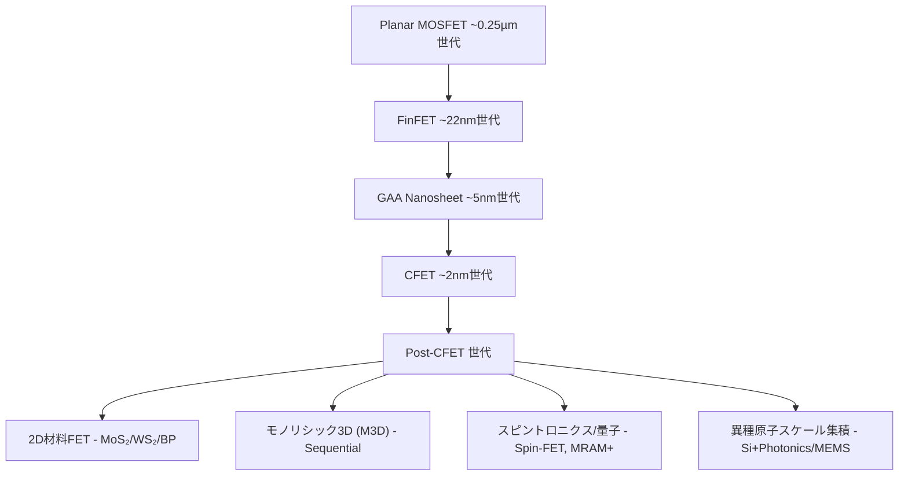
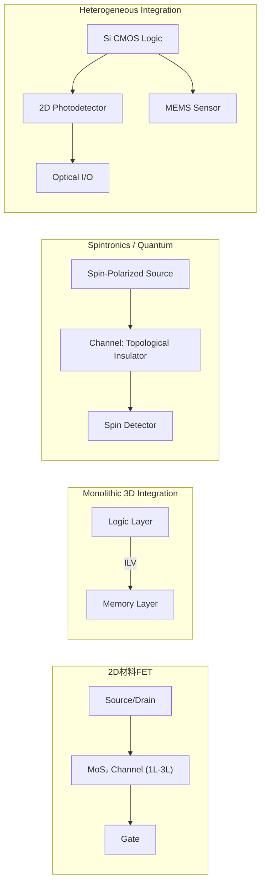
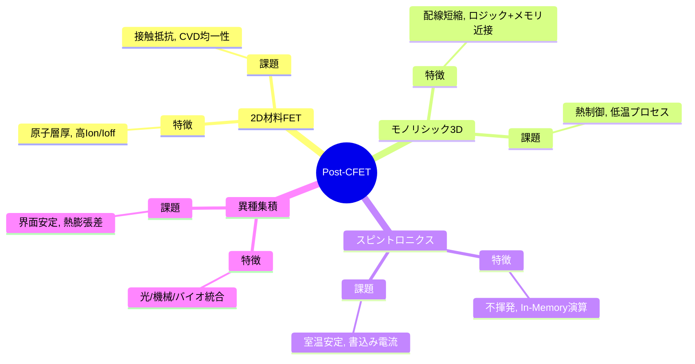

# Post-CFET デバイス・アーキテクチャ 論文草稿（図表インライン版）

## 要旨（Abstract）
CMOS スケーリングは Planar MOSFET から FinFET、ゲート・オール・アラウンド（GAA）、そして Complementary FET（CFET）へと進化してきた。CFET は電気的制御性をさらに高め、短チャネル効果や配線ボトルネックを緩和するが、シリコン基盤の材料物性や熱拡散特性は限界に近づきつつある。本稿では、**Post-CFET デバイス候補**として、**二次元材料 FET、モノリシック 3D 集積、スピントロニクス／量子デバイス、異種原子スケール集積**を整理する。それぞれの物理原理、製造課題、定量的指標、応用分野、設計フローへの影響を比較し、教育的意義を含めた展望を与える。

---

## 1. 序論
半導体産業は 1970 年代以降、微細化と新構造導入により性能向上を続けてきた。  
- **Planar MOSFET → FinFET → GAA → CFET** は、デバイス構造による「電気的制御性向上」の道のりである。  
- **限界要因**：シリコンチャネルの移動度劣化、リーク電流増加、配線遅延支配、熱拡散制約。  

CFET によりトランジスタの「空間効率」は高まったが、**材料限界**や**配線・熱課題**を克服するには、新しい材料や三次元統合、あるいは論理＋記憶＋物理の融合が不可欠となる。  
この次の時代を「Post-CFET」と定義する。  

---

## 2. CMOS から Post-CFET への進化経路
- **Planar → FinFET**：3次元化で短チャネル制御を改善。  
- **FinFET → GAA**：チャネルを完全に囲み、さらに制御性を強化。  
- **GAA → CFET**：nFET/pFET の積層により配線効率・面積効率を飛躍的に改善。  
- **Post-CFET へ**：材料限界（Si）と熱限界を突破するため、新しい物理・新しい統合が必要。  

---

## 3. Post-CFET 候補技術

### 3.1 二次元材料 FET
- **実証例**：IEDM 2023 で **MoS₂ Lg=12 nm FET** が報告され、**Ion/Ioff ≈ 10⁷、SS ≈ 65 mV/dec** を達成。  
- **課題**：CVD 膜の均一性（ばらつき 5–10%）、接触抵抗 Rc ≈ 1 kΩ·µm。  
- **応用**：IoT ノード、フレキシブル電子回路、生体センサー。  

### 3.2 モノリシック 3D 集積（M3D）
- **実証例**：2019 IEDM にて **SRAM 上下積層**、配線遅延 30% 減・面積 40% 削減。  
- **応用**：*Nature Electronics 2022* で AI ワークロード効率 1.4–1.7 倍改善。  
- **課題**：450℃以下プロセス必須、ホットスポット >1 W/mm²。  

### 3.3 スピントロニクス・量子デバイス
- **実証例**：IBM STT-MRAM endurance 10¹² cycle。  
- **研究進展**：SOT 書込み電流 30–40% 減、トポロジカル FET 室温でオン/オフ比 10³。  
- **応用**：ニューロモーフィック、宇宙用耐放射線、In-Memory Computing。  

### 3.4 異種原子スケール集積
- **実証例**：*Nat. Photonics 2020*、Si+MoS₂ 光検出器 Responsivity 200 mA/W @1.55 µm。  
- **応用**：光インターコネクト、医療・宇宙センサー統合。  

---

## 4. 設計・教育的観点
Post-CFET 技術は多物理制約を伴うため、SystemDK / AITL による設計教育が不可欠。  
- **カリキュラム提案**：スケーリング史 → 技術レビュー → マルチフィジックス演習 → 応用事例 → SystemDK演習。  

---

## 5. 将来シナリオ
- **2030年代前半**：2D-CFET ハイブリッド、M3D-2D 実証。  
- **2030年代後半**：IoT/AI Edge 導入。  
- **2040年代**：HPC・宇宙用で主流化。  

---

## 6. 結論
Post-CFET デバイスは **構造スケーリングから材料・システム統合スケーリング** への転換を象徴する。教育・設計支援・社会実装を統合的に整理することが必要である。  

---

## 7. 図・表

### 図1：CMOS → CFET → Post-CFET 進化ツリー

### 図2：Post-CFET デバイス概念ブロック図

### 図3：Post-CFET 技術マインドマップ

### 表1：Post-CFET 候補技術の比較マトリクス

| 技術            | 実証データ                          | 課題                   | 応用分野                 | TRL (研究→産業) |
|-----------------|-----------------------------------|------------------------|--------------------------|----------------|
| 2D材料FET       | Ion/Ioff ≈ 10⁷, SS ≈ 65 mV/dec   | Rc 高い, 膜均一性       | IoT, フレキシブル        | 3 → 5 |
| M3D             | 配線遅延 -30%, 面積 -40%          | 熱管理, 低温プロセス    | AI, メモリ中心計算       | 4 → 6 |
| スピントロニクス | MRAM endurance 10¹² cycle        | 書込み電流, CMOS互換    | ニューロ, 宇宙耐放射線    | 3 → 5 |
| 異種集積        | Si+MoS₂ 光検出器 200 mA/W        | 界面安定, 歩留まり       | 光I/O, 医療, 宇宙        | 2 → 4 |

---

## 参考文献
1. IRDS, *International Roadmap for Devices and Systems*, 2024 Edition  
2. 高木聡一郎ほか, “2D材料FETのCMOS限界突破可能性,” *IEDM Tech Digest*, 2023  
3. Liu et al., “Monolithic 3D Integration for Memory-Centric Computing,” *Nature Electronics*, 2022  
4. Fert et al., “Spintronics: The Future of Logic and Memory,” *Rev. Mod. Phys.*, 2019  
5. Wong, H.-S. P., “Beyond the Limits of Silicon: Opportunities and Challenges of 2D Materials,” *Nature Reviews Materials*, 2020  
6. Batude, P. et al., “3D Sequential Integration: A Key Enabler of Monolithic 3D ICs,” *IEDM*, 2019  
