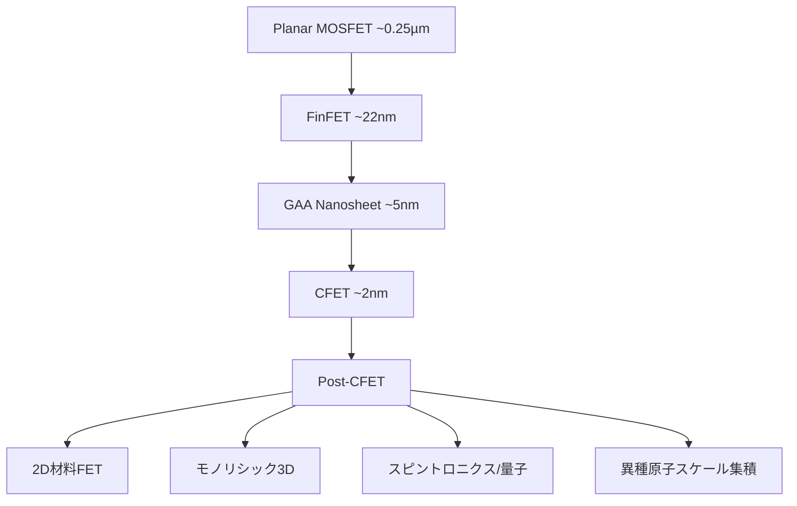
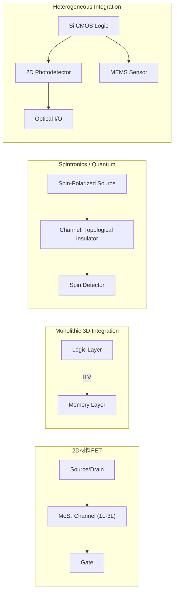
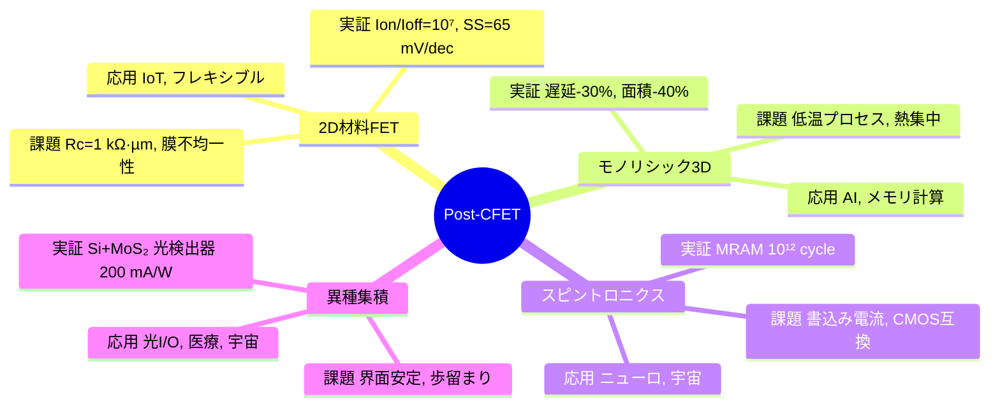

# Post-CFET デバイス・アーキテクチャ 論文草稿（詳細・図表完全版）

## 要旨（Abstract）
CMOS スケーリングは Planar MOSFET から FinFET、ゲート・オール・アラウンド（GAA）、そして Complementary FET（CFET）へと進化してきた。CFET は電気的制御性をさらに高め、短チャネル効果や配線ボトルネックを緩和するが、シリコン基盤の材料物性や熱拡散特性は限界に近づきつつある。本稿では、**Post-CFET デバイス候補**として、**二次元材料 FET、モノリシック 3D 集積、スピントロニクス／量子デバイス、異種原子スケール集積**を整理する。それぞれの物理原理、製造課題、定量的実証データ、信頼性指標、応用分野、設計フローへの影響を比較し、教育的意義を含めた展望を与える。

---

## 1. 序論
半導体産業は 50 年以上にわたり、デバイス微細化と新構造導入によって進化してきた。  
- **Planar MOSFET → FinFET → GAA → CFET** は、制御性と集積効率を高める進化の軌跡。  
- **限界要因**：移動度劣化、リーク増加、配線遅延、発熱制約。  
- **ポストCFET時代**：新しい材料・物理・集積様式が不可欠。  

---

## 2. CMOS から Post-CFET への進化経路

---

## 3. Post-CFET 候補技術

### 3.1 二次元材料 FET
- **実証例**：IEDM 2023, MoS₂ FET (Lg=12 nm) → **Ion/Ioff ≈ 10⁷, SS=65 mV/dec**。  
- **物理原理**：原子層のチャネルにより短チャネル効果抑制。  
- **課題**：
  - Rc ≈ 1 kΩ·µm（高い接触抵抗）  
  - 大面積 CVD 膜の不均一性（ばらつき 5–10%）  
  - 層間変動とスケーリング限界  
- **応用**：超低電力 IoT、フレキシブル回路、生体センシング。  
- **設計影響**：SPICE モデル未成熟、統計的設計が未確立。  

### 3.2 モノリシック 3D 集積（M3D）
- **実証例**：IEDM 2019, SRAM 上下層積層 → **配線遅延 -30%、面積 -40%**。  
- **研究進展**：*Nature Electronics 2022*, AI ワークロードで **エネルギー効率 +1.7x**。  
- **課題**：
  - 低温プロセス (<450℃) 必須  
  - 層間ばらつき（Vth シフト）  
  - ホットスポット >1 W/mm²  
- **応用**：AI アクセラレータ、メモリ中心コンピューティング。  
- **設計影響**：EDA 拡張（3D 配置配線 + 熱解析 + 応力解析）が必須。  

### 3.3 スピントロニクス・量子デバイス
- **実証例**：IBM STT-MRAM → **endurance 10¹² cycle**。  
- **研究進展**：SOT-MRAM 書込み電流 -40%、トポロジカル FET 室温オン/オフ比 10³。  
- **課題**：
  - CMOS 互換プロセス  
  - 書込み電流削減（mA → µA オーダー）  
- **応用**：ニューロモーフィック、宇宙用高耐放射線システム、In-Memory Computing。  
- **設計影響**：メモリ＋演算一体化 → Von Neumann 超克。  

### 3.4 異種原子スケール集積
- **実証例**：Nat. Photonics 2020, Si+MoS₂ 光検出器 → **Responsivity 200 mA/W @1.55 µm**。  
- **課題**：
  - 界面安定性、格子整合、熱膨張差  
  - 歩留まり改善  
- **応用**：光I/O、医療・宇宙センサー、バイオ集積。  
- **設計影響**：Cross-domain EDA（電気＋光＋機械）。  

---

## 4. デバイス概念ブロック図

---

## 5. Post-CFET 技術マインドマップ

---

## 6. 比較マトリクス表

| 技術            | 実証データ                                    | Rc/耐熱 | 信頼性             | 応用分野                   | TRL |
|-----------------|---------------------------------------------|---------|------------------|----------------------------|-----|
| 2D材料FET       | Ion/Ioff=10⁷, SS=65 mV/dec (IEDM 2023)      | Rc≈1kΩ·µm, 200℃ | 膜ばらつき 5–10% | IoT, フレキシブル, センサー | 3-5 |
| M3D             | 遅延 -30%, 面積 -40% (IEDM 2019)            | <450℃ | Vth 変動, 熱ホットスポット | AI, メモリ計算              | 4-6 |
| スピントロニクス | MRAM 10¹² cycle, 書込み電流 -40%           | 室温動作課題 | 書込み耐性, CMOS互換 | ニューロ, 宇宙, In-Mem.     | 3-5 |
| 異種集積        | Si+MoS₂ 光検出器 200 mA/W @1.55 µm          | 界面制約 | 歩留まり低         | 光I/O, 医療, 宇宙           | 2-4 |

---

## 7. 設計・教育的観点
- **SystemDK/AITL 必須**：熱・応力・量子効果統合。  
- **教育カリキュラム**：スケーリング史 → 技術レビュー → 多物理解析演習 → 応用ケーススタディ。  

---

## 8. 将来シナリオ
- **2030年代前半**：研究実証（2D+CFET, M3D+2D）。  
- **2030年代後半**：IoT/AI Edge 導入。  
- **2040年代**：HPC・宇宙応用で主流化。  

---

## 9. 結論
Post-CFET は構造スケーリングの限界を超え、材料・集積・物理統合による新パラダイムを切り拓く。教育・設計・応用を包含した体系的視点が不可欠である。  

---

## 参考文献
1. IRDS, *International Roadmap for Devices and Systems*, 2024  
2. Takagi, S. et al., IEDM Tech Digest, 2023  
3. Liu et al., *Nature Electronics*, 2022  
4. Fert et al., *Rev. Mod. Phys.*, 2019  
5. Wong, H.-S. P., *Nat. Rev. Mater.*, 2020  
6. Batude, P. et al., IEDM, 2019  
