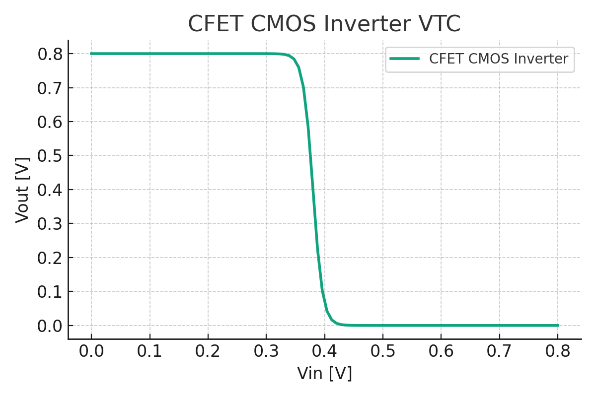

# SPICE Models for FinFET / GAA Transistors  
FinFET / GAA トランジスタ用 SPICE モデル

このディレクトリには、15nm世代のFinFETおよび5nm世代のGAA（Gate-All-Around）構造に対応した、BSIM-CMG準拠のSPICEモデルを収録しています。

---

## 📁 File List / ファイル一覧

| File | Description |
|------|-------------|
| `finfet_15nm_model.spice`        | 15nm FinFET NMOS モデル（BSIM-CMG） |
| `pfinfet_15nm_model.spice`       | 15nm FinFET PMOS モデル |
| `gaa_5nm_model.spice`            | 5nm GAA NMOS モデル（Multi-Nanosheet） |
| `pgaa_5nm_model.spice`           | 5nm GAA PMOS モデル |
| `nmos_iv_test.spice`             | NMOSのI-V特性確認用ベンチマーク回路 |
| `cmos_inverter_finfet.spice`     | FinFET CMOSインバータ回路 |
| `cmos_inverter_gaa.spice`        | GAA CMOSインバータ回路 |
| `cfet_stack_model.spice`        | 仮想CFET NMOS/PMOSスタックモデル |
| `cmos_inverter_cfet.spice`      | CFET CMOSインバータ回路（仮想） |

---

## ✅ How to Use / 使い方

1. 使用したいモデルを `.include` で読み込みます：

```spice
.include finfet_15nm_model.spice
* または
.include gaa_5nm_model.spice
```

2. I-V特性を確認するには、`nmos_iv_test.spice` を使って `.dc` 解析を実行します：

```spice
.dc Vgs 0 1.0 0.05
.print dc V(drain) I(Vds)
```

> 🛠 このベンチは LTspice / ngspice 等で動作確認できます。

---

## 📈 I-V Test Sample

以下のような回路で、NMOS単体の I<sub>ds</sub>–V<sub>gs</sub> 特性を観察できます：

```spice
.dc Vgs 0 1.0 0.05
.print dc V(drain) I(Vds)
```

---

## ⚙️ CMOS Inverter Examples / CMOSインバータ回路例

FinFET、GAA、CFET構造を使ったCMOSインバータの `.spice` 回路例です。  
`.dc` 解析により、入力電圧 Vin に対する出力 Vout（VTC: Voltage Transfer Characteristic）を確認できます。

| File                         | Description                             |
|------------------------------|-----------------------------------------|
| `cmos_inverter_finfet.spice` | FinFET CMOS インバータ回路（15nm）      |
| `cmos_inverter_gaa.spice`    | GAA CMOS インバータ回路（5nm）         |
| `cmos_inverter_cfet.spice`   | CFET CMOS インバータ回路（仮想モデル） |

### 🧪 FinFET CMOS Inverter

```spice
.include finfet_15nm_model.spice
.include pfinfet_15nm_model.spice

Vdd vdd 0 DC 0.8
Vin in 0 DC 0.0
M1 out in 0 0 nfinfet L=15n W=120n
M2 out in vdd vdd pfinfet L=15n W=120n

.dc Vin 0 0.8 0.05
.print dc V(in) V(out)
.end
```

### 🧪 GAA CMOS Inverter

```spice
.include gaa_5nm_model.spice
.include pgaa_5nm_model.spice

Vdd vdd 0 DC 0.8
Vin in 0 DC 0.0
M1 out in 0 0 ngaa L=10n W=120n
M2 out in vdd vdd pgaa L=10n W=120n

.dc Vin 0 0.8 0.05
.print dc V(in) V(out)
.end
```

### 🧪 CFET CMOS Inverter（仮想モデル）

```spice
.include cfet_stack_model.spice

Vdd vdd 0 DC 0.8
Vin in 0 DC 0.0

* Stacked PMOS (Top)
M1 out in vdd vdd pcfet L=10n W=120n

* Stacked NMOS (Bottom)
M2 out in 0 0 ncfet L=10n W=120n

.dc Vin 0 0.8 0.01
.print dc V(in) V(out)
.end
```

---

## 🖼️ CMOS Inverter VTC Plots / 伝達特性グラフ

以下は、FinFET・GAA・CFET CMOSインバータの `.dc` 解析によって得られた伝達特性（Vin–Vout）のグラフです：

### 🔷 FinFET CMOS Inverter (15nm)


### 🟢 GAA CMOS Inverter (5nm)


### 🔴 CFET CMOS Inverter (Stacked CMOS)


📌 GAAおよびCFET構造はFinFETに比べて**しきい値電圧が低く、スイッチング遷移が鋭い**傾向があります。特にCFETは構造上、**理想的な反転動作**に近づくよう設計されています。  
このように、**構造の違いが電気特性にどのように反映されるか**を、Spice解析および図を通じて学ぶことができます。

> `.dc` 解析結果から得られる **VTCカーブ** は、LTspice / ngspice / Python等でも視覚化可能です。

---

## 📌 Future Work / 今後の予定

- ✅ PMOSモデルの追加（`pfinfet`, `pgaa`）  
  → NMOSだけでなくPMOSも含めたフルCMOSモデル化を完了
- ✅ CMOSインバータ回路の追加（FinFET / GAA）  
  → VTC特性を通じた構造間比較の教育展開
- ✅ CFET仮想モデルの定義と検証（`cfet_stack_model.spice`）
  → 将来世代デバイスの予測モデル構築と教材応用
- 📊 Pythonによる I-V / VTC プロット自動化の追加  
  → ngspice等と連携した教育用グラフ生成スクリプト
- 📚 教材との統合（Edusemi 第1章と完全連携）  
  → 構造・回路・シミュレーションの教材横断統合
  
---

## 🧪 参考仕様（抜粋）

| Parameter           | FinFET             | GAA                     | CFET (仮想モデル)         |
|---------------------|--------------------|--------------------------|----------------------------|
| Node                | 15nm               | 5nm                      | 2nm（仮想）                |
| W<sub>eff</sub>     | 3 fins × 30nm      | 3 sheets × 5nm           | 上下2段 × 2 sheets × 5nm   |
| T<sub>ox</sub>      | 1.2nm              | 0.8nm                    | 0.7nm                      |
| V<sub>th</sub>      | 0.42V / –0.45V     | 0.38V / –0.40V           | 0.35V / –0.38V             |
| Drive Strength      | ◎ 中               | ◎ 高                     | ◎◎ 非常に高               |
| Stacking Structure  | ✗（非スタック）     | ✗（非スタック）           | 上下構造（PMOS over NMOS） |
| Area Efficiency     | ◯ 中               | ◎ 高                     | ◎◎ 非常に高               |

📌 CFETは、上下にPMOS/NMOSを積層することで**面積効率と性能の両立**を狙う構造です。仮想モデルとして、Multi-Nanosheetベースの上下スタック構成を想定しています。

---

**Author**: Samizo-AITL / Edusemi Project  
**License**: MIT (or educational use only, if specified)

---

🔝 **[特別編　第1章トップに戻る（FinFET / GAA / CFET）](../README.md)**
