# 📦 SystemDK PoCマニュアル  
**SystemDK-Based PoC Manual for Physical Constraint Integration**

---

## 📘 概要｜Overview

本マニュアルでは、System Design Kit（SystemDK）に基づく物理制約の統合設計と、  
**GAA（Gate-All-Around） / AMS（Analog-Mixed Signal） / MRAM（Magnetoresistive RAM）** を統合する  
チップレットPoC（概念実証）構成を体系的に解説します。

This manual systematically introduces a PoC structure based on the **System Design Kit (SystemDK)**  
for physical constraint integration and chiplet-based heterogeneous design  
with **GAA**, **AMS**, and **MRAM** functional blocks.

---

## 📊 構造図｜Block Diagram

## 📊 構造図｜Block Diagram

     
---

## 📚 セクション構成｜Section Structure

| 節 | ファイル名 / File | 内容 / Description |
|----|-------------------|---------------------|
| 1 | [`poc_1_motivation.md`](./poc_1_motivation.md) | なぜSystemDKによるPoCが必要か？設計動機と狙い Why a PoC using SystemDK is needed: motivations & goals |
| 2 | [`poc_2_systemdk_platform.md`](./poc_2_systemdk_platform.md) | SystemDKのプラットフォーム概要と評価支援 SystemDK overview as a constraint-aware platform |
| 3 | [`poc_3_block_spec.md`](./poc_3_block_spec.md) | GAA / AMS / MRAMブロックの仕様と構成定義 Node and block specifications for GAA, AMS, MRAM |
| 4 | [`poc_4_constraint_profiles.md`](./poc_4_constraint_profiles.md) | SI/PI・熱・応力・EMI/EMCの設計要件 Constraint profiles for SI/PI, thermal, stress, EMI/EMC |
| 5 | [`poc_5_integration.md`](./poc_5_integration.md) | Chiplet統合における制約整合とレイアウト設計 Physical alignment and layout in chiplet integration |
| 6 | [`poc_6_fem_analysis.md`](./poc_6_fem_analysis.md) | FEM・熱・電磁界・応力解析の事例 Examples of FEM, thermal, EM, and mechanical analysis |
| 7 | [`poc_7_summary.md`](./poc_7_summary.md) | 本PoCのまとめと教育的意義の整理 Summary and educational reflections on the PoC |

---

## 🧾 DesignKitとは｜What Are DesignKits?

| DesignKit | 正式名称 | 対象階層 | 説明 |
|-----------|----------|----------|------|
| **BRDK** | Board-Level Design Kit | 評価ボード | PoC評価用PCB設計と実装制約（熱、電源、IR Dropなど） |
| **IPDK** | Interposer Design Kit | インターポーザ層 | チップレット間接続層。TSV、RDL、応力吸収、EMI制御が中心 |
| **PKGDK** | Package-Level Design Kit | PKG全体 | PoP、マルチチップ、放熱構造、スタッキングなどの制約 |
| **SystemDK** | System-Level Design Kit | システム統合階層 | 上記を統括し設計制約・FEM情報を一元管理・再利用可能にする |

---

## 🔍 FEM関連ノート｜FEM-Related Notes

PoC評価における熱・応力・EMIなどの**FEM解析結果**をSystemDK設計に反映させるための技術ノート群です。  
*These technical notes summarize how FEM results (thermal, mechanical stress, EMI) are fed back into SystemDK design during PoC evaluation.*

### 📄 fem_constraints.md  
🔗 [➡️ 開く（Open fem_constraints.md）](./notes/fem_constraints.md)  
- **SystemDK × FEM制約情報（熱・応力・EMI連携）**の全体方針  
- *Overview of how FEM constraints are integrated into SystemDK (thermal, stress, EMI coherence).*

### 🧱 stress_map.md  
🔗 [➡️ 開く（Open stress_map.md）](./notes/stress_map.md)  
- **MRAMセルにおける熱-応力分布とSystemDK設計への反映**  
- *Stress concentration in MRAM cells from FEM and feedback into SystemDK DesignKit.*

### 📡 emi_constraints.md  
🔗 [➡️ 開く（Open emi_constraints.md）](./notes/emi_constraints.md)  
- **EMI発生源とその抑制設計、PKGDK等への統合戦略**  
- *Sources of EMI, mitigation design, and integration strategies for SystemDK/PKGDK.*

---

## 🔁 PoCDKによる実評価と制約抽出｜PoCDK Evaluation Flow

PoC設計の最終フェーズでは、**実際のPoC評価ボードを用いた混載構成の動作検証**と、  
**FEM解析による多物理場制約の抽出**を行います。

> In the final stage of the PoC, real board-level testing is combined with FEM-based analysis  
> to extract cross-domain physical constraints for SystemDK refinement.

#### ✅ 実施内容（What to Perform）

| 項目 | 内容（日本語） | 内容（英語） |
|------|----------------|----------------|
| FPGAでの動作検証 | MRAM / AMS / SoCモジュールを評価ボード上に混載し、通信/制御を実機検証 | Mixed integration on a PoC board with FPGA control, verifying actual interaction |
| FEM解析 | 熱・応力・EMI・IR dropの解析を行い、各構造の弱点を抽出 | Conduct FEM analysis for thermal, mechanical, EMI, IR-drop to identify constraints |
| 制約のDesignKit化 | 解析結果をBRDK/IPDK/PKGDKへ展開し、SystemDKに再統合 | Feed constraint results into respective kits and unify via SystemDK |

---

#### 🔄 SystemDK PoC 全体フロー｜SystemDK PoC Full Process

```mermaid
graph TD
  A[① 全体アーキテクチャ設計<br>（PoC目的・ブロック接続定義）] --> B[② モジュール選定<br>（GAA / AMS / MRAM）]
  B --> C[③ FPGAベースのRTL設計<br>（Verilog記述）]
  C --> D[④ テストベンチ作成<br>（動作検証環境構築）]
  D --> E[⑤ PoC評価ボード設計<br>（FEM考慮の回路設計）]
  E --> F[⑥ 実装発注<br>（MRAM・AMS混載構成）]
  F --> G[⑦ 実ボード評価 + FEM解析<br>（熱・応力・EMI）]
  G --> H{⑧ SoC化の可否判断}
  H -->|Yes| I[⑨ SoC RTL設計<br>（統合アーキ）]
  I --> J[⑩ 物理設計フローへ移行<br>（P&R, DRC等）]
  J --> K[⑪ SystemDK構築<br>（BRDK / IPDK / PKGDK統合）]

  H -->|No| L[🔁 PoC段階で再評価・改善]
```

> ※この図は、PoCからSystemDK設計への段階的なフローを示しています。  
> *This diagram illustrates the sequential flow from PoC to SystemDK integration.*

---

#### 📦 PoCDKからのDesignKit派生

| DesignKit | 抽出される主な情報（例） |
|-----------|--------------------------|
| **BRDK** | 熱分布マップ、電源経路IR Drop、基板配線インピーダンス |
| **IPDK** (*Interposer*) | TSV構造、RDLパターン、層間応力、EMI拡散層 |
| **PKGDK** | チップスタック放熱、ワイヤボンド応力、PKG内PI/SI制約 |
| **SystemDK** | DK統合マップ、FEMフィードバック、設計履歴/トレードオフ記録 |

---

## 🧩 位置づけ｜Relation to Edusemi

このPoCマニュアルは、**Edusemi-v4x 特別編 第2a章 SystemDK教材** の一部として設計されています。

This PoC manual is part of the **SystemDK module (Special Chapter 2a)** within **Edusemi-v4x**,  
providing a deeper implementation and hands-on practice based on the conceptual contents of:

- [`f2a_8_chiplet_example_gaa_ams_mram.md`](../f2a_8_chiplet_example_gaa_ams_mram.md)

---

## 🎯 教育的意義｜Educational Value

- SystemDKを活用したPoC設計の**具体的ステップと構造理解**
- **物理制約（SI/PI, 熱, 応力, EMI/EMC）**の統合設計の実践的理解
- **異種ノード統合**における設計トレードオフと現実性の認識
- 将来的な**AI連携・自動化設計**の土台となる教材構成

- Understand **step-by-step design** using SystemDK for PoC  
- Experience **multi-constraint integration** (SI/PI, thermal, stress, EMI/EMC)  
- Learn the **trade-offs of heterogeneous integration**  
- Build foundation for future **AI-assisted or automated design flows**

---

## 👤 著者・ライセンス｜Author & License

| 項目 / Item | 内容 / Details |
|-------------|----------------|
| 著者 / Author | 三溝 真一（Shinichi Samizo） Shinshu University / Ex-Epson |
| GitHub | [Samizo-AITL](https://github.com/Samizo-AITL) |
| Email | [shin3t72@gmail.com](mailto:shin3t72@gmail.com) |
| ライセンス / License | MIT License（再配布・改変自由） MIT License (Free to reuse/modify/redistribute) |

---

## 🔙 戻る｜Back

[← SystemDK教材トップへ戻る｜Back to SystemDK Top](../README.md)
