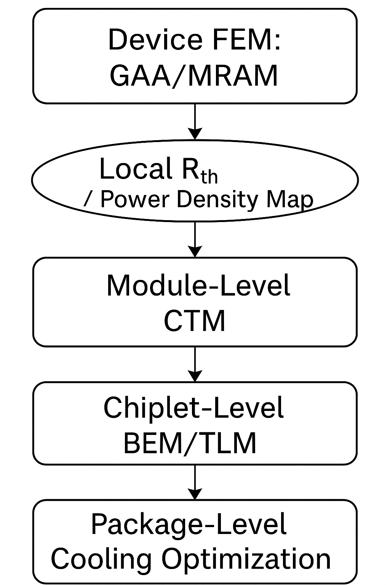

---

# SystemDKにおけるFEM制約統合ノート  
*SystemDK-Based Integration of FEM-Derived Constraints*

---

## 1. はじめに / Introduction

SystemDKは、PoC評価から量産SoC設計までを一貫して支える設計アーキテクチャである。本ノートでは、PoC段階で得られたFEM（Finite Element Method）解析結果をどのようにSystemDKにフィードバックし、熱・応力・EMIなどの**物理制約**として統合するかを扱う。

> SystemDK supports end-to-end design from PoC evaluation to mass production SoC.  
This note discusses how to feed back FEM (Finite Element Method) results obtained at the PoC stage into SystemDK, integrating physical constraints such as thermal, stress, and EMI.

---

## 2. PoCレベルでのFEM解析事例 / FEM Analysis at the PoC Level

- 🔥 **GAA構造における熱分布**  
  放熱不均一に起因するリーク電流増加やタイミング劣化を検出する。

- 🧱 **MRAM構造の応力集中**  
  スタック構造界面における割れや歩留まり低下リスクの定量化。

- 📡 **AMSとデジタルの混載におけるEMI評価**  
  高周波信号のクロストークや電源ライン共振を解析。

> This section presents FEM use cases at the PoC level:  
thermal distribution in GAA structures, stress concentration in MRAM stacks, and EMI risks in AMS-digital integration.

---

<p align="center">
  
</p>

<p align="center">
  <em>Figure 1: Simulated thermal distribution in a GAA nanowire structure using FEM.</em>
</p>

---

## 2.5 局所FEM結果のスケール統合  
*2.5 Multi-Scale Integration of Local FEM Results*

FEMによるトランジスタやナノワイヤ構造（例：GAA）の解析では、ナノメートルスケールでの局所的な熱分布・温度ピークを精密に捉えることができる。しかし、これらの結果をそのままモジュールやチップレット全体の熱分布と結びつけるには、**スケールをまたぐ物理モデルの階層連携**が必要である。

FEM analysis at the device level (e.g., GAA nanowires) captures fine-grained thermal behavior such as localized heating or interface resistances. However, to relate these to module- or chiplet-scale thermal distributions, a **hierarchical multi-scale modeling approach** is required.

---

### 🔗 スケール統合の一般的手法 / Common Integration Techniques

| スケール | 対象 | 手法 | 備考 |
|----------|------|------|------|
| **デバイスFEM** | GAA, MRAM, Cell | 熱抵抗 $begin:math:text$ R_{th} = \\Delta T / P $end:math:text$ 抽出 | 電力あたり温度上昇を取得 |
| **モジュールCTM** | SRAM, ALU, AMS | 発熱密度マップ（W/μm²）化 | レイアウト上に敷き詰める |
| **チップレットCTM/BEM** | SoCタイル全体 | 熱源マップ＋材料境界条件 | チップ内熱干渉をモデル化 |
| **PKG/システムTLM/CFD** | ヒートシンク、冷却路 | 上位伝熱経路と接続 | 冷却能力の評価 |

---

### 🖼️ 概念図（階層熱伝搬） / Conceptual Flow

<p align="center">
  
</p>

<p align="center">
  <em>Figure 2: Multi-scale thermal modeling flow from device FEM to package-level cooling.</em>
</p>

---

## 3. BRDK / PKGDK / IPDKへの制約伝搬モデル  
*Constraint Propagation Models to BRDK, PKGDK, and IPDK*

- 🌡️ **熱制約**：FEM温度分布 → BRDKの局所冷却指示（例：熱バンプ配置）
- 🧘 **応力制約**：応力ピーク → IPレイアウトのバリア層設計へ反映
- 🛰️ **EMI制約**：高調波ノイズ域 → PKGDKのGND/VSSプレーン強化へ

> FEM-derived constraints are propagated into various DK layers, enabling adaptive layout, thermal optimization, and noise reduction strategies.

---

### 🔧 JSONデータ例（FEM出力 → BRDK形式）

```json
{
  "component": "GAA_cell_3",
  "max_temperature_C": 102.3,
  "thermal_margin_C": 15,
  "cooling_required": true,
  "preferred_sink_location": [ "bottom_left", "center" ]
}
```

*Figure 3: Example of thermal_map.json derived from FEM output.*

---

## 4. SystemDK設計での活用事例 / Use Cases in SystemDK Design

- 🎯 **熱応答ベースの配線制約**（Thermal-aware auto routing）
- 🧩 **FEM境界条件を考慮した自動フロアプラン**
- 🛡️ **電磁ノイズ耐性を考慮したESDガード設計**

> By integrating FEM feedback, SystemDK can support layout and routing strategies that reflect realistic environmental and physical constraints.

---

## 5. おわりに / Outlook

FEM解析とSystemDKの統合は、PoCの精度を高めるだけでなく、**量産設計への物理的妥当性の橋渡し**を可能にする。将来的には、AIによるFEMパラメータ最適化や、マルチモーダル制約統合（熱・応力・電源・ノイズ同時最適化）が期待される。

> Integration of FEM into SystemDK bridges PoC accuracy and mass-production validity.  
Future directions include AI-assisted FEM optimization and multi-modal constraint integration.

---
