# 🧪 6. FEM・熱・電磁界・応力解析の事例  
**6. Examples of FEM, Thermal, Electromagnetic, and Stress Analysis**

---

## 🎯 目的｜Objective

この章では、SystemDKベースPoCにおける**多物理場解析（FEM）**の役割と具体的な適用事例を紹介する。  
設計に反映可能な制約情報を取得し、DesignKit（BRDK / IPDK / PKGDK）へフィードバックする工程である。

> This section demonstrates multi-physics analysis examples including FEM,  
> and how their outcomes contribute to constraint refinement in SystemDK.

---

## 🔥 熱解析事例｜Thermal Simulation

- **モデル｜Model**：PoC評価ボードに GAA / MRAM / AMS を配置  
- **条件｜Conditions**：ピーク時電力負荷、自然空冷（θJA 設定）  
- **結果例｜Findings**：  
  - MRAM周辺が **125℃を超過** → AMSとの距離を再設計  
  - 熱拡散の非対称性 → **放熱パッド再配置**を提案

> Excessive heat around MRAM triggers redesign of AMS placement  
> and motivates layout-based thermal countermeasures.

---

## 📶 EMI / PI 解析事例｜Electromagnetic & Power Integrity

- **モデル｜Model**：PDNモデル + 高速信号ライン + IBISモデル  
- **条件｜Conditions**：クロックノイズ帯域・IR Drop制限  
- **結果例｜Findings**：  
  - PLLクロックが **AMS ADCのSNRを劣化**させる  
  - 電源IR Dropが深刻 → **専用LDO設計**へ移行

> Clock jitter and power fluctuation reduce ADC performance,  
> driving the need for local LDO and clean PDN design.

---

## 🧱 機械応力解析｜Mechanical Stress Analysis

- **モデル｜Model**：TSV・バンプ構造の3D FEMメッシュ  
- **条件｜Conditions**：温度サイクル（-40℃～125℃）を模擬  
- **結果例｜Findings**：  
  - **TSV周辺の応力集中**でパッドクラックのリスク  
  - 層間界面に**剪断応力蓄積** → 接着材料の見直し

> Stress accumulation near TSV and interface layers leads to  
> reliability concerns and material optimization.

---

## 📊 解析結果の設計キット反映｜DesignKit Feedback

| 💠 Design Kit | 🧩 反映される設計制約（Constraint Feedback） |
|---------------|---------------------------------------------|
| **BRDK**      | 熱分布・冷却要求、IR Drop対策、配置制約         |
| **IPDK**      | EMI感度ゾーン、ピン配置、応力対応構造            |
| **PKGDK**     | 熱拡散層の厚み調整、パッケージ構造の最適化       |
| **SystemDK**  | 制約マップ統合、物理制約に基づく再利用設計方針   |

> Each kit absorbs FEM insights to guide physical-aware design decisions  
> and enrich SystemDK’s constraint-driven methodology.

---

## 🖇️ 6.3 PoC評価とFEM制約の統合構成図｜PoC Evaluation & Constraint Integration

PoC評価ボードとFEM解析は、**異なる経路でSystemDKに制約情報を提供**する。  
以下の構成図は、**機能評価系（緑）**と**物理解析系（青）**の二重流路を示す。

> Functional and physical analyses follow distinct yet converging paths  
> to supply rich design constraints into SystemDK.

### 🧭 構成概要｜System Overview

- **PoC評価経路**：RTL → PoC評価 → 各DK（機能面の妥当性確認）  
- **FEM解析経路**：FEM → PKGDK（構造解析）→ 他DK（物理制約伝播）  
- **SystemDK統合**：BRDK / IPDK / PKGDK からの制約を統合設計へ反映

```mermaid
flowchart TD
    RTL[RTL / FPGA]
    PoC[PoC Eval Board]
    FEM[FEM Analysis]

    BRDK[BRDK]
    IPDK[IPDK]
    PKGDK[PKGDK: Structural]
    SDK[SystemDK]

    %% PoC評価パス
    RTL --> PoC
    PoC --> BRDK
    PoC --> IPDK
    PoC --> PKGDK

    %% FEM経路
    FEM --> PKGDK
    PKGDK --> BRDK
    PKGDK --> IPDK

    %% 各DK統合先
    BRDK --> SDK
    IPDK --> SDK
    PKGDK --> SDK
```

> **補足｜Notes**  
> - **PKGDK**：構造FEMの主担当。熱応力・EMI伝搬の定量化。  
> - **BRDK / IPDK**：機能評価と物理制約の交差点。SystemDKとの橋渡し。

---

## 📘 本章のまとめ｜Summary

FEM解析と多物理場評価は、PoC設計における**制約導出と構造改善の要**である。  
SystemDKはこの解析情報を各設計キットに組み込み、**制約ベース設計の標準化**を推進する。

> FEM-driven analysis enriches the SystemDK framework  
> with precise, reusable, and physically-informed constraints.
