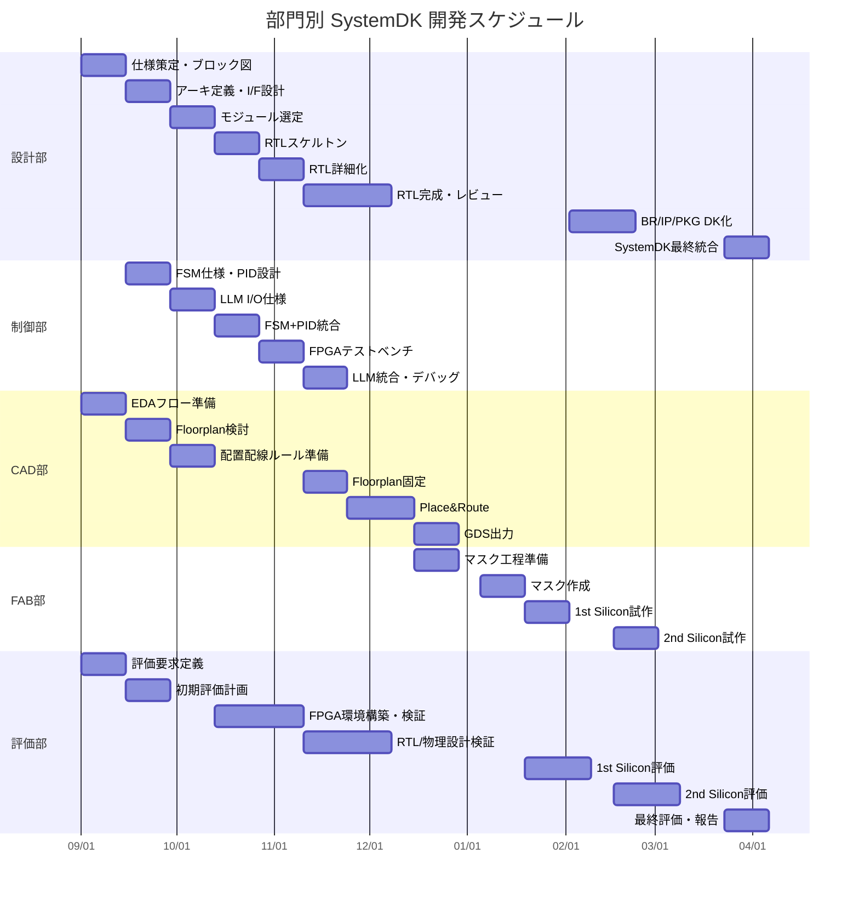

---

# 🗓️ SystemDK 開発プロジェクト進行表（部門別詳細版）  
**SystemDK Development Schedule by Division**

---

## 📅 部門別・週単位スケジュール表

| 週 / Week | 設計部 / Design         | 制御部 / Control           | CAD部 / CAD & Layout     | FAB部 / Fabrication      | 評価部 / Evaluation         |
|-----------|-------------------------|----------------------------|--------------------------|--------------------------|------------------------------|
| 1–2       | 仕様策定・全体ブロック図 | FSM仕様整理                 | EDAフロー準備             |                          | 評価要求定義                 |
| 3–4       | アーキ定義・I/F設計     | PIDモデル設計               | Floorplan検討             |                          | 初期評価計画                 |
| 5–6       | モジュール選定（IP候補）| LLM I/O仕様化               | レイアウトルール準備       |                          | FPGA検証計画                 |
| 7–8       | RTLスケルトン作成       | FSM+PID統合設計             | 配置配線ルール作成         |                          | FPGA環境セットアップ         |
| 9–10      | RTL詳細化               | FPGAテストベンチ構築         | P&Rツールフロー確認        |                          | FPGA初期検証                 |
| 11–12     | RTLレビュー・修正       | LLM統合シナリオ              | Floorplan固定              |                          | RTL検証                      |
| 13–14     | RTL完成版               | 制御統合デバッグ             | Placement/Route実施       |                          | 物理設計検証（DRC/LVS支援）  |
| 15–16     |                         |                            | GDS出力                   | マスク工程準備           | Tape-out前レビュー            |
| 17–18     |                         |                            |                          | マスク作成                |                              |
| 19–20     |                         |                            |                          | IC試作（1st Silicon）     | ウエハテスト、初期評価        |
| 21–22     | IP再設計、改善           | 制御系修正                   | ECOレイアウト修正          | IC 2nd試作準備            | 再評価                       |
| 23–24     | BR/IP/PKG DK化           |                            |                          | IC 2nd試作                | 再ウエハテスト                |
| 25–26     | IP/BR/PKG 統合           |                            |                          |                          | 評価・システム統合支援        |
| 27–28     | SystemDK最終統合         |                            |                          |                          | 最終評価・報告                |

---

## 🖼️ Mermaid ガントチャート

