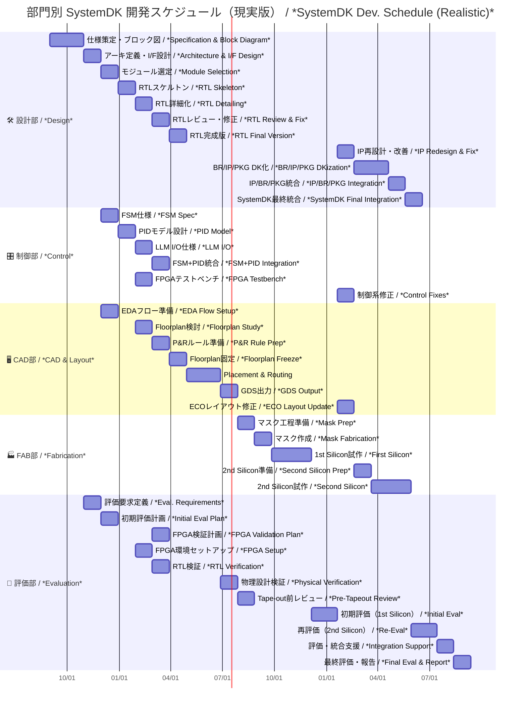

---

# 🗓️ SystemDK 開発プロジェクト進行表（部門別詳細版・現実スケジュール版）  
**SystemDK Development Schedule by Division (Realistic Timeline)**

---

## 📘 概要｜Overview

本スケジュールは、教育用に単純化したものではなく、**実務に基づく現実的な進行表**です。  
SystemDK のように **設計・制御・CAD・製造・評価** を跨ぐ大規模プロジェクトは、  
**最低 14〜16か月** のスパンを必要とします。  

*This schedule reflects a **realistic project timeline** based on industry practice.  
Large-scale projects like SystemDK require **14–16 months** across design, control, CAD, fabrication, and evaluation.*  

---

## 📅 部門別・月単位スケジュール表  
*Monthly Schedule by Division*

| 月 / Month | 🛠️ 設計部 / *Design* | 🎛️ 制御部 / *Control* | 🖥️ CAD部 / *CAD & Layout* | 🏭 FAB部 / *Fabrication* | 🔬 評価部 / *Evaluation* | 🎯 主なトリガー / *Trigger* |
|------------|------------------|-------------------|------------------------|-----------------------|------------------------|---------------------------|
| **1–2** | **仕様策定・全体ブロック図**  *Specification & Block Diagram* | | | | | 🚀 プロジェクト開始 |
| **2–3** | **アーキ定義・I/F設計**  *Architecture & I/F Design* | FSM仕様整理  *FSM Spec* | | | 評価要求定義  *Eval. Requirements* | ✅ 仕様策定完了 |
| **3–4** | **モジュール選定**  *Module/IP Selection* | PIDモデル設計  *PID Model Design* | EDAフロー準備  *EDA Flow Setup* | | 初期評価計画  *Initial Eval Plan* | 📐 アーキ定義完了 |
| **4–5** | **RTLスケルトン作成**  *RTL Skeleton* | LLM I/O仕様化  *LLM I/O Definition* | Floorplan検討  *Floorplan Study* | | FPGA検証計画  *FPGA Validation Plan* | 🧩 モジュール選定完了 |
| **5–6** | **RTL詳細化**  *RTL Detailing* | FSM+PID統合設計  *FSM+PID Integration* | P&Rルール準備  *P&R Rule Prep* | | FPGA環境セットアップ  *FPGA Setup* | 📝 RTLスケルトン完成 |
| **6–7** | **RTLレビュー・修正**  *RTL Review & Fix* | FPGAテストベンチ構築  *FPGA Testbench* | Floorplan固定  *Floorplan Freeze* | | RTL検証  *RTL Verification* | 🔍 RTL詳細化進捗 |
| **7–8** | **RTL完成版**  *RTL Final Version* | 制御統合デバッグ  *Control Integration Debug* | Placement & Routing 実施  *P&R Execution* | | 物理設計検証（DRC/LVS）  *Physical Verification* | ✅ RTLレビュー完了 |
| **9–10** | | | **GDS出力**  *GDS Output* | **マスク工程準備**  *Mask Prep* | **Tape-out前レビュー**  *Pre-Tapeout Review* | 📦 P&R完了 |
| **11** | | | | **マスク作成**  *Mask Fabrication* | | 🏁 GDS出力完了 |
| **12–14** | | | | **1st Silicon試作**  *First Silicon (Fab run, 10週)* | **初期評価**  *Initial Eval* | 🧪 マスク完成 |
| **15** | **IP再設計・改善**  *IP Redesign & Fix* | 制御系修正  *Control Fixes* | ECOレイアウト修正  *ECO Layout Update* | 2nd試作準備  *Second Silicon Prep* | | 🔄 1st Eval 結果 |
| **16–18** | **BR/IP/PKG DK化**  *BR/IP/PKG DKization* | | | **2nd Silicon試作**  *Second Silicon (Fab run, 10週)* | 再評価  *Re-Eval* | 🛠️ 改善設計完了 |
| **19** | **IP/BR/PKG統合**  *IP/BR/PKG Integration* | | | | 評価・統合支援  *System Integration Support* | 📊 2nd Eval 結果 |
| **20** | **SystemDK最終統合**  *SystemDK Final Integration* | | | | **最終評価・報告**  *Final Eval & Report* | 🏆 全部門統合完了 |

---

## 🖼️ Mermaid ガントチャート  
*Mermaid Gantt Chart (Realistic Schedule)*

