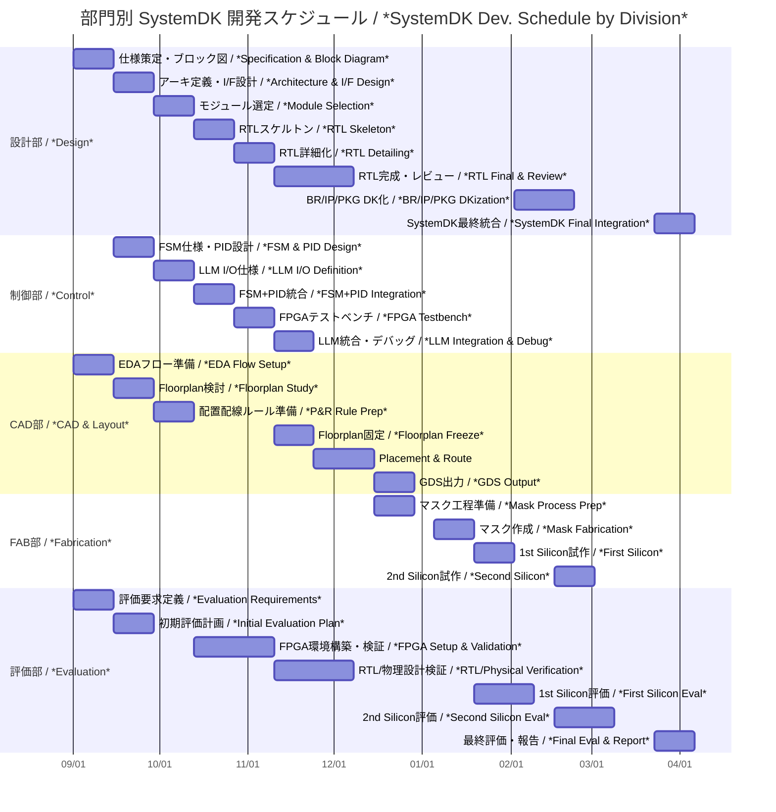

---

# 🗓️ SystemDK 開発プロジェクト進行表（部門別詳細版）  
**SystemDK Development Schedule by Division**

---

## 📅 部門別・週単位スケジュール表  
*Weekly Schedule by Division*

| 週 / Week | 設計部 / *Design*        | 制御部 / *Control*          | CAD部 / *CAD & Layout*    | FAB部 / *Fabrication*     | 評価部 / *Evaluation*        |
|-----------|--------------------------|-----------------------------|---------------------------|---------------------------|-------------------------------|
| 1–2       | 仕様策定・全体ブロック図  *Specification & Block Diagram* | FSM仕様整理  *FSM Specification* | EDAフロー準備  *EDA Flow Setup* |                           | 評価要求定義  *Evaluation Requirements* |
| 3–4       | アーキ定義・I/F設計  *Architecture & I/F Design* | PIDモデル設計  *PID Model Design* | Floorplan検討  *Floorplan Study* |                           | 初期評価計画  *Initial Evaluation Plan* |
| 5–6       | モジュール選定（IP候補）  *Module/IP Candidate Selection* | LLM I/O仕様化  *LLM I/O Definition* | レイアウトルール準備  *Layout Rule Prep* |                           | FPGA検証計画  *FPGA Validation Plan* |
| 7–8       | RTLスケルトン作成  *RTL Skeleton* | FSM+PID統合設計  *FSM+PID Integration* | 配置配線ルール作成  *P&R Rule Setup* |                           | FPGA環境セットアップ  *FPGA Environment Setup* |
| 9–10      | RTL詳細化  *RTL Detailing* | FPGAテストベンチ構築  *FPGA Testbench* | P&Rツールフロー確認  *P&R Flow Check* |                           | FPGA初期検証  *Initial FPGA Validation* |
| 11–12     | RTLレビュー・修正  *RTL Review & Fix* | LLM統合シナリオ  *LLM Integration Scenario* | Floorplan固定  *Floorplan Freeze* |                           | RTL検証  *RTL Verification* |
| 13–14     | RTL完成版  *RTL Final Version* | 制御統合デバッグ  *Control Integration Debug* | Placement/Route実施  *Placement & Routing* |                           | 物理設計検証（DRC/LVS支援）  *Physical Design Check (DRC/LVS)* |
| 15–16     |                          |                             | GDS出力  *GDS Output*  | マスク工程準備  *Mask Process Prep* | Tape-out前レビュー  *Pre-Tapeout Review* |
| 17–18     |                          |                             |                           | マスク作成  *Mask Fabrication* |                           |
| 19–20     |                          |                             |                           | IC試作（1st Silicon）  *First Silicon Prototype* | ウエハテスト、初期評価  *Wafer Test & Initial Eval* |
| 21–22     | IP再設計、改善  *IP Redesign & Improvement* | 制御系修正  *Control Fixes* | ECOレイアウト修正  *ECO Layout Update* | IC 2nd試作準備  *Second Silicon Prep* | 再評価  *Re-Evaluation* |
| 23–24     | BR/IP/PKG DK化  *BR/IP/PKG DKization* |                             |                           | IC 2nd試作  *Second Silicon* | 再ウエハテスト  *Second Wafer Test* |
| 25–26     | IP/BR/PKG 統合  *IP/BR/PKG Integration* |                             |                           |                           | 評価・システム統合支援  *Evaluation & System Integration* |
| 27–28     | SystemDK最終統合  *SystemDK Final Integration* |                             |                           |                           | 最終評価・報告  *Final Evaluation & Report* |

---

## 🖼️ Mermaid ガントチャート  
*Mermaid Gantt Chart*

