---

# 🗓️ SystemDK 開発プロジェクト進行表（部門別詳細版・修正版）  
**SystemDK Development Schedule by Division (Revised)**

---

## 📘 概要｜Overview

SystemDK は、**設計・制御・CAD・製造・評価**といった複数部門を跨ぐ統合開発であり、 
単独の技術理解だけでなく、**週単位での全体進行管理**が極めて重要となります。  
*SystemDK is an integrated development across **design, control, CAD, fabrication, and evaluation**,  
where not only technical understanding but also **weekly cross-divisional project management** is crucial.*

そのため本資料では、部門別に詳細化した **SystemDK 開発プロジェクト進行表** を提示します。  
*Therefore, this document provides a **detailed SystemDK project schedule by division**,  
allowing readers to connect **constraint theories** with **practical development timelines**.*

---

## 📅 部門別・週単位スケジュール表  
*Weekly Schedule by Division*

| 週 / Week | 設計部 / *Design* | 制御部 / *Control* | CAD部 / *CAD & Layout* | FAB部 / *Fabrication* | 評価部 / *Evaluation* |
|-----------|------------------|-------------------|------------------------|-----------------------|------------------------|
| 1–2 | 仕様策定・全体ブロック図  *Specification & Block Diagram* | | | | |
| 3–4 | アーキ定義・I/F設計  *Architecture & I/F Design* | FSM仕様整理  *FSM Spec* | | | 評価要求定義  *Eval. Requirements* |
| 5–6 | モジュール選定（IP候補）  *Module/IP Selection* | PIDモデル設計  *PID Model Design* | EDAフロー準備  *EDA Flow Setup* | | 初期評価計画  *Initial Eval Plan* |
| 7–8 | RTLスケルトン作成  *RTL Skeleton* | LLM I/O仕様化  *LLM I/O Definition* | Floorplan検討  *Floorplan Study* | | FPGA検証計画  *FPGA Validation Plan* |
| 9–10 | RTL詳細化  *RTL Detailing* | FSM+PID統合設計  *FSM+PID Integration* | P&Rルール準備  *P&R Rule Prep* | | FPGA環境セットアップ  *FPGA Setup* |
| 11–12 | RTLレビュー・修正  *RTL Review & Fix* | FPGAテストベンチ構築  *FPGA Testbench* | Floorplan固定  *Floorplan Freeze* | | RTL検証  *RTL Verification* |
| 13–14 | RTL完成版  *RTL Final Version* | 制御統合デバッグ  *Control Integration Debug* | Placement & Routing 実施  *P&R Execution* | | 物理設計検証（DRC/LVS）  *Physical Verification* |
| 15–16 | | | GDS出力  *GDS Output* | マスク工程準備  *Mask Prep* | Tape-out前レビュー  *Pre-Tapeout Review* |
| 17–18 | | | | マスク作成  *Mask Fabrication* | |
| 19–20 | | | | IC試作（1st Silicon）  *First Silicon* | ウエハテスト・初期評価  *Wafer Test & Initial Eval* |
| 21–22 | IP再設計・改善  *IP Redesign & Fix* | 制御系修正  *Control Fixes* | ECOレイアウト修正  *ECO Layout Update* | 2nd試作準備  *Second Silicon Prep* | 再評価  *Re-Evaluation* |
| 23–24 | BR/IP/PKG DK化  *BR/IP/PKG DKization* | | | 2nd試作（Second Silicon） | 再ウエハテスト  *Second Wafer Test* |
| 25–26 | IP/BR/PKG統合  *IP/BR/PKG Integration* | | | | 評価・システム統合支援  *System Integration Support* |
| 27–28 | SystemDK最終統合  *SystemDK Final Integration* | | | | 最終評価・報告  *Final Eval & Report* |

---

## 🖼️ Mermaid ガントチャート  
*Mermaid Gantt Chart (Revised)*

```mermaid
gantt
    title 部門別 SystemDK 開発スケジュール（修正版） / *SystemDK Dev. Schedule by Division*
    dateFormat  YYYY-MM-DD
    axisFormat  %m/%d
    todayMarker stroke-width:2px,stroke:red,opacity:0.5

    section 設計部 / *Design*
    仕様策定・ブロック図 / *Specification & Block Diagram* :a1, 2025-09-01, 14d
    アーキ定義・I/F設計 / *Architecture & I/F Design*      :a2, after a1, 14d
    モジュール選定 / *Module Selection*                   :a3, after a2, 14d
    RTLスケルトン / *RTL Skeleton*                        :a4, after a3, 14d
    RTL詳細化 / *RTL Detailing*                           :a5, after a4, 14d
    RTLレビュー・修正 / *RTL Review & Fix*                :a6, after a5, 14d
    RTL完成版 / *RTL Final Version*                       :a7, after a6, 14d
    IP再設計・改善 / *IP Redesign & Fix*                  :a8, after a7, 14d
    BR/IP/PKG DK化 / *BR/IP/PKG DKization*                :a9, after a8, 14d
    IP/BR/PKG統合 / *IP/BR/PKG Integration*               :a10, after a9, 14d
    SystemDK最終統合 / *SystemDK Final Integration*       :a11, after a10, 14d

    section 制御部 / *Control*
    FSM仕様 / *FSM Spec*                                  :b1, after a2, 14d
    PIDモデル設計 / *PID Model*                           :b2, after b1, 14d
    LLM I/O仕様 / *LLM I/O*                               :b3, after b2, 14d
    FSM+PID統合 / *FSM+PID Integration*                   :b4, after b3, 14d
    FPGAテストベンチ / *FPGA Testbench*                   :b5, after a4, 14d
    制御系修正 / *Control Fixes*                          :b6, after b5, 14d

    section CAD部 / *CAD & Layout*
    EDAフロー準備 / *EDA Flow Setup*                      :c1, after a2, 14d
    Floorplan検討 / *Floorplan Study*                     :c2, after a4, 14d
    P&Rルール準備 / *P&R Rule Prep*                       :c3, after c2, 14d
    Floorplan固定 / *Floorplan Freeze*                    :c4, after c3, 14d
    Placement & Routing                                   :c5, after c4, 14d
    GDS出力 / *GDS Output*                                :c6, after c5, 14d
    ECOレイアウト修正 / *ECO Layout Update*               :c7, after c6, 14d

    section FAB部 / *Fabrication*
    マスク工程準備 / *Mask Prep*                          :d1, after c6, 14d
    マスク作成 / *Mask Fabrication*                       :d2, after d1, 14d
    1st Silicon試作 / *First Silicon*                     :d3, after d2, 14d
    2nd Silicon準備 / *Second Silicon Prep*               :d4, after d3, 14d
    2nd Silicon試作 / *Second Silicon*                    :d5, after d4, 14d

    section 評価部 / *Evaluation*
    評価要求定義 / *Eval. Requirements*                   :e1, after a1, 14d
    初期評価計画 / *Initial Eval Plan*                    :e2, after e1, 14d
    FPGA検証計画 / *FPGA Validation Plan*                 :e3, after b3, 14d
    FPGA環境セットアップ / *FPGA Setup*                   :e4, after a4, 14d
    RTL検証 / *RTL Verification*                          :e5, after a5, 14d
    物理設計検証 / *Physical Verification*                :e6, after c5, 14d
    Tape-out前レビュー / *Pre-Tapeout Review*             :e7, after c6, 14d
    初期評価（1st Silicon） / *Initial Eval*              :e8, after d3, 14d
    再評価（2nd Silicon） / *Re-Eval*                     :e9, after d5, 14d
    評価・統合支援 / *Integration Support*                :e10, after a9, 14d
    最終評価・報告 / *Final Eval & Report*                :e11, after a11, 14d
```

