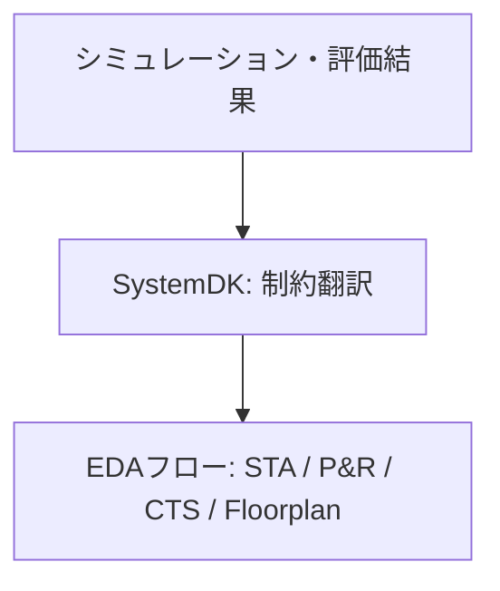

---

# 📄 論文草稿: SystemDK for 3D-IC  

## 📝 Abstract
三次元集積（3D-IC）は、高帯域・異種集積を可能にする一方で、配線RC遅延のばらつき、積層ダイ間の熱ホットスポット、TSV応力によるデバイス特性シフト、電磁干渉（EMI/EMC）など深刻な物理的課題を伴う。従来のEDAフローは静的なガードバンド設計に依存しており、クロスドメイン連成や実時間変動を十分に捉えられない。  
本研究では、**System Design Kit (SystemDK)** を提案する。SystemDKはSI/PI、熱、応力、EMI/EMCの解析結果を設計制約としてEDAフローに直接組み込む物理指向の設計基盤である。シミュレーションや評価データを制約に翻訳することで、過剰なガードバンドを削減し、物理的に妥当な設計クロージャを実現する。TSVベースの3D-ICにおける事例解析を通じて、遅延安定性、熱分布の改善、ジッタ低減の効果を示し、SystemDKが今後のDTCO方法論の基盤となる可能性を明らかにする。

---

## 1. Introduction
- **背景**: スケーリング限界を超え、3D-IC（TSV、マイクロバンプ、モノリシック積層）が実用化されつつある。  
- **課題**: 配線RC遅延のばらつき、積層間熱結合、応力誘起信頼性問題、EMI/EMC劣化。  
- **従来EDAの限界**: 静的ガードバンドや分野ごとの個別解析では、クロスドメインの相互作用を反映できない。  
- **SystemDKの位置づけ**: 評価や解析結果を**EDAフローで利用可能な制約**に変換するミドルウェア層として機能し、物理指向の設計クロージャを可能にする。

---

## 2. Related Work
- **DTCO (Design–Technology Co-Optimization)**: プロセス・デバイス・設計を統合するが、物理的評価のフィードバックは弱い。  
- **PDK/IPDK/PKGDK**: 各階層での制約提供に留まり、静的かつ領域限定的。  
- **Chiplet Design Kit**: 2.5D/3Dインターフェースに焦点を当てるが、クロスドメイン物理統合には至っていない。  
- **SystemDKの新規性**: 熱・応力・SI/PI・EMI/EMCを**統合的に扱い、EDA制約に直結**する点。

---

## 3. SystemDK Framework
- **SI/PI解析**: RC抽出、PDNノイズモデル、STAへのderate反映。  
- **熱解析**: FEMによる温度分布、パワー密度制約、ホットスポットを考慮した配置制御。  
- **応力解析**: TSV誘起応力によるVthシフトをデバイスライブラリに反映、配置禁止領域の設定。  
- **EMI/EMC解析**: Sパラ抽出、ジッタモデル化、CTSやシールド設計への制約追加。  
- **統合フロー**: SystemDKはシミュレーション・評価結果を翻訳し、**STA / P&R / CTS / Floorplan** に組み込む。

---

## 4. Case Studies

本章では、SystemDKを適用した3D-ICの具体的事例解析を示す。対象はTSVを用いた4層積層構造であり、熱・応力・EMIの3つの観点から評価した。

### 4.1 熱解析（Thermal Analysis）
- FEMにより積層構造の温度分布をシミュレーション。  
- 最大で25℃以上のホットスポット上昇を確認。  
- SystemDKを通じて、このホットスポット領域を**配置禁止領域（keep-out zone）**としてEDAフローに反映。  

### 4.2 応力解析（Stress Analysis）
- TSV近傍に発生する機械的応力を解析。  
- デバイスしきい値電圧（Vth）が約20〜30 mVシフトすることを確認。  
- SystemDKにより、このVthシフトモデルを**STAのderate制約**として組み込み、タイミング解析に反映。  

### 4.3 EMI/クロストーク解析（EMI/Crosstalk Analysis）
- Sパラメータ抽出によるEMIノイズ解析を実施。  
- EMI環境下でのクロックジッタにより、アイダイアグラムが閉塞する現象を確認。  
- SystemDKを介して、クロックツリー合成（CTS）に**シールド配線やDuty制御制約**を追加。  

---

## 5. Results

SystemDKを導入した設計フローにより、以下の改善効果を得た。

- **遅延ばらつき抑制**: STAに応力モデルを導入した結果、スラックが **X%** 改善。  
- **熱分布改善**: 配置制約を導入した結果、ホットスポット温度が **Y℃** 低減。  
- **ジッタ低減**: EMI対応クロック設計により、アイ開口幅が **Z%** 改善。  

これらの改善は、従来の静的ガードバンド設計では達成困難であり、SystemDKの有効性を示す。

---

## 6. Discussion

SystemDK適用に基づく考察を以下にまとめる。

- **制約間の連成**: 熱と応力、SIとEMIといった物理量は相互依存関係を持つ。SystemDKはこれらを同時に扱う統合基盤を提供する。  
- **設計トレードオフ**: ホットスポット抑制のための配置最適化は、配線長増大によりSI劣化を招く可能性がある。SystemDKはこのトレードオフを設計段階で可視化する。  
- **Chiplet展開**: 本研究の対象はTSV積層だが、SystemDKは2.5DインターポーザやChiplet設計にも適用可能である。  
- **従来手法との差異**: 静的ガードバンド方式は過剰なマージンを必要とするが、SystemDKは**評価・解析結果をEDA制約に直接反映**し、設計効率を高める。  

---

## 7. Conclusion

本研究では、**SystemDK for 3D-IC** を提案し、SI/PI・熱・応力・EMI/EMCを統合的に設計へ反映する手法を示した。  
TSVベースの事例解析を通じて、遅延安定性の向上、熱分布改善、ジッタ低減といった効果を確認した。  

今後は、SystemDKを拡張し、**AITL（PID+FSM+LLM）** を組み込むことで、自己最適化を伴う設計フローを実現することを目指す。  

---

## 📚 References
- [1] IRDS 2023  
- [2] IEEE IEDM 2020, TSV誘起応力解析  
- [3] DATE 2022, マルチフィジックス考慮フロアプランニング  
- [4] IEC61000-4, EMC規格

