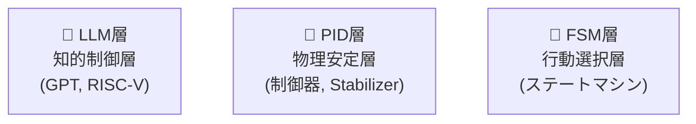

---

# 🧠 3.1 AITL-Hアーキテクチャと層分離設計  
**3.1 AITL-H Architecture and Layered Design**

---

## 🧠 AITL-Hとは何か？  
**What is AITL-H?**

**AITL-H（All-in-Theory Logic - Hybrid）** は、制御システムを以下の **三層構造** で捉える設計パラダイムです。  
**AITL-H** is a control system design paradigm structured into the following **three-layer architecture**:

| 層｜Layer | 役割｜Function | 例｜Example |
|-----------|-------------------|--------------------|
| **LLM（知性）** Intelligence | 意図・推論・判断 Intent, inference, decision-making | 対話、計画、最適化 Dialogue, planning, optimization |
| **PID（理性）** Reasoning | 安定化・物理調整 Stabilization, physical control | モーター制御、姿勢制御 Motor and attitude control |
| **FSM（本能）** Instinct | 行動スイッチ Reactive state transitions | 移動開始、旋回、停止 Start, turn, stop |

➡ このように各層の責務を **機能分離（Separation of Concerns）** することで、設計の明確化と再利用性を向上させます。  
➡ This separation improves **design clarity** and **module reusability**.

---

## 🧱 三層構造の接続イメージ（ブロック図）  
**Block Diagram: Three-Layer Integration**

> ⚠️ このページではMermaidフローチャートは表示されません  
> 👉 **以下のリンクからGitHubで視覚化表示をご確認ください：**  
> [📎 GitHubでMermaidフローチャートを見る](https://github.com/Samizo-AITL/Edusemi-v4x/blob/main/f_chapter3_socsystem/docs/3_1_aitl_architecture.md)

- **FSM**：センサ信号に基づいて状態遷移・行動切替を行う  
  *FSM switches behavior based on sensor input.*
- **PID**：FSMやLLMから与えられる `ref` をもとに連続制御  
  *PID continuously controls based on reference from FSM/LLM.*
- **LLM**：状況判断に応じて制御をオーバーライド  
  *LLM intervenes and overrides based on high-level context.*

---

## 🎯 なぜ分離するのか？  
**Why Separate the Layers?**

| ⚠️ 項目｜Aspect | ❌ 分離しない場合｜Without Separation | ✅ 分離した場合（AITL-H）｜With AITL-H Separation |
|-------------|-----------------------------|--------------------------------------------|
| **実装再利用性** Reusability | 状態・制御が混在 State logic and control are entangled | FSM / PID / LLM を個別再利用可能 Each layer can be reused independently |
| **保守性** Maintainability | 修正が全体へ波及 Changes affect entire system | 層ごとの独立性が高い High independence among layers |
| **AIとの統合** AI Integration | 統合困難 Difficult to insert AI | LLM層をLLM/GPTで置換可能 Easy to replace LLM layer with AI |

> 💡 特に**SoC設計**では、**ハード制御（FSM/PID）とソフト制御（LLM）**の分離が極めて重要です。  
> *Separation of hardware (FSM/PID) and software (LLM) control is critical for SoC design.*

---

## 🔗 SoC設計における三層マッピング  
**Layer Mapping in SoC Implementation**

| 層｜Layer | 実装対象｜Implementation Target | 種別｜Type |
|--------|---------------------------|------------------|
| **FSM** | Verilog RTL | ハード / Hardware |
| **PID** | RTL または アナログ制御回路 RTL or Analog | ハード / Hardware |
| **LLM** | RISC-V上のC/LLMソフトウェア LLM Software on RISC-V | ソフト / Software |

---

## 💡 設計上のポイント  
**Key Design Considerations**

- **FSM/PIDはリアルタイム動作が要求される**  
  *FSM and PID require real-time execution.*
- **LLMは非リアルタイムで知的判断を担う**  
  *LLM operates asynchronously with intelligent decision-making.*
- **明示的なインタフェースを設計することが重要**  
  *Define explicit interfaces such as:*  
  - `ref`：目標値 / reference value  
  - `u_out`：制御出力 / control output  
  - `action_out`：動作指令 / behavioral command

---

## 📎 次節との接続  
**Connection to the Next Section**

次の「**3.2 FSM設計とRTLモジュール構成**」では、  
この三層構造の**最下層であるFSM**について、**状態設計とRTL実装**の手法を詳述します。  
*In the next section (3.2), we focus on FSM design and RTL implementation as the foundational behavior layer.*

---

## 🔙 戻る｜Back to Chapter Top

🏠 [特別編 第3章 トップに戻る｜Back to Special Chapter 3 README](../README.md)
