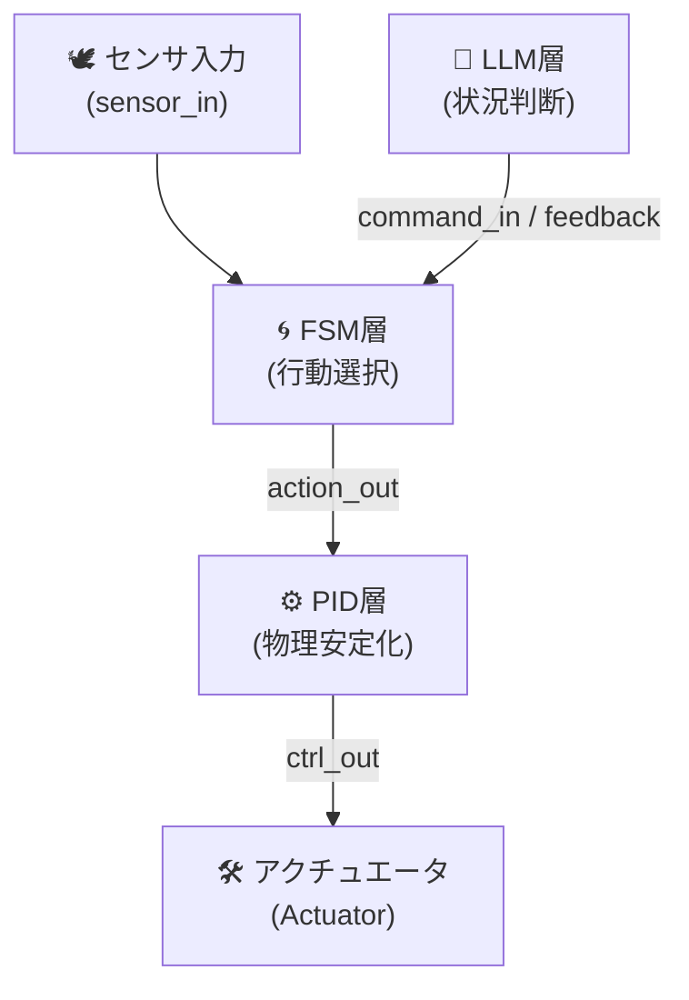

---

# 3.2 FSM設計とRTLモジュール構成  
🧠 Design and RTL Implementation of FSM (Finite State Machine)

---

## 🧠 FSMの役割と位置づけ  
**FSM（Finite State Machine）は、AITL-Hにおける「本能的行動制御」層**を担い、  
環境入力に基づいて状態遷移を行い、**定型的かつ瞬時な行動**を生成します。

> FSM is responsible for *instinctive behavior control* in AITL-H. It transitions states based on environment inputs and generates quick, predefined actions.

---

## ⚙️ 状態遷移モデルの設計手順  
**How to Design a State Transition Model**

1. **🧩 行動仕様の分解**  
   ロボットの立ち上がり、旋回、停止などを**状態単位で分割**  
   → Decompose behavior into discrete states (e.g., start, walk, turn, stop)

2. **🔁 状態と遷移条件の定義**  
   各状態とその間を結ぶ**トリガ条件（センサ入力など）**を定義  
   → Define states and transition conditions (input signals, events)

3. **🗺 状態遷移図の作成**  
   `start → walking → turning → stop` などを**視覚的に図示**  
   → Draw the state diagram for clarity and validation

4. **🔢 状態符号の決定（state encoding）**  
   Binary, One-hotなどの方式を選定し、RTLで扱いやすく  
   → Choose state encoding scheme: binary, one-hot, gray code, etc.

---

## 💻 RTLモジュール構成（例：fsm_engine.v）

以下は、典型的なFSM制御モジュールのVerilog実装例です：

```verilog
module fsm_engine (
    input wire clk,
    input wire rst,
    input wire [3:0] sensor_in,
    output reg [2:0] action_out
);

    typedef enum logic [1:0] {
        IDLE  = 2'b00,
        WALK  = 2'b01,
        TURN  = 2'b10,
        STOP  = 2'b11
    } state_t;

    state_t state, next_state;

    // 状態遷移ロジック
    always_ff @(posedge clk or posedge rst) begin
        if (rst)
            state <= IDLE;
        else
            state <= next_state;
    end

    // 遷移条件
    always_comb begin
        case (state)
            IDLE:  next_state = sensor_in[0] ? WALK : IDLE;
            WALK:  next_state = sensor_in[1] ? TURN : WALK;
            TURN:  next_state = sensor_in[2] ? STOP : TURN;
            STOP:  next_state = IDLE;
            default: next_state = IDLE;
        endcase
    end

    // 出力生成
    always_comb begin
        case (state)
            IDLE:  action_out = 3'b000;
            WALK:  action_out = 3'b001;
            TURN:  action_out = 3'b010;
            STOP:  action_out = 3'b100;
            default: action_out = 3'b000;
        endcase
    end

endmodule
```

📌 このテンプレートは `verilog/fsm_engine.v` に実装されます。

---

## 🔌 AITLアーキテクチャとの接続例（ポート設計）

FSMモジュールは、AITL-Hの上下層と以下のように信号接続されます：

| 🧾 信号名        | ビット幅 | 説明                               | 接続先             |
|------------------|----------|------------------------------------|--------------------|
| `clk`            | 1bit     | システムクロック                   | SoC共通            |
| `rst`            | 1bit     | 非同期リセット                     | SoC共通            |
| `sensor_in`      | 4bit     | センサからの状態信号入力           | PID層 or Sensor IF |
| `action_out`     | 3bit     | FSMによる行動制御信号              | PID層 or Actuator  |

> `action_out` は、状態に応じてPID制御器へ行動種別（歩行・旋回・停止など）を通知します。

---

## 📌 FSM設計のポイントと設計指針

- ✅ 状態数は**4〜8個程度**を基本とし、複雑化する場合は階層型FSM（HFSM）を導入
- 🔁 非決定的・複雑な制御分岐は**LLMに委譲**し、FSMは単純化
- 📚 `case`文での**明示的な遷移制御**により検証性・デバッグ性を向上
- 🧾 `typedef enum` の利用により**可読性と保守性**を向上

---

## 🔄 AITL-H 内部の信号流れ（概略図）

> ⚠️ このページではMermaidフローチャートは表示されません  
> 👉 **以下のリンクからGitHubで視覚化表示をご確認ください：**  
> [📎 GitHubでMermaidフローチャートを見る](https://github.com/Samizo-AITL/Edusemi-v4x/blob/main/f_chapter3_socsystem/docs/3_2_fsm_design.md)
>



> 🧠 FSMは「**反射的行動生成**」、⚙️ PIDは「**物理制御安定化**」、LLMは「**状況判断とオーバーライド**」を担います。

---

📎 Previous｜前節：  
🔙 [3.1 AITL-Hアーキテクチャと層分離設計](3_1_aitl_architecture.md)

📎 Next｜次節：  
👉 [3.3 PID制御のASIC実装（デジタル／アナログ）](3_3_pid_design.md)  
Implementation of **PID controllers** in ASIC design, both in **digital and analog domains**.

📚 [🔙 特別編 第3章 README に戻る｜Back to Chapter 3 README](../README.md)
