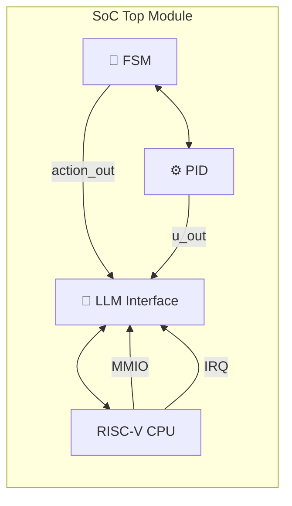

---

# 3.5 SoC統合とバス構造・通信設計  
**SoC Integration and Bus-Based Communication Design**

---

## 🧩 統合設計の目的｜Purpose of Integration

FSM・PID・LLMの三層制御モジュールを、1つのSoCとして統合する際に必要な設計は以下の通りです：

📝 **日本語｜Japanese**
- 各モジュールの**明確な役割分離とインターフェース定義**
- **通信バス**を用いたモジュール間接続（AXI, APB等）
- トップモジュールでの**スケーラビリティの確保**

📝 **English**
- Clear separation of responsibilities and interface definitions
- Interconnection via **communication bus** (e.g., AXI, APB)
- Scalability management in the top-level module

---

## 🏗 SoC全体構成ブロック図｜SoC Block Diagram

> ⚠️ このページではMermaidフローチャートは表示されません  
> 👉 **以下のリンクからGitHubで視覚化表示をご確認ください：**  
> [📎 GitHubでMermaidフローチャートを見る](https://github.com/Samizo-AITL/Edusemi-v4x/blob/main/f_chapter3_socsystem/docs/3_5_soc_integration.md)
> 


```text
    +-----------------------------+
    |           SoC Top          |
    |                             |
    |   +---------+   +--------+  |
    |   |   FSM   |←→|   PID   |  |
    |   +----+----+   +--------+  |
    |        ↑                ↑   |
    |        | action_out     | u_out
    |        ↓                ↓
    |     +-----------------------+
    |     |      LLM Interface    | ←→ RISC-V CPU
    |     +-----------------------+
    |            ↑   ↑
    |         MMIO  IRQ
    +-----------------------------+
```

---

## 📡 バス接続方式の選択肢｜Bus Architecture Options

| 🧩 バス種別<br>Bus Type | 🔧 用途<br>Usage | ✅ メリット<br>Merits | 📝 備考<br>Remarks |
|------------------|----------------|------------------|----------------|
| AXI4 | 高速制御・LLM通信 | 高帯域・複数マスター対応 | RISC-V ↔ LLM I/F |
| APB | 周辺制御・FSM/PID連携 | 低電力・実装容易 | FSM/PIDに適 |

💡 教材設計では、「**RISC-Vマスター + AXI + APBブリッジ + FSM/PIDスレーブ**」構成を推奨。

---

## 🔄 各モジュール接続と信号一覧｜Module Connections and Signal Summary

| 🔧 モジュール<br>Module | 📶 ポート例<br>Main Ports | 🔗 接続先<br>Connected To |
|------------------|------------------------|------------------|
| FSM | `clk`, `rst`, `sensor_in`, `action_out` | Top, Sensor, PID |
| PID | `clk`, `rst`, `ref`, `y`, `u_out` | FSM, Actuator |
| LLM I/F | `llm_action`, `llm_ref`, `mode` | RISC-V ↔ FSM/PID |
| RISC-V SoC | AXI Master | LLM I/F経由で制御 |

---

## ⚙️ トップモジュールの設計例（抜粋）  
**Top-Level RTL Example**

```verilog
module soc_top (
    input wire clk,
    input wire rst,
    input wire [3:0] sensor_data,
    input wire [15:0] y_feedback,
    output wire [15:0] actuator_out
);

    // FSM Instance
    wire [2:0] action_out;
    fsm_engine fsm_inst (
        .clk(clk),
        .rst(rst),
        .sensor_in(sensor_data),
        .action_out(action_out)
    );

    // PID Instance
    wire [15:0] ref;
    pid_controller pid_inst (
        .clk(clk),
        .rst(rst),
        .ref(ref),
        .y(y_feedback),
        .u_out(actuator_out)
    );

    // LLM Interface (MMIO Controlled)
    llm_interface llm_if (
        .llm_action_in(mmio_action),
        .llm_ref_in(mmio_ref),
        .fsm_action_out(action_out),
        .pid_ref_out(ref)
    );

endmodule
```

---

## 📝 統合設計の注意点｜Design Considerations

- ⏱ **バスクロックと制御クロックの整合性**
- 📉 **MMIO通信レイテンシを許容する設計**
- 🧺 **バッファリングやFIFOの挿入検討**

---

## 📎 次節への接続｜Next Section

次は「**3.6 ケーススタディ：三層制御によるPoC実装例**」です。  
本章で示したSoC構成を基に、FSM×PID×LLMによる倒立振子制御などの**PoC事例**を取り上げます。

---

📚 [🔙 特別編 第3章 README に戻る](../README.md)
