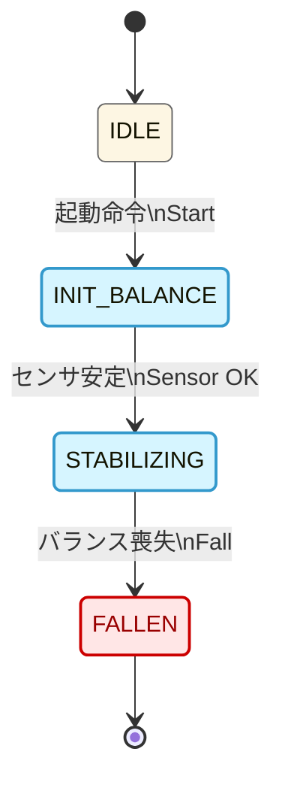

# 3.6 ケーススタディ：三層制御によるPoC実装例  
**Case Study: PoC Implementation of Triple-Layered Control (FSM × PID × LLM)**

---

## 🎯 本節の目的｜Objective of This Section

本章で解説した三層制御構造（FSM・PID・LLM）を実際に組み合わせて実装し、  
**SoC上での動作検証や制御特性の評価**を行います。

This section demonstrates the practical implementation of the **FSM × PID × LLM** control structure,  
and evaluates their behavior and performance on an actual SoC.

---

## 🧪 ケース①：倒立振子の安定化制御｜Case 1: Stabilization of an Inverted Pendulum

### 📌 構成概要｜System Configuration

| 層 Layer | 実装内容｜Function |
|-------------|--------------------|
| **FSM**     | 起動・停止・落下状態の遷移管理 Manages states like start, stop, fall |
| **PID**     | 角度センサに基づいてトルクを出力 Generates torque from angle sensor |
| **LLM**     | 「止まって」などの命令をFSMへ指示 Issues commands such as "stop" to FSM |

### 🌀 状態遷移例｜State Transitions

> ⚠️ このページではMermaidフローチャートは表示されません  
> 👉 **以下のリンクからGitHubで視覚化表示をご確認ください：**  
> [📎 GitHubでMermaidフローチャートを見る](https://github.com/Samizo-AITL/Edusemi-v4x/blob/main/f_chapter3_socsystem/docs/3_6_case_study.md)

### 🔁 制御ループ｜Control Loop

1. FSMが「起動」状態へ遷移  
2. PIDがリアルタイムに角度を補正  
3. LLMが「停止」命令 → FSMがSTOP状態に移行

---

## 🤖 ケース②：人型ロボットの旋回・立ち上がり制御  
**Case 2: Standing and Turning Control of Humanoid Robot**

### 📌 構成概要｜System Configuration

| 層 Layer | 実装内容｜Function |
|-------------|--------------------|
| **FSM**     | 立ち上がり・旋回・停止の行動管理 Handles standing up, turning, and stopping |
| **PID**     | サーボ制御（角度・速度） Servo control (angle/velocity) |
| **LLM**     | 自然言語命令をFSMコマンドに変換 Maps natural language to FSM commands |

### 💡 設計のポイント｜Design Highlights

- LLMが「方向転換して」などを解釈しFSMへ伝達  
- FSMは行動遷移（例：旋回開始→停止）を実行  
- PIDは各行動ごとのパラメータで補正制御

---

## 🧭 評価指標｜Evaluation Metrics

| 評価項目｜Item | 内容｜Description |
|--------------|----------------|
| **安定性** Stability | PID応答の収束性・発振抑制 |
| **応答性** Responsiveness | FSMの状態遷移スピード、LLM介入の遅延 |
| **柔軟性** Flexibility | LLMによる指令変更への対応力 |
| **拡張性** Extensibility | 状態数や命令種別の追加の容易さ |

---

## 📝 実装・評価のヒント｜Implementation Notes

- 🧾 **トレースログ出力**を活用し、状態・出力・命令を時系列で可視化  
- ⏱ LLM命令の**タイミングと粒度**が制御の質に影響  
- ⚙ FSMとPIDは**LLMが停止しても単独で動作可能**な設計が望ましい

---

## 📦 関連PoC構成｜Related PoC Repositories

- 🔗 [**AITL-H/PoC/**](https://github.com/Samizo-AITL/AITL-H/tree/main/PoC)  
　FSM / PID / LLMの接続例を含むPoC全体構成

- 🔗 [**AITL-H/implementary/**](https://github.com/Samizo-AITL/AITL-H/tree/main/implementary)  
　各層のRTL設計・ソフト制御コードを収録

---

## ✅ まとめと次の展開｜Summary & Future Steps

- FSM × PID × LLM の三層制御は、**反応・安定・判断**の統合アーキテクチャ
- モジュール化設計により、**多様なPoC/ロボット/制御装置に応用可能**
- 次章では、**OpenLaneなどを活用した物理設計や自動化設計**の応用展開に進みます

---

📎 Previous｜前節：  
🔙 [3.5 SoC統合とバス構造・通信設計](3_5_soc_integration.md)

📚 [🔙 特別編 第3章 README に戻る｜Back to Chapter 3 README](../README.md)
